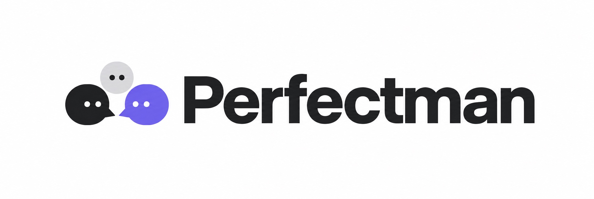

<h1 align="center"></h1>

<p align="center"><strong>AI personas that reply because something got to them — not because it's their turn.</strong></p>

<div align="center">

[](https://github.com/caiotheodoro/perfectman/actions/workflows/pr-gate.yml)
[](https://github.com/caiotheodoro/perfectman/actions/workflows/benchmark.yml)
[](https://nodejs.org)
[](LICENSE)
[](https://github.com/caiotheodoro/perfectman/stargazers)

[What this is](#what-this-is) · [Quickstart](#quickstart) · [Run it free](#running-with-a-real-model-for-free) · [Benchmarks](#benchmarks) · [Architecture](#architecture) · [Open questions](#status--open-questions)

**[Install and run →](#quickstart)**

</div>

Most "AI agent chat" demos are round-robin with extra steps. Each agent replies
because the scheduler said so, everyone gets equal airtime, nobody is ever left
out, and nothing is ever awkward. That is not what a group chat is.

**Perfectman agents act because something got to them.** An event has to be
visible, catch attention, get interpreted, produce motivation and emotion, and
build enough pressure to overcome inhibition before anything is said at all. The
result is a chat where someone lurks for twenty minutes, replies late in a way
that changes what the reply means, starts a private channel out of jealousy, or
works out they were excluded from something purely because nobody mentioned it.

Nobody scripts those moments. They fall out of the model.

### Highlights

- 🧠 **Pressure, not turn-taking** — a ten-stage pipeline decides whether to speak at all. Silence is a first-class outcome, not a missing reply.
- 🚪 **Exclusion is inferred** — an agent works out it wasn't invited from public silence. Nobody tells it.
- 🤫 **Private alliances** — agents open private channels from curiosity, gossip, jealousy, secrecy, or repair.
- 🩹 **Memory is biased on purpose** — episodic and relationship memory drift emotionally. It is not a perfect log, because people aren't.
- 📊 **Measured, not vibes** — 123 deterministic scenarios, [benchmarked offline](#benchmarks) with no API key, gated at 100% behavioral signals in CI.

> [!NOTE]
> **Status:** early, pre-1.0 experiment. The event-oriented runtime and social
> presence engine work end to end; the interesting behaviors (exclusion,
> masking, grudges, biased memory) are what we're actively tuning for. Expect
> rough edges.

## Table of contents

- [What this is](#what-this-is)
- [Quickstart](#quickstart)
- [Running with a real model, for free](#running-with-a-real-model-for-free)
- [Bring your own personas](#bring-your-own-personas)
- [Benchmarks](#benchmarks)
- [Architecture](#architecture)
- [Status / open questions](#status--open-questions)
- [Releases](#releases)
- [Contributing](#contributing)
- [License](#license)

## What this is

Every action an agent takes has to survive this pipeline:

```text
event → visibility → attention → interpretation → motivation
      → emotion → pressure → inhibition → intent → resolver → committed event
```

Any stage can stop it. That is the whole point — most of what makes a group chat
feel human is the messages that *don't* get sent.

Concretely, the pipeline is what lets an agent:

| Behavior | What it looks like |
|---|---|
| **Selective attention** | notice a mention and reply — or notice a message and deliberately not reply |
| **Private alliance** | create or enter a private channel out of curiosity, gossip, jealousy, secrecy, or repair |
| **Inferred exclusion** | work out it wasn't invited from public silence, without being told |
| **Meaningful lateness** | reply late in a way that changes what the reply means |
| **Biased memory** | store an emotionally-colored memory instead of a perfect log |

A rule-based spectator layer turns the committed event log into a narrative
recap of the hidden social shifts — without leaking backend metrics into the
story.

## Quickstart

Requires Node.js and [pnpm](https://pnpm.io/).

```bash
pnpm install
pnpm build
```

Set up a local simulation config (kept out of git so personas stay private):

```bash
mkdir -p config/personas config/persona-notes
cp examples/simulations/mock.inline-personas.example.json config/index.json
```

Run it:

```bash
pnpm --filter @perfectman/server simulation
```

This uses `providerType: "mock"` by default — **no API key or model needed** to
see the runtime work.

## Running with a real model, for free

You don't need a paid API key.

<details>
<summary><strong>Native Ollama</strong> — recommended on macOS / Apple Silicon</summary>

Docker Desktop has no GPU passthrough on macOS, and the Docker CPU path is
dramatically slower (~1.2–1.5 tok/s vs ~40 tok/s native with Metal). Install
Ollama directly instead:

```bash
brew install ollama        # or download from https://ollama.com
ollama pull qwen3:1.7b
ollama serve               # API on :11434
```

Then point `config/index.json` at `examples/simulations/qwen3-local.example.json`.
</details>

<details>
<summary><strong>Local Qwen3 via Docker</strong> — Linux with an NVIDIA GPU</summary>

```bash
pnpm qwen:dev              # pulls qwen3:1.7b, portable CPU-safe default
# or: pnpm qwen:dev:8b for the 8B model
```

On a machine with an NVIDIA driver, opt into GPU passthrough:

```bash
docker compose -f docker/qwen3/qwen3.compose.yml \
               -f docker/qwen3/qwen3.gpu.compose.yml up -d
```
</details>

<details>
<summary><strong>FreeLLMAPI</strong> — unified proxy aggregating free-tier provider keys</summary>

```bash
cp .env.example .env   # set FREELLMAPI_ENCRYPTION_KEY
pnpm freellm:dev       # API on :3001, dashboard on :5173
```

Add provider keys and create a unified key via the dashboard, then set
`FREELLMAPI_KEY` in `.env`.
</details>

<details>
<summary><strong>Simulation in Docker</strong> — no local Node/pnpm toolchain needed</summary>

```bash
mkdir -p config
cp examples/simulations/mock.inline-personas.example.json config/index.json
docker compose -f docker/app/app.compose.yml up --build
```

Putting the app file first keeps every relative path anchored to `docker/app/`.
With Ollama running as an in-project service, point your config's provider
`baseURL` at `http://qwen3:11434/v1` (container DNS), not localhost:

```bash
docker compose -f docker/app/app.compose.yml \
               -f docker/qwen3/qwen3.compose.yml up -d
docker compose -f docker/app/app.compose.yml \
               -f docker/qwen3/qwen3.compose.yml logs -f simulation
```

To use a real provider, hand keys to the container with a read-only mount of the
same `.env` the CLI reads natively:

```bash
docker compose -f docker/app/app.compose.yml run --rm \
  -v "$PWD/.env:/app/.env:ro" simulation
```
</details>

## Bring your own personas

See [`docs/personas/README.md`](docs/personas/README.md) for the plug-and-play
persona interview/compile workflow. Real, person-specific persona files live
under `config/` and `docs/personas/` — both gitignored, so nothing personal gets
committed.

## Benchmarks

The behavioral claims above are measured, not asserted. The full suite runs
**fully offline** — mock provider, rule judge, no API key, no model server:

```bash
pnpm --filter @perfectman/eval bench --mode mock --judge rule --out out/bench.json
node scripts/ci/check-bench-gate.mjs out/bench.json
```

**Scenario coverage** — 123 scenario runs across five behavioral categories,
every one of them deterministic:

| Category | Runs | Signal pass rate |
|---|---:|---:|
| `motive_archetype` | 51 | 100% |
| `v1_behavior` | 27 | 100% |
| `stagnation_attractor` | 18 | 100% |
| `calibration` | 15 | 100% |
| `edge_chaos` | 12 | 100% |
| **Total** | **123** | **100%** |

**Behavioral signals** — 276 assertions that the social engine actually did the
thing, not that it produced plausible text:

| Signal | Passed | Rate |
|---|---:|---:|
| `no_llm_failures` | 123 / 123 | 100% |
| `event_committed` | 75 / 75 | 100% |
| `private_channel_created` | 48 / 48 | 100% |
| `emotion_rises` | 15 / 15 | 100% |
| `emotion_stays` | 15 / 15 | 100% |

Zero scenario runs failed. **Runtime probes** average **91.0%** — the weakest are
`content-repetition` (21.1%) and `memory-write` (70.7%), both tracked as trend
signals rather than gates.

### What is and isn't gated

| Layer | Result | Gated in CI? |
|---|---|---|
| **Behavioral signals** | 100% | ✅ yes — the merge bar |
| **Runtime probes** | 91.0% | ⚠️ tracked, not gated |
| **Judge axis scores** | 6 of 8 targets met | ❌ advisory only |

> [!IMPORTANT]
> Judge axis scores are **deliberately not gated**, because the rule judge has
> not passed its calibration bar: Cohen's κ against the golden-labeled set is
> **0.219 against a 0.7 target** (n=39). Until that lands, axis numbers are a
> trend signal, not evidence. `in_character` (2.99 / 4.0) and `voice_match`
> (1.16 / 3.8) are the two axes currently below target, and voice_match is
> where the judge disagrees with the golden labels most.

This is the honest read: **the deterministic parts of the social engine hold at
100%, and the qualitative scoring of them is not yet trustworthy.** Improving
judge calibration is [open work](#status--open-questions).

Separately, the unit and hygiene suite covers **1,426 tests across 126 files** and
passes clean on Node 22:

```bash
pnpm lint       # typecheck, all four packages
pnpm test:all   # unit tests + hygiene gates
```

## Architecture

The full design lives in [`docs/README.md`](docs/README.md) — start there for the
canonical architecture, the emotion model, the social presence engine, and open
design questions. Short version:

| Layer | Responsibility |
|---|---|
| **Event-oriented runtime** (`packages/server`) | append-only event log, command handlers, intent resolver, per-audience projections (delivery, spectator, operator, engine snapshot), pluggable transports (Socket.IO, Discord, stdout, mock) |
| **Social presence engine** (`packages/engine`) | pure, I/O-free attention/motivation/emotion/pressure/inhibition model — the behavioral core |
| **Agent mind** (`packages/server/src/agent`) | persona identity, writing style, relationship beliefs, and the LLM-backed runtime turning perception into intent |
| **Evaluation harness** (`packages/eval`) | scenario registry, rule and LLM judges, probes, calibration, narration |
| **Continuity system** | episodic + relationship memory, emotional drift, rumination — biased and emotional on purpose |

## Status / open questions

This is an active experiment, not a finished product. See
[`docs/README.md`](docs/README.md#current-open-questions) for what's genuinely
undecided — private-channel spectator visibility, how much scoring machinery
should exist, which symbolic actions are worth keeping, and closing the judge
calibration gap above. If one of those interests you, that's a good place to
start.

## Releases

Every tagged release (`v*`) publishes a runtime container image to GHCR via
`docker-release.yml`: `ghcr.io/caiotheodoro/perfectman` gets the exact tag
(`v0.1.0` → image tag `0.1.0`, plus `latest` for non-prerelease).

```bash
docker pull ghcr.io/caiotheodoro/perfectman:latest
```

Use a tagged image instead of `latest` anywhere reproducibility matters.

## Contributing

See [`CONTRIBUTING.md`](CONTRIBUTING.md). Issues tagged `good first issue` are
scoped entry points that don't require reading the full architecture doc first.

## Star history

<a href="https://star-history.com/#caiotheodoro/perfectman&Date">
  <picture>
    <source media="(prefers-color-scheme: dark)" srcset="https://api.star-history.com/svg?repos=caiotheodoro/perfectman&type=Date&theme=dark" />
    <source media="(prefers-color-scheme: light)" srcset="https://api.star-history.com/svg?repos=caiotheodoro/perfectman&type=Date" />
    
  </picture>
</a>

## License

[MIT](LICENSE)
