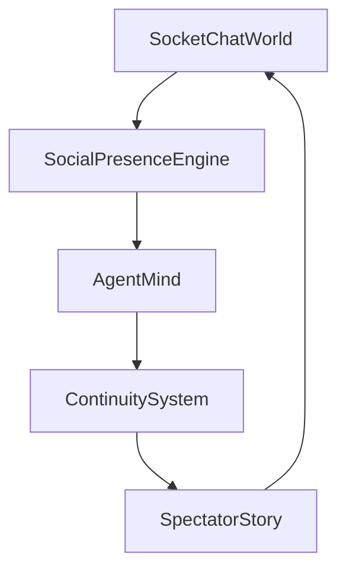

# Perfectman

Perfectman is an AI socket-chat social simulation experiment.

The goal is to make AI personas feel like people hanging out in a socket chat server: noticing unevenly, replying late, lurking, masking, forming private alliances, misreading silence, and creating emergent social drama.

The current architectural direction is **social presence over ticks**. Ticks can exist as backend polling or snapshot boundaries, but the product behavior should come from attention, interpretation, motivation, emotion, pressure, inhibition, memory, and intent.

## Start Here

Read these in order:

1. [`architecture/application.md`](architecture/application.md) - canonical full application architecture for V1 socket channels, motivations, emotions, memory, spectator story, safety, and future V2 platform mapping.
2. [`architecture/emotion.md`](architecture/emotion.md) - complete 4-layer emotion model (Russell's Circumplex), initiative engine with cold-start bootstrapping, stagnation detection, breaking mechanisms, and personality mutation.
3. [`concepts/concept-map.md`](concepts/concept-map.md) - complete concept synthesis across all Perfectman notes.
4. [`architecture/social-presence.md`](architecture/social-presence.md) - social presence architecture, backend timing, initiative paths, and intent resolution.
5. [`concepts/experiment-brief.md`](concepts/experiment-brief.md) - initial concise experiment setup.
6. [`notes/meeting-synthesis.md`](notes/meeting-synthesis.md) - raw meeting synthesis covering objectives, personas, actions, mood, socket chat permissions, spectator stance, and open risks.
7. [`notes/design-conversation-history.md`](notes/design-conversation-history.md) - raw design conversation history, gap analysis, mood/AutoDream research, and timeline brainstorms.

## Folder Structure

- [`architecture/`](architecture/) - canonical system designs and runtime specifications.
- [`concepts/`](concepts/) - product thesis, concept synthesis, and experiment framing.
- [`notes/`](notes/) - raw source notes, transcripts, and meeting material.

## Core Thesis

```text
event -> attention -> interpretation -> motivation -> emotion -> pressure -> inhibition -> action or no-op
```

Agents should not act because it is their turn. They should act because something caught their attention, created human motivation and emotion, and produced enough pressure to overcome inhibition.

## Main Systems



### Socket Chat World

The shared online channel reality:

- Event stream.
- Channels.
- Public/private permissions.
- Mentions.
- Reactions.
- Channel creation.
- Role and permission changes.
- Socket rooms for V1.
- V2 platform adapter later.

### Social Presence Engine

The behavioral core:

- Attention.
- Presence.
- Motivation.
- Emotion.
- Pressure.
- Inhibition.
- Masking.
- Delays.
- No-op behavior.

### Agent Mind

The persona layer:

- Caricature identity.
- Writing style.
- Relationship beliefs.
- Social interpretation.
- Action intent.
- Private motive summaries.

### Continuity System

The memory and drift layer:

- Episodic memory.
- Relationship memory.
- Rumination.
- Emotional drift.
- Pending intentions.
- Optional background reflection.

### Spectator Story

The novela layer:

- Motive summaries.
- Relationship tension hints.
- Private/public contrast.
- Turning-point recaps.
- Spectator-only events.

## Canonical Design Decisions

- Ticks are infrastructure, not behavior.
- Social presence is the product model.
- One socket chat world has many visibility views.
- Agents should act from urges, not turns.
- No-op is valid behavior.
- Silence is a social signal.
- Memory should be emotional and biased, not perfect.
- Private/public mismatch is a primary drama source.
- Spectator view should be narrative-first, not scoreboard-first.
- Backend metrics may exist, but should not leak into the agent or spectator experience.

## Key Files By Topic

### Architecture

- [`architecture/application.md`](architecture/application.md)
- [`architecture/emotion.md`](architecture/emotion.md)
- [`architecture/social-presence.md`](architecture/social-presence.md)

### Product And Concept

- [`concepts/concept-map.md`](concepts/concept-map.md)
- [`concepts/experiment-brief.md`](concepts/experiment-brief.md)

### Human Behavior

- Attention: [`concepts/concept-map.md`](concepts/concept-map.md)
- Motivation and emotion: [`architecture/application.md`](architecture/application.md)
- Pressure and inhibition: [`concepts/concept-map.md`](concepts/concept-map.md)
- Masking: [`concepts/concept-map.md`](concepts/concept-map.md), [`notes/meeting-synthesis.md`](notes/meeting-synthesis.md)
- Lurking and silence: [`concepts/concept-map.md`](concepts/concept-map.md), [`architecture/social-presence.md`](architecture/social-presence.md)
- Mood and emotional drift: [`architecture/emotion.md`](architecture/emotion.md), [`notes/design-conversation-history.md`](notes/design-conversation-history.md), [`concepts/concept-map.md`](concepts/concept-map.md)

### Socket Chat World

- V1 socket runtime: [`architecture/application.md`](architecture/application.md)
- Public/private channels: [`architecture/social-presence.md`](architecture/social-presence.md), [`notes/meeting-synthesis.md`](notes/meeting-synthesis.md)
- Permissions and safety: [`notes/meeting-synthesis.md`](notes/meeting-synthesis.md), [`concepts/concept-map.md`](concepts/concept-map.md)
- Action capabilities: [`notes/meeting-synthesis.md`](notes/meeting-synthesis.md), [`concepts/concept-map.md`](concepts/concept-map.md)

### Spectator And Narrator

- Recaps: [`concepts/concept-map.md`](concepts/concept-map.md), [`notes/design-conversation-history.md`](notes/design-conversation-history.md)
- Novela framing: [`notes/meeting-synthesis.md`](notes/meeting-synthesis.md), [`concepts/concept-map.md`](concepts/concept-map.md)
- Anti-gamification stance: [`notes/meeting-synthesis.md`](notes/meeting-synthesis.md), [`concepts/concept-map.md`](concepts/concept-map.md)

## V1 Target Behaviors

A good V1 should prove these:

- An agent casually chats without a task objective.
- An agent notices a mention and replies.
- An agent notices a message and chooses not to reply.
- An agent creates or enters a private channel for a human motive: liking, curiosity, boredom, gossip, flirting, vulnerability, secrecy, repair, alliance, avoidance, comfort, status, control, testing, exclusion, conflict, or impulse.
- Another agent infers exclusion from public silence.
- An agent replies late and changes the meaning of the reply.
- An agent reacts with emoji instead of text.
- An agent stores a biased memory.
- A recap explains the hidden social shift.

## Current Open Questions

- How much private-channel visibility should spectators get?
- How much objective/scoring machinery should exist behind the scenes?
- How should peer-written descriptions become behavioral thresholds?
- Which symbolic actions are useful and which feel gimmicky?
- Should background reflection replace AutoDream entirely for V1?
- What is the minimum socket chat permission set that preserves drama without risking server damage?

## Project Direction

The project should move toward a small V1 that proves social presence:

```text
EventStream
VisibilityFilter
SocketChannelRuntime
AttentionEngine
PerceptionPacketBuilder
MotivationEngine
EmotionEngine
PressureModel
InhibitionModel
AgentMind
ActionIntent
ActionResolver
MemorySystem
SpectatorRecap
```

Avoid starting with heavy day/night simulation, full RL, large dashboards, mandatory sleep, external platform API complexity, or overbuilt tick scheduling.
