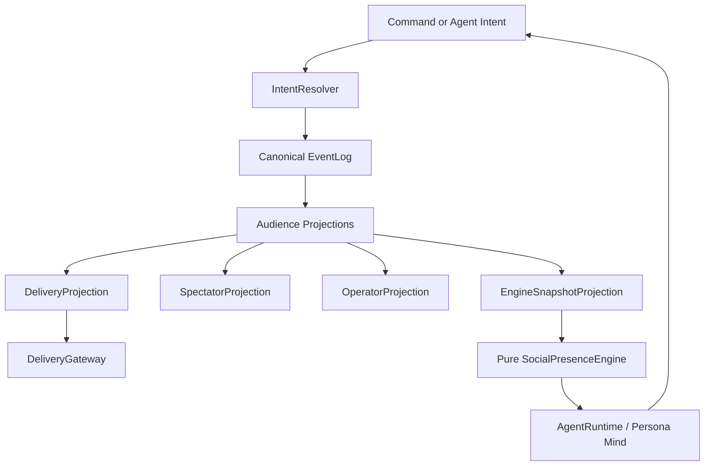

# Perfectman

Perfectman is an AI socket-chat social simulation experiment.

The goal is to make AI personas feel like people hanging out in a socket chat server: noticing unevenly, replying late, lurking, masking, forming private alliances, misreading silence, and creating emergent social drama.

The current architectural direction is **social presence over ticks**. Ticks can exist as backend polling or snapshot boundaries, but the product behavior should come from attention, interpretation, motivation, emotion, pressure, inhibition, memory, and intent.

## Start Here

Read these in order:

1. [`architecture/application.md`](architecture/application.md) - canonical full application architecture for V1 socket channels, motivations, emotions, memory, spectator story, safety, and future V2 platform mapping.
2. [`architecture/emotion.md`](architecture/emotion.md) - complete 4-layer emotion model (Russell's Circumplex), initiative engine with cold-start bootstrapping, stagnation detection, breaking mechanisms, and personality mutation.
3. [`concepts/concept-map.md`](concepts/concept-map.md) - complete concept synthesis across all Perfectman notes.
4. [`architecture/social-presence.md`](architecture/social-presence.md) - social presence architecture, backend timing, initiative paths, and intent resolution.
5. [`personas/README.md`](personas/README.md) - plug-and-play persona setup workflow, local-only persona paths, and interview-agent instructions.
6. [`concepts/experiment-brief.md`](concepts/experiment-brief.md) - initial concise experiment setup.
7. [`notes/meeting-synthesis.md`](notes/meeting-synthesis.md) - raw meeting synthesis covering objectives, personas, actions, mood, socket chat permissions, spectator stance, and open risks.
8. [`notes/design-conversation-history.md`](notes/design-conversation-history.md) - raw design conversation history, gap analysis, mood/AutoDream research, and timeline brainstorms.

## Folder Structure

- [`architecture/`](architecture/) - canonical system designs and runtime specifications.
- [`concepts/`](concepts/) - product thesis, concept synthesis, and experiment framing.
- [`notes/`](notes/) - raw source notes, transcripts, and meeting material.
- [`implementation/`](implementation/) - post-merge implementation notes per dev stream.
- [`plans/`](plans/) - cross-boundary contracts and per-dev implementation plans.
- [`personas/`](personas/) - generic persona setup docs and templates only. Real/person-specific subfolders are local-only and gitignored.

## Core Thesis

```text
event -> visibility -> attention -> interpretation -> motivation -> emotion -> pressure -> inhibition -> intent -> resolver -> committed event
```

Agents should not act because it is their turn. They should act because something caught their attention, created human motivation and emotion, and produced enough pressure to overcome inhibition. Agents produce structured intents; only the event runtime/resolver commits durable facts.

## Main Systems



### Event-Oriented Runtime

The shared online channel reality:

- Canonical append-only event log.
- Channel registry and membership.
- Command handlers for human/operator/socket requests.
- Intent resolver for agent proposals.
- Public/private permissions.
- Mentions, reactions, channel creation, presence, delay, no-op, and memory events.
- Projections for delivery gateways, spectators, operators, and engine snapshots.
- Socket.IO, Discord, stdout, or mock gateways as transport adapters, not the core architecture.

### Social Presence Engine

The behavioral core:

- Attention.
- Presence.
- Motivation.
- Emotion.
- Pressure.
- Inhibition.
- Masking.
- Delays.
- No-op behavior.

### Agent Mind

The persona layer:

- Caricature identity.
- Writing style.
- Relationship beliefs.
- Social interpretation.
- Action intent.
- Private motive summaries.

### Continuity System

The memory and drift layer:

- Episodic memory.
- Relationship memory.
- Rumination.
- Emotional drift.
- Pending intentions.
- Optional background reflection.

### Spectator Story

The novela layer, implemented as a projection over committed events:

- Motive summaries.
- Relationship tension hints.
- Private/public contrast.
- Turning-point recaps.
- Spectator-only events.
- Rule-based MVP projection; LLM narration can be added later without changing the event log.

## Canonical Design Decisions

- Ticks are infrastructure, not behavior.
- Social presence is the product model.
- One socket chat world has many visibility views.
- Agents should act from urges, not turns.
- No-op is valid behavior.
- Silence is a social signal.
- Memory should be emotional and biased, not perfect.
- Private/public mismatch is a primary drama source.
- Spectator view should be narrative-first, not scoreboard-first.
- Backend metrics may exist, but should not leak into the agent or spectator experience.

## Key Files By Topic

### Architecture

- [`architecture/application.md`](architecture/application.md)
- [`architecture/emotion.md`](architecture/emotion.md)
- [`architecture/social-presence.md`](architecture/social-presence.md)

### Product And Concept

- [`concepts/concept-map.md`](concepts/concept-map.md)
- [`concepts/experiment-brief.md`](concepts/experiment-brief.md)

### Human Behavior

- Attention: [`concepts/concept-map.md`](concepts/concept-map.md)
- Motivation and emotion: [`architecture/application.md`](architecture/application.md)
- Pressure and inhibition: [`concepts/concept-map.md`](concepts/concept-map.md)
- Masking: [`concepts/concept-map.md`](concepts/concept-map.md), [`notes/meeting-synthesis.md`](notes/meeting-synthesis.md)
- Lurking and silence: [`concepts/concept-map.md`](concepts/concept-map.md), [`architecture/social-presence.md`](architecture/social-presence.md)
- Mood and emotional drift: [`architecture/emotion.md`](architecture/emotion.md), [`notes/design-conversation-history.md`](notes/design-conversation-history.md), [`concepts/concept-map.md`](concepts/concept-map.md)
- Persona setup workflow: [`personas/README.md`](personas/README.md)
- Personality/persona questionnaires: [`notes/persona-assessment-canonical.md`](notes/persona-assessment-canonical.md), [`notes/personality-assessment-research.md`](notes/personality-assessment-research.md), [`notes/friend-questionnaire.md`](notes/friend-questionnaire.md), [`notes/solo-questionnaire.md`](notes/solo-questionnaire.md)

### Channel World

- V1 delivery-agnostic runtime: [`architecture/application.md`](architecture/application.md)
- Public/private channels: [`architecture/social-presence.md`](architecture/social-presence.md), [`notes/meeting-synthesis.md`](notes/meeting-synthesis.md)
- Permissions and safety: [`notes/meeting-synthesis.md`](notes/meeting-synthesis.md), [`concepts/concept-map.md`](concepts/concept-map.md)
- Action capabilities: [`notes/meeting-synthesis.md`](notes/meeting-synthesis.md), [`concepts/concept-map.md`](concepts/concept-map.md)

### Spectator And Narrator

- Recaps: [`concepts/concept-map.md`](concepts/concept-map.md), [`notes/design-conversation-history.md`](notes/design-conversation-history.md)
- Novela framing: [`notes/meeting-synthesis.md`](notes/meeting-synthesis.md), [`concepts/concept-map.md`](concepts/concept-map.md)
- Anti-gamification stance: [`notes/meeting-synthesis.md`](notes/meeting-synthesis.md), [`concepts/concept-map.md`](concepts/concept-map.md)

## V1 Target Behaviors

A good V1 should prove these:

- An agent casually chats without a task objective.
- An agent notices a mention and replies.
- An agent notices a message and chooses not to reply.
- An agent creates or enters a private channel for a human motive: liking, curiosity, boredom, gossip, flirting, vulnerability, secrecy, repair, alliance, avoidance, comfort, status, control, testing, exclusion, conflict, or impulse.
- Another agent infers exclusion from public silence.
- An agent replies late and changes the meaning of the reply.
- An agent reacts with emoji instead of text.
- An agent stores a biased memory.
- A recap explains the hidden social shift.

## Running A Simulation

The server package has a CLI entrypoint that wires all layers from a JSON config file.

```bash
# auto-discovers config/index.json walking up from CWD
pnpm --filter @perfectman/server simulation

# explicit path
pnpm --filter @perfectman/server simulation --config path/to/config.json
```

Config format: see [`../examples/simulations/mock.inline-personas.example.json`](../examples/simulations/mock.inline-personas.example.json). For local friend-group personas stored outside git, see [`../examples/simulations/mock.persona-file.example.json`](../examples/simulations/mock.persona-file.example.json), [`../examples/personas/`](../examples/personas/), and [`personas/README.md`](personas/README.md).

`buildConfiguredSimulation` in `packages/server/src/config/simulation-config.ts` is the composition root — it validates the config, wires repositories (in-memory or SQLite), delivery gateways (mock, stdout, or composite), `AgentConfigRegistry`, `AgentRuntime`, and `SimulationRuntime`.

`config/index.json` is gitignored. Copy the example, fill in your agents, and set the appropriate API key env vars if not using `providerType: "mock"`. To keep real people out of git, put compiled persona files in `config/personas/*.persona.json` and reference them from `config/index.json` using `personaFile`.

### Local friend-group persona quickstart

```bash
mkdir -p config/personas config/persona-notes
cp examples/personas/setup/persona-setup.config.example.json config/persona-setup.local.json
cp examples/personas/compiled/ana.persona.example.json config/personas/ana.persona.json
cp examples/simulations/mock.persona-file.example.json config/index.json
```

Then edit:

- `config/persona-setup.local.json` — who you are interviewing and which aliases/agent ids to use.
- `config/personas/<agent-id>.persona.json` — compiled runtime persona and prompt profile.
- `config/index.json` — local simulation config; each agent should use `"personaFile": "personas/<agent-id>.persona.json"`.

Optional local helper: create/use `docs/personas/local-questionnaire-agent.md` to guide an AI agent through the interview and synthesis process. That file is intentionally gitignored.

Before committing, check that real persona files are ignored:

```bash
git status --ignored --short docs/personas config
git check-ignore -v config/index.json config/personas/ana.persona.json config/persona-notes/ana/raw.md docs/personas/local-questionnaire-agent.md
```

## Current Open Questions

- How much private-channel visibility should spectators get?
- How much objective/scoring machinery should exist behind the scenes?
- How should peer-written descriptions become behavioral thresholds?
- Which symbolic actions are useful and which feel gimmicky?
- Should background reflection replace AutoDream entirely for V1?
- What is the minimum channel permission set that preserves drama without risking external surface damage?

## Project Direction

The project should move toward a small V1 that proves social presence through an event-oriented runtime:

```text
CommandHandlers
ActionIntent
IntentResolver
CommittedEvent
CanonicalEventLog
ChannelRegistry
EventProjections
DeliveryProjection
SpectatorProjection
OperatorProjection
EngineSnapshotProjection
VisibilityFilter
AttentionEngine
PerceptionPacketBuilder
MotivationEngine
EmotionEngine
PressureModel
InhibitionModel
AgentRuntime
MemorySystem
```

Avoid starting with heavy day/night simulation, full RL, large dashboards, mandatory sleep, external platform API complexity, or overbuilt tick scheduling.
