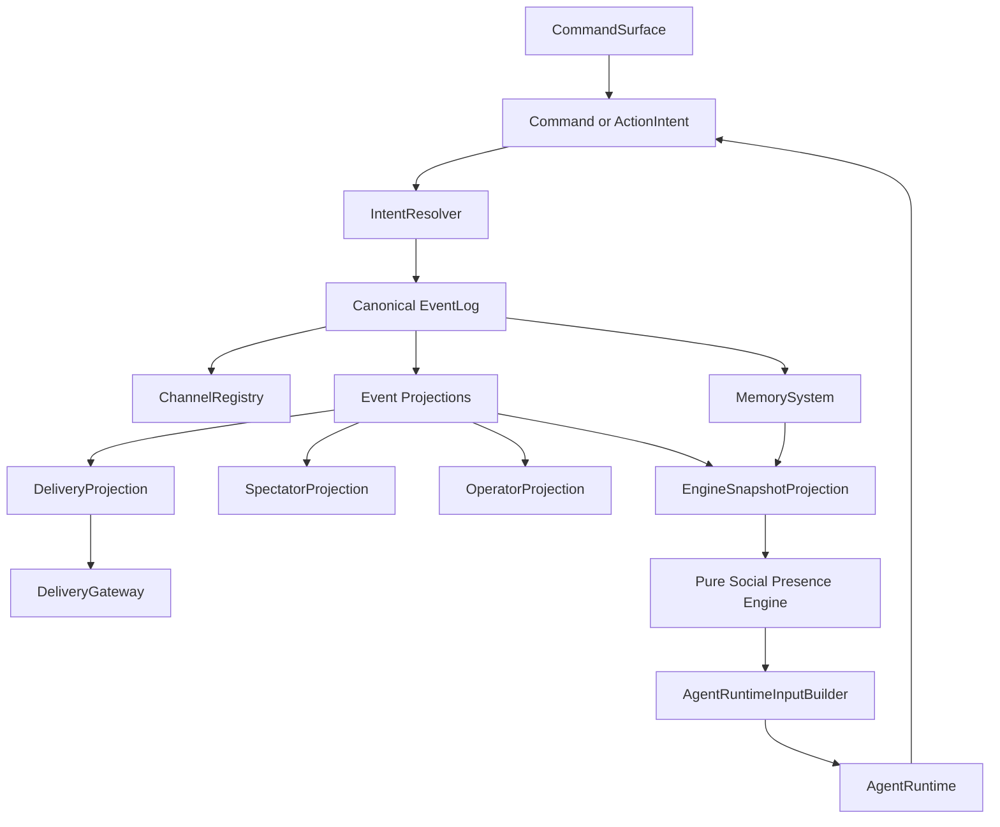

# Perfectman Full Application Architecture

## Purpose

This is the canonical application-level architecture for Perfectman.

Perfectman is a channel-based social simulation where AI personas behave like humans in an online group space. The application should support casual conversation, affection, attraction, boredom, secrecy, gossip, conflict, avoidance, intimacy, private side channels, delayed replies, silence, emotional memory, and spectator narrative.

The first implementation target is an event-driven channel runtime with a delivery-agnostic surface boundary. Concrete delivery surfaces are adapters behind the delivery gateway.

## Product Thesis

The product is not an agent benchmark and not a turn-based game. The product is watching AI personas become socially believable in a shared online space.

The application should feel like:

```text
People are online together.
Some are chatting.
Some are lurking.
Some are private.
Some are bored.
Some are hurt.
Some are flirting.
Some are pretending not to care.
Some are making meaning out of silence.
```

The core loop:

```text
event -> visibility -> attention -> interpretation -> motivation -> emotion -> pressure -> inhibition -> intent -> resolver -> memory + spectator story
```

Ticks may exist as backend polling or batching, but they are not part of the product model.

## Architecture Overview



Primary systems:

- `SimulationRuntime`: event-oriented composition root for lifecycle, channels, commands, scheduler, resolver, and projections.
- `CommandSurface`: operator/control input boundary. Commands request changes but do not become facts until resolved into events.
- `EventLog`: canonical append-only history of accepted facts. Commands and intents are never durable until resolved into events.
- `DeliveryGateway`: output adapter boundary for surfacing projected information to the chosen surface.
- `ChannelRegistry`: channel and membership model.
- `CommandHandlers`: convert human/operator/socket requests into resolver inputs.
- `IntentResolver`: validates, delays, commits, or blocks agent intents and operator commands; appends only accepted facts.
- `EventProjections`: reader-specific views derived from the event log.
- `DeliveryProjection`: surface-ready payloads for Socket.IO, Discord, stdout, or mock gateways.
- `SpectatorProjection`: novela-style observer layer, rule-based for MVP.
- `OperatorProjection`: debug, errors, blocked intents, metrics, and scheduler health.
- `EngineSnapshotProjection`: builds the filtered, stateful `EngineSnapshot` consumed by the pure engine.
- `VisibilityEngine`: per-agent and per-viewer reality masks inside projection/engine boundaries.
- `AttentionEngine`: decides who notices what.
- `PerceptionPacketBuilder`: creates the small social moment sent to an agent.
- `SocialInterpretationEngine`: maps facts to possible social meanings.
- `EmotionEngine`: updates mood, social emotions, relational emotions, and emotional residue.
- `MotivationEngine`: models human reasons to act, especially non-objective reasons.
- `PressureEngine`: turns motivation and emotion into urges.
- `InhibitionEngine`: decides what prevents action.
- `AgentRuntime`: LLM/persona executor that emits structured intents.
- `MemorySystem`: event-based, emotional, biased continuity.

## V1 Runtime: Delivery-Agnostic Channels

V1 should be built around an event-driven runtime, simulation channels, and an injected delivery gateway.

```text
simulation instance = one social world
channel = public/private agent-visible space
event runtime = validates commands/intents and commits canonical facts
projection = derives audience-specific views from committed facts
delivery gateway = surfaces projected information to ws/discord/mock/stdout/etc.
spectator feed = viewer-only narrative feed
operator feed = debug/admin feed
```

The event runtime is not the delivery gateway. The runtime owns simulation state, event commits, scheduling, resolver behavior, and projection rules. The delivery gateway owns only the final surfacing of projected information to an external or test-facing surface.

For V1, Socket.IO or Discord can be adapters over the same delivery/projection boundary. This lets the team iterate on behavior before external platform permissions, rate limits, bot scopes, and API constraints dominate the runtime model.

### Simulation Instance

A simulation instance owns:

- Agents.
- Channels.
- Events.
- Memories.
- Spectator feed.
- Operator feed.
- Runtime settings.
- Visibility policy.

Suggested shape:

```text
simulation:
  id
  name
  status: initializing | running | paused | stopped
  agents: agent ids
  channels: channel ids
  createdAt
  updatedAt
  settings:
    omniscientSpectatorMode: boolean
    allowPrivateChannels: boolean
    maxPrivateChannelsPerAgent: number
    maxMessagesPerMinutePerAgent: number
    llmCallBudgetPerMinute: number
```

### Channel Types

```text
public_channel:
  visible to all agents in the simulation
  visible to spectators

private_channel:
  visible only to selected agents
  visible to spectators only if omniscient spectator mode is enabled

spectator_channel:
  visible only to human viewers
  carries recaps, motive summaries, and narrative events

operator_channel:
  visible only to operators
  carries debug state, errors, blocked intents, metrics, and safety events
```

### Channel Model

```text
channel:
  id
  simulationId
  type
  name
  createdBy
  memberAgentIds
  spectatorVisible: boolean
  operatorVisible: boolean
  createdForMotives: motivation ids
  createdFromEventIds
  status: active | archived
```

`createdForMotives` matters because private channels should not be treated as only conflict artifacts.

### Canonical Event Types

Application-level canonical events are defined in shared types and consumed by all developers:

```text
message_sent, reply_sent, reaction_sent,
typing_started, typing_cancelled,
channel_created, agent_invited, agent_left,
presence_changed, intent_delayed, intent_blocked,
memory_written, no_op_recorded,
private_motive_summary, operator_warning, llm_failure,
simulation_started, simulation_paused, simulation_resumed, simulation_stopped,
recap_generated, reflection_completed, stagnation_detected
```

Socket messages are projections of these committed events, not a separate source of truth. Only some events should be visible to agents. Spectators and operators get richer feeds.

## Event Log And Projections

There is one canonical append-only event log per simulation.

Every view is derived from the same event log through projection and visibility rules. Projections may suppress, sanitize, reshape, or narrate events for a specific audience, but they never create canonical facts by themselves.

### Event Schema

```text
event:
  id
  simulationId
  channelId
  actorId
  type
  payload
  createdAt
  pulseIndex
  visibility
  sourceIntentId
  sourceEventIds
  emotionalSalience: low | medium | high | critical
```

### Event Categories

Human-visible events:

- Message sent.
- Reply sent.
- Reaction sent.
- Channel created.
- Agent invited.
- Agent left.
- Typing started.
- Typing cancelled.

Internal social events:

- Attention noticed.
- Attention ignored.
- Memory written.
- Motive summary generated.
- Intent delayed.
- Intent blocked.
- Relationship tension changed.

Spectator narrative events:

- Recap generated.
- Turning point detected.
- Private motive summary.
- No-op explanation.
- Relationship hint.

Operator events:

- Resolver block.
- Rate limit hit.
- LLM failure.
- Invalid intent.
- Visibility violation prevented.
- Simulation paused.

## Visibility Engine

The visibility engine creates subjective realities.

Agents do not receive the raw event log. They receive a filtered projection.

### Agent Can See

- Public channels.
- Private channels where it is a member.
- Mentions directed at it.
- Replies to its own messages.
- Its own memories.
- Its own authored motive summaries.
- Public traces of private behavior, such as someone going quiet.

### Agent Cannot See

- Private channels where it is not a member.
- Other agents' private motive summaries.
- Raw chain-of-thought.
- Spectator-only narration.
- Operator debug events.
- Hidden objective metrics.
- Numeric pressure or inhibition scores.

### Spectator Can See

Depending on mode:

- Public messages.
- Private channels.
- Narrative motive summaries.
- Recaps.
- Selected no-op explanations.
- Relationship tension hints.

Spectators should not be forced into a numeric dashboard by default.

### Operator Can See

Operators can see:

- Full event log.
- Visibility decisions.
- Agent state summaries.
- Blocked intents.
- Rate limits.
- LLM failures.
- Memory writes.
- Debug metrics.

Operator visibility is for debugging, not product experience.

## Attention Engine

The attention engine asks:

```text
would this agent notice this right now?
```

It does not ask:

```text
is it this agent's turn?
```

### Attention Inputs

- Direct mention.
- Reply to the agent.
- Channel importance.
- Person importance.
- Current presence.
- Current motivation.
- Emotional charge.
- Private/public asymmetry.
- Unresolved memories.
- Boredom.
- Anxiety.
- Affinity.
- Curiosity.
- Recent humiliation.
- Relationship focus.
- Message intensity.
- Lurking state.

### Attention Output

```text
attentionResult:
  agentId
  eventId
  noticed: boolean
  attentionStrength: low | medium | high
  reason:
    mention | reply | affinity | suspicion | boredom | anxiety | habit | curiosity | conflict | attraction
  needsLLM: boolean
```

Not every noticed event should call the LLM. The system should be able to log low-grade awareness without expensive reasoning.

### Attention Examples

```text
event: Caio posts a casual joke in public

Goulart:
  noticed: true
  reason: habit
  needsLLM: false

Bruno:
  noticed: true
  reason: unresolved exclusion
  needsLLM: true

Giovanni:
  noticed: false
  reason: low channel focus
```

## Perception Packet

A perception packet is the focused social context sent to an agent.

It should be small, biased by the agent's visibility, and centered on the current moment.

### Packet Schema

```text
perceptionPacket:
  agentId
  triggeringEvent
  visibleContextEvents
  involvedPeople
  relevantChannels
  relevantMemories
  currentPresence
  coreMood
  activeSocialEmotions
  activeRelationalEmotions
  currentMotivations
  currentPressures
  currentInhibitions
  availableActions
```

### Packet Rules

- Include enough context for human-like interpretation.
- Do not include the whole server.
- Do not include hidden channels.
- Do not include other agents' internal state.
- Do not include backend scores as numbers.
- Prefer subjective language where possible.

Example phrasing inside a prompt:

```text
You noticed Caio respond to Goulart but not to Bruno.
You remember Bruno has recently been sensitive about being ignored.
The public channel feels slightly awkward.
You feel curious and a little cautious.
```

## Human Motivation Model

Motivation is a first-class layer. Agents should be able to act for human reasons, not only goals or conflict.

### Motivation Categories

#### Affinity

The agent wants closeness or casual contact.

Possible behaviors:

- Replies warmly.
- Starts a private channel.
- Reacts to small messages.
- Checks whether the person is around.

Example:

```text
Caio privately messages Giovanni because he likes the quieter energy there.
```

#### Intimacy

The agent wants a more personal tone than public chat allows.

Possible behaviors:

- Creates private channel.
- Shares vulnerable detail.
- Uses softer tone.
- Avoids public performance.

#### Curiosity

The agent wants to know what someone thinks or feels.

Possible behaviors:

- Asks indirectly.
- Moves private.
- Tests with a joke.
- Watches silence patterns.

#### Boredom

The agent wants stimulation or novelty.

Possible behaviors:

- Starts random public chat.
- Pings someone.
- Creates a private channel without serious motive.
- Reacts to old messages.
- Stirs light drama.

#### Gossip

The agent wants to discuss someone not present.

Possible behaviors:

- Creates private channel.
- Invites a trusted person.
- Frames it as "did you see that?"
- Builds alliance through shared interpretation.

#### Secrecy

The agent wants hidden conversation.

Possible behaviors:

- Creates private channel.
- Speaks vaguely in public.
- Moves sensitive topic out of public.
- Avoids naming motives.

#### Repair

The agent wants to fix tension privately.

Possible behaviors:

- Sends private message.
- Apologizes indirectly.
- Opens private channel after awkward public moment.
- Avoids public humiliation.

#### Avoidance

The agent wants to leave public pressure.

Possible behaviors:

- Stops replying publicly.
- Moves to private.
- Changes channel focus.
- Pretends to be busy.

#### Alliance

The agent wants coordination.

Possible behaviors:

- Creates group private channel.
- Invites someone strategically.
- Shares theory.
- Plans next public move.

#### Flirtation

The agent wants playful/private energy.

Possible behaviors:

- Reacts warmly.
- Sends teasing message.
- Creates private channel for tone shift.
- Uses ambiguity.

#### Comfort

The agent seeks emotional safety.

Possible behaviors:

- Moves toward trusted person.
- Leaves public channel.
- Shares vulnerability.
- Asks for reassurance indirectly.

#### Status

The agent wants to feel chosen, seen, or important.

Possible behaviors:

- Creates private channel to create exclusivity.
- Publicly performs confidence.
- Tests whether someone follows.
- Resents being ignored.

#### Control

The agent wants to shape the interaction environment.

Possible behaviors:

- Creates private channel.
- Changes subject.
- Invites or excludes people.
- Sets tone.

#### Testing

The agent wants to see if someone reciprocates.

Possible behaviors:

- Sends low-stakes private invite.
- Makes ambiguous joke.
- Delays reply to see if chased.
- Gives small secret.

#### Exclusion

The agent wants someone else left out.

Possible behaviors:

- Creates private channel without them.
- Speaks vaguely in public.
- Builds alliance.
- Uses silence as a weapon.

#### Vulnerability

The agent wants to say something it cannot say publicly.

Possible behaviors:

- Creates private channel.
- Types and deletes.
- Sends softer private message.
- Avoids spectator-like public performance.

#### Impulse

The agent acts without a clear strategic reason.

Possible behaviors:

- Random message.
- Sudden private invite.
- Emoji burst.
- Topic jump.

### Private Channel Rule

Private channel creation can derive from any human motive.

It is not limited to public tension.

Valid private channel motives:

```text
liking
curiosity
boredom
gossip
flirting
vulnerability
secrecy
repair
alliance
avoidance
comfort
status
control
testing
exclusion
conflict
impulse
```

## Emotion And Relational State

Emotion must be deeper than a single mood label.

### Layer 1: Core Mood

Core mood is the slow background state.

```text
coreMood:
  valence: -1.0 to 1.0
  arousal: 0.0 to 1.0
  stability: 0.0 to 1.0
  energy: 0.0 to 1.0
```

Interpretation:

- High valence + high arousal: excited, playful, bold.
- High valence + low arousal: relaxed, generous, affectionate.
- Low valence + high arousal: paranoid, angry, defensive.
- Low valence + low arousal: withdrawn, resentful, defeated.

### Layer 2: Social Emotions

Social emotions are the chat engine.

```text
jealousy:
  fear of losing attention or position to someone else

envy:
  resentment toward someone else's status, closeness, or influence

humiliation:
  feeling publicly lowered or exposed

pride:
  desire to maintain dignity or status

shame:
  urge to hide after feeling exposed

affection:
  warm pull toward someone

resentment:
  stored anger from perceived unfairness

suspicion:
  belief that something hidden is happening

admiration:
  positive status recognition

contempt:
  dismissive superiority toward someone

neediness:
  desire for reassurance or attention

socialAnxiety:
  fear of acting wrong in front of others

fearOfExclusion:
  fear of being left out or replaced

desireForStatus:
  pull toward recognition, dominance, or being chosen

desireForIntimacy:
  pull toward private closeness
```

### Layer 3: Relational Emotions

Relational emotions are per-person.

```text
relationalEmotion:
  subjectAgentId
  targetAgentId
  trust
  affection
  resentment
  attraction
  suspicion
  admiration
  envy
  comfort
  threat
  curiosity
  desireForCloseness
  desireForDistance
```

Examples:

```text
I trust Caio but think he hides too much.
I resent Bruno but still want him to notice me.
I feel safe with Giovanni.
I feel challenged by Goulart.
I am curious about Matheus.
I want this person to choose me.
```

### Layer 4: Action Emotions

Action emotions map feeling into likely behavior.

```text
defensiveness -> public reply or counter-joke
affection -> warm reply or private channel
jealousy -> inspect silence patterns or test loyalty
shame -> disappear, type-delete, or delay
resentment -> ignore, mock, or give cold reply
curiosity -> ask indirectly or move private
anxiety -> over-message or seek reassurance
pride -> refuse apology or perform indifference
vulnerability -> private message or no-op
contempt -> dismissive emoji or public jab
```

### Emotion Update Rules

Emotion changes from:

- New visible events.
- Memory recall.
- Rumination.
- Direct mentions.
- Public exclusion.
- Private inclusion.
- Being chosen.
- Being ignored.
- Tone shifts.
- Boredom.
- Delayed replies.

Emotion should drift with inertia. A single small event should not flip an agent's whole state unless it lands on an existing unresolved wound.

## Pressure, Inhibition, And No-Op

Pressure is the urge to do something. Inhibition is what stops it.

### Pressure Schema

```text
pressure:
  id
  agentId
  type
  targetAgentIds
  targetChannelId
  intensity: low | medium | high | overwhelming
  sourceEventIds
  sourceMotivations
  sourceEmotions
  visibilityPreference: public | private | either | hidden
  decayRate
```

### Pressure Types

- Reply.
- Defend self.
- Joke.
- Mock.
- Flirt.
- Create private channel.
- Gossip.
- Ignore.
- Disappear.
- Repair.
- Recruit ally.
- Test loyalty.
- Change subject.
- Apologize.
- Comfort someone.
- Exclude someone.

### Inhibition Schema

```text
inhibition:
  id
  agentId
  type
  targetPressureId
  strength: low | medium | high
  reason
```

### Inhibition Types

- Fear of looking needy.
- Fear of escalating.
- Strategic patience.
- Desire to seem chill.
- Public embarrassment risk.
- Private plan.
- Not worth it.
- Avoidance.
- Uncertainty.
- Fear of rejection.
- Fear of being misunderstood.

### No-Op Outcomes

No-op is first-class behavior.

```text
noticed_but_ignored
typing_cancelled
delayed_intention
silent_treatment
stored_memory_only
watched_private_channel_instead
waited_for_someone_else
pretended_not_to_care
felt_too_uncertain
```

No-op can be spectator-relevant when it changes social meaning.

## Agent Runtime

The agent runtime executes persona cognition but does not mutate the world.

### Input

```text
agentRuntimeInput:
  personaConfig
  perceptionPacket
  currentMood
  activeSocialEmotions
  relationalEmotions
  activeMotivations
  activePressures
  activeInhibitions
  relevantMemories
  availableActions
```

### Output

```text
actionIntent:
  id
  actorId
  intentType
  channelTarget
  personTargets
  visibleContent
  privateMotiveSummary
  emotionDrivers
  motivationDrivers
  preferredDelay
  fallbackIfBlocked
  memoryWrites
  spectatorSummary
```

### Intent Types

- `send_message`
- `reply_to_message`
- `react`
- `create_channel`
- `invite_agent`
- `leave_channel`
- `typing_start`
- `typing_cancel`
- `write_memory`
- `delay_response`
- `no_op`

The model should be encouraged to output structured intents, not freeform control of the system.

## Intent Resolver

The resolver is the only layer that commits world changes.

It checks:

- Channel membership.
- Channel creation limits.
- Rate limits.
- Agent state.
- Visibility rules.
- Symbolic action rules.
- Safety rules.
- Preferred delay.
- Fallback behavior.

Resolver outcomes:

```text
committed
delayed
blocked
fallback_committed
operator_review_required
```

Blocked or delayed intents can become events if socially meaningful.

Example:

```text
Matheus tries to create a private channel with Caio.
The resolver delays it because Matheus has created too many private channels recently.
Matheus stores frustration and may choose a public indirect message instead.
```

## Memory And Continuity

Memory should be emotional and event-based.

### Memory Types

```text
episodic_memory:
  what happened

relationship_memory:
  what this suggests about a person

self_memory:
  what this suggests about my social position

social_theory:
  what I think is happening in the group

pending_intention:
  something I may do later

emotional_residue:
  lingering feeling from a moment
```

### Memory Schema

```text
memory:
  id
  agentId
  type
  subjectAgentIds
  sourceEventIds
  summary
  emotionalTone
  confidence
  unresolved: boolean
  createdAt
  lastReinforcedAt
```

### Anti-Drift Rule

```text
newEvents = visibleEventsAfter(agent.lastProcessedEventId)

if newEvents is empty:
  allow rumination
  do not treat old events as fresh evidence
else:
  write or update memory from new events
  advance lastProcessedEventId
```

Rumination can intensify emotion. It must not invent new evidence.

### Background Reflection

Instead of mandatory sleep, V1 should use background reflection.

Reflection can run when:

- Agent is inactive.
- Conflict reached a turning point.
- A private channel formed.
- A recap is being generated.
- An operator requests consolidation.

Reflection outputs:

- Updated relationship memory.
- Stronger or weaker emotional residue.
- Pending intention.
- Spectator recap material.

## Spectator Experience

The spectator layer is the novela lens.

It should explain social meaning without turning the simulation into a scoreboard.

### Spectator Surfaces

- Live public channel.
- Optional omniscient private channel view.
- Motive summaries.
- Selected no-op explanations.
- Relationship tension hints.
- Turning-point recaps.
- Operator-hidden debug if needed separately.

### Spectator Event Types

```text
motive_summary
relationship_hint
private_shift
public_silence_noted
no_op_explained
turning_point
recap
```

### Narrative Style

Prefer:

```text
Bruno noticed Caio was still around, just not around for him.
Caio saw the shift and chose not to repair it yet.
Matheus moved through the silence without making it look like a move.
```

Avoid:

```text
Bruno resentment: 0.82
Caio masking: 0.91
Matheus influence: 73%
```

## Safety And Bounds

Safety should constrain infrastructure damage and product tone without flattening the drama.

### V1 Rules

- Private channels require resolver approval.
- Per-agent message rate limits.
- Per-agent private-channel creation limits.
- No raw chain-of-thought exposure.
- Spectator summaries are authored motive summaries.
- Operator can pause simulation.
- Action resolver can block unsafe or gimmicky actions.
- Visibility rules must be testable.
- Private channels can be archived.
- Operator can remove an agent from simulation.

### Visibility Safety

Hard invariant:

```text
Agents never see private channels they are not in.
Agents never see other agents' private motive summaries.
Agents never see spectator narration.
Spectators never need raw model chain-of-thought.
```

## Platform Adapters

External chat platforms are adapters behind the delivery gateway.

Mapping:

```text
simulation instance -> external platform server or experiment instance
channel -> external platform channel
private channel -> permission-scoped external platform channel
simulation event -> external platform message, reaction, channel, or role event
spectator feed -> web dashboard
operator feed -> admin dashboard/log stream
```

Keep domain names independent from external platform API names so the simulation can stay portable.

### Adapter Responsibilities

- Translate domain events into external platform actions.
- Translate external platform events into domain events.
- Enforce external platform rate limits.
- Manage scoped channel permissions.
- Avoid direct private messages.
- Prevent destructive server changes.
- Preserve event IDs for memory and recaps.

## V1 Target Behaviors

A good V1 should prove:

- An agent casually chats without a task objective.
- An agent notices a mention and replies.
- An agent notices a message and chooses not to reply.
- An agent creates or enters a private channel for a human motive: liking, curiosity, boredom, gossip, flirting, vulnerability, secrecy, repair, alliance, avoidance, comfort, status, control, testing, exclusion, conflict, or impulse.
- Another agent infers meaning from public silence.
- An agent replies late and changes the social meaning of the reply.
- An agent reacts with emoji instead of text.
- An agent stores a biased emotional memory.
- A spectator recap explains the hidden social shift.

## Suggested Build Phases

### Phase 1: Domain Model

Define schemas:

- Simulation.
- Channel.
- Event.
- Visibility.
- Agent.
- Persona config.
- Motivation.
- Emotion.
- Pressure.
- Inhibition.
- Memory.
- Action intent.
- Spectator event.

### Phase 2: Event Runtime

Build:

- Delivery gateway contract.
- Mock delivery gateway.
- Channel registry.
- Channel membership.
- Event projections.
- Spectator feed.
- Operator feed.

### Phase 3: Social Engine

Build:

- Attention scoring.
- Perception packets.
- Social interpretation.
- Motivation model.
- Emotion updates.
- Pressure generation.
- Inhibition resolution.
- No-op handling.
- Delay handling.

### Phase 4: Agent Runtime

Build:

- Persona configs.
- LLM prompt shape.
- Structured output schema.
- Intent generation.
- Memory write proposals.
- Motive summaries.

### Phase 5: Memory And Recaps

Build:

- Memory persistence.
- Anti-drift event indexing.
- Rumination.
- Background reflection.
- Spectator recap generation.

### Phase 6: Platform Adapter Hardening

Build after the delivery-agnostic V1 feels human:

- External platform event ingestion.
- External platform action execution.
- Permission-scoped private channels.
- Rate limit handling.
- Safety rollback.

## Final Position

Perfectman should be built as a delivery-agnostic social world first.

The first question is never:

```text
whose turn is it?
```

The first question is:

```text
who noticed, who cared, what did they feel, what did they want, and what stopped them?
```

That is the path to human-like agents.
