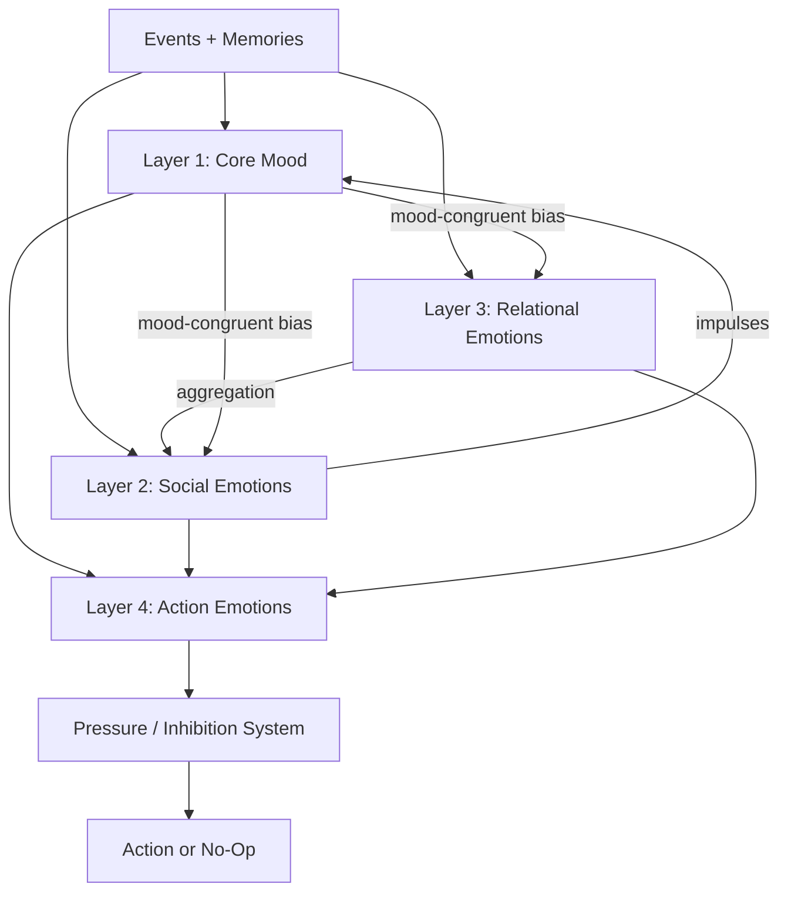

# Perfectman Emotion Architecture

## Purpose

This is the canonical specification for Perfectman's emotion model, initiative bootstrapping, and simulation health systems. It replaces the emotion sections in [`application.md`](application.md) and the behavioral model in [`social-presence.md`](social-presence.md) with a complete, implementable design grounded in Russell's Circumplex Model of Affect (1980).

## Foundation: Russell's Circumplex as Mathematical Substrate

All affective states exist on a 2D plane defined by two orthogonal axes: **valence** (pleasure-displeasure, x-axis, range -1.0 to +1.0) and **arousal** (activation-deactivation, y-axis, range 0.0 to 1.0).

Emotional transitions follow **angular adjacency** on the circumplex. Moving smoothly around the circle is natural; teleporting across it requires a severe event.

### Circumplex Reference Positions

```text
  0 degrees: happy           (V=+1.0, A=0.5)
 30 degrees: excited         (V=+0.87, A=0.75)
 60 degrees: alert           (V=+0.5, A=0.93)
 90 degrees: tense           (V=0.0, A=1.0)
120 degrees: nervous         (V=-0.5, A=0.93)
150 degrees: upset           (V=-0.87, A=0.75)
180 degrees: sad             (V=-1.0, A=0.5)
210 degrees: depressed       (V=-0.87, A=0.25)
240 degrees: bored           (V=-0.5, A=0.07)
270 degrees: calm            (V=0.0, A=0.0)
300 degrees: serene          (V=+0.5, A=0.07)
330 degrees: content         (V=+0.87, A=0.25)
```

The angular distance between two emotional states determines how much energy (event magnitude) is required to transition between them. Moving 30 degrees is natural drift. Moving 180 degrees requires a severe event.

## Architecture Overview



Four layers, bottom-up:

1. **Core Mood**: slow background state on the circumplex (valence x arousal)
2. **Social Emotions**: 15 emotions about social position in the group
3. **Relational Emotions**: 12 dimensions per agent-pair, asymmetric
4. **Action Emotions**: 15 behavioral tendencies computed each cycle, feeding pressure/inhibition

---

## Layer 1: Core Mood

### Schema

```typescript
interface CoreMood {
  valence: number;            // -1.0 to +1.0
  arousal: number;            // 0.0 to 1.0
  stability: number;          // 0.0 to 1.0 (volatile to steady)
  energy: number;             // 0.0 to 1.0 (exhausted to full)
  circumplex_angle: number;   // atan2(arousal - 0.5, valence)
  circumplex_radius: number;  // distance from origin (intensity)
  momentum_valence: number;   // rate of change per cycle
  momentum_arousal: number;   // rate of change per cycle
}
```

### Quadrant Behavioral Mapping

```text
Quadrant I  (V > 0, A > 0.5): APPROACH + ENGAGE
  High initiative, public engagement, generous interpretation.
  Masking is LOW (comfortable being visible).

Quadrant II (V < 0, A > 0.5): FIGHT + DEFEND
  High reactivity, defensive, hostile interpretation.
  Masking is TESTED (high pressure to break masking).

Quadrant III (V < 0, A < 0.5): WITHDRAW + RUMINATE
  Low initiative, lurking, private-channel drift.
  Masking is HIGH (hides behind quietness).

Quadrant IV (V > 0, A < 0.5): OBSERVE + DRIFT
  Low reactivity, content, generous interpretation.
  May miss important signals.
```

### Update Rules: Damped Spring with Angular Constraint

Mood moves like a damped spring toward a target set by impulses. It never jumps.

```python
def update_core_mood(mood, impulses, persona, dt):
    # Step 1: Compute raw target from impulses
    target_v = mood.valence
    target_a = mood.arousal
    for imp in impulses:
        weight = imp.magnitude * persona.emotional_reactivity
        target_v += imp.delta_valence * weight
        target_a += imp.delta_arousal * weight
    target_v = clamp(target_v, -1.0, 1.0)
    target_a = clamp(target_a, 0.0, 1.0)

    # Step 2: Angular adjacency constraint
    current_angle = atan2(mood.arousal - 0.5, mood.valence)
    target_angle = atan2(target_a - 0.5, target_v)
    angle_diff = normalize_angle(target_angle - current_angle)
    max_angle = persona.max_mood_rotation
    if abs(angle_diff) > max_angle:
        clamped_angle = current_angle + sign(angle_diff) * max_angle
        radius = sqrt(target_v**2 + (target_a - 0.5)**2)
        target_v = radius * cos(clamped_angle)
        target_a = 0.5 + radius * sin(clamped_angle)

    # Step 3: Inertia (higher stability = slower drift)
    inertia = persona.mood_inertia * mood.stability
    new_v = mood.valence + (target_v - mood.valence) * inertia * dt
    new_a = mood.arousal + (target_a - mood.arousal) * inertia * dt

    # Step 4: Energy caps arousal ceiling
    arousal_ceiling = 0.3 + 0.7 * mood.energy
    new_a = min(new_a, arousal_ceiling)

    # Step 5: Stability decay under pressure, slow recovery
    impulse_pressure = sum(abs(i.magnitude) for i in impulses)
    new_stability = clamp(
        mood.stability - impulse_pressure * 0.1 + 0.02 * dt,
        0.1,
        persona.baseline_stability
    )

    # Step 6: Energy decay from processing
    energy_cost = len(impulses) * 0.01 + impulse_pressure * 0.02
    new_energy = clamp(mood.energy - energy_cost + persona.energy_regen * dt, 0.0, 1.0)

    return CoreMood(
        valence=new_v, arousal=new_a,
        stability=new_stability, energy=new_energy,
        momentum_valence=new_v - mood.valence,
        momentum_arousal=new_a - mood.arousal
    )
```

Shock override: events with magnitude > 0.8 temporarily increase max_rotation by up to pi/4, allowing plausible emotional shock (content to distressed in one cycle).

### Mood Impulse Schema

```typescript
interface MoodImpulse {
  source: 'event' | 'memory' | 'social_signal' | 'rumination' | 'contagion' | 'drift';
  delta_valence: number;
  delta_arousal: number;
  magnitude: number;
  source_event_id?: string;
  source_person_id?: string;
}
```

### Event-to-Impulse Table

| Event | delta_valence | delta_arousal | magnitude |
|-------|-------------|-------------|-----------|
| Direct mention answered | +0.1 | +0.1 | 0.3 |
| Direct mention ignored | -0.2 | +0.15 | 0.5 |
| Public praise | +0.3 | +0.2 | 0.6 |
| Public humiliation | -0.4 | +0.3 | 0.8 |
| Private channel invite (liked person) | +0.2 | +0.1 | 0.4 |
| Private channel invite (neutral) | +0.05 | +0.1 | 0.2 |
| Excluded from private channel | -0.3 | +0.25 | 0.7 |
| Someone you resent gets praised | -0.15 | +0.1 | 0.4 |
| Long silence (nothing happening) | -0.05 | -0.1 | 0.1 |
| Successful joke/reaction received | +0.2 | +0.1 | 0.3 |
| Being disagreed with publicly | -0.1 | +0.15 | 0.3 |
| Alliance signal from trusted person | +0.15 | +0.05 | 0.3 |
| Betrayal signal | -0.5 | +0.4 | 0.9 |
| Rumination (existing resentment) | -0.05 | +0.05 | 0.2 |
| Contagion (high-arousal nearby agent) | 0.0 | +0.08 | 0.15 |

The `magnitude` is multiplied by persona-specific sensitivity before applying. Bruno's `exclusion_sensitivity = 1.8` means "excluded from private channel" hits at 0.7 * 1.8 = 1.26 (clamped to 1.0).

### Mood-Congruent Perception Bias

Current mood distorts how agents interpret ambiguous events.

```python
def apply_mood_congruent_bias(interpretations, mood):
    for interp in interpretations:
        bias = 0.0
        if interp.valence_alignment == 'negative':
            if mood.valence < 0:
                bias = abs(mood.valence) * 0.3
            if mood.arousal > 0.6:
                bias += (mood.arousal - 0.6) * 0.2
        elif interp.valence_alignment == 'positive':
            if mood.valence > 0:
                bias = mood.valence * 0.2
            if mood.valence < -0.3:
                bias -= 0.15
        elif interp.valence_alignment == 'neutral':
            if mood.valence < -0.2 and mood.arousal > 0.5:
                bias -= 0.2
        interp.confidence = clamp(interp.confidence + bias, 0.0, 1.0)
    return interpretations
```

### Per-Persona Calibration

```typescript
interface PersonaMoodConfig {
  baseline_valence: number;
  baseline_arousal: number;
  baseline_stability: number;
  baseline_energy: number;
  emotional_reactivity: number;
  mood_inertia: number;
  max_mood_rotation: number;
  energy_regen: number;
  exclusion_sensitivity: number;
  praise_sensitivity: number;
  conflict_sensitivity: number;
  boredom_sensitivity: number;
  intimacy_sensitivity: number;
}
```

| Param | Goulart | Caio | Giovanni | Bruno | Matheus |
|-------|---------|------|----------|-------|---------|
| baseline_valence | +0.3 | +0.1 | +0.05 | -0.05 | +0.15 |
| baseline_arousal | 0.65 | 0.45 | 0.3 | 0.5 | 0.35 |
| baseline_stability | 0.5 | 0.8 | 0.85 | 0.4 | 0.75 |
| baseline_energy | 0.8 | 0.6 | 0.5 | 0.55 | 0.6 |
| emotional_reactivity | 1.3 | 0.7 | 0.5 | 1.5 | 0.6 |
| mood_inertia | 0.08 | 0.2 | 0.25 | 0.12 | 0.22 |
| max_mood_rotation | pi/4 | pi/8 | pi/10 | pi/5 | pi/8 |
| energy_regen | 0.04 | 0.03 | 0.025 | 0.03 | 0.03 |
| exclusion_sensitivity | 0.6 | 1.0 | 0.4 | 1.8 | 0.7 |
| praise_sensitivity | 1.2 | 0.6 | 0.5 | 1.0 | 0.5 |
| conflict_sensitivity | 0.5 | 1.0 | 0.3 | 1.4 | 0.4 |
| boredom_sensitivity | 1.5 | 0.7 | 0.4 | 0.8 | 0.6 |
| intimacy_sensitivity | 0.4 | 0.9 | 0.7 | 1.1 | 0.8 |

Goulart: volatile (inertia 0.08), wide rotation (pi/4), high reactivity (1.3). Bruno: highest reactivity (1.5), extreme exclusion sensitivity (1.8), low stability (0.4). Giovanni: most steady (stability 0.85, inertia 0.25), hardest to move. Caio: slow river (inertia 0.2, stability 0.8). Matheus: hard to read (stability 0.75, reactivity 0.6).

---

## Layer 2: Social Emotions

Social emotions are about position in the group, not directed at individuals. Each is positioned on the circumplex.

### Schema

```typescript
interface SocialEmotions {
  jealousy: number;           // 0.0-1.0  circumplex: V=-0.6, A=0.8
  envy: number;               // 0.0-1.0  circumplex: V=-0.5, A=0.6
  humiliation: number;        // 0.0-1.0  circumplex: V=-0.9, A=0.7
  pride: number;              // 0.0-1.0  circumplex: V=+0.6, A=0.7
  shame: number;              // 0.0-1.0  circumplex: V=-0.7, A=0.3
  affection: number;          // 0.0-1.0  circumplex: V=+0.8, A=0.4
  resentment: number;         // 0.0-1.0  circumplex: V=-0.8, A=0.4
  suspicion: number;          // 0.0-1.0  circumplex: V=-0.3, A=0.7
  admiration: number;         // 0.0-1.0  circumplex: V=+0.5, A=0.5
  contempt: number;           // 0.0-1.0  circumplex: V=-0.4, A=0.3
  neediness: number;          // 0.0-1.0  circumplex: V=-0.2, A=0.6
  socialAnxiety: number;      // 0.0-1.0  circumplex: V=-0.4, A=0.8
  fearOfExclusion: number;    // 0.0-1.0  circumplex: V=-0.6, A=0.9
  desireForStatus: number;    // 0.0-1.0  circumplex: V=+0.3, A=0.7
  desireForIntimacy: number;  // 0.0-1.0  circumplex: V=+0.6, A=0.3
}
```

### Trigger Rules

Each emotion has specific triggers, decay rates, and mood interaction thresholds.

```text
jealousy:
  triggers:
    person_you_like_creates_private_channel_with_other: +0.3
    person_you_like_replies_to_other_not_you: +0.15
    someone_gets_attention_you_wanted: +0.2
    private_channel_exists_you_are_not_in: +0.1
  decay_rate: 0.03
  mood_interaction: delta_V=-0.1 delta_A=+0.1 threshold=0.4

envy:
  triggers:
    other_agent_praised_publicly: +0.1
    other_agent_has_more_private_channels: +0.05
    other_agent_dominates_conversation: +0.1
    other_agent_gets_invited_you_dont: +0.2
  decay_rate: 0.02
  mood_interaction: delta_V=-0.05 delta_A=+0.05 threshold=0.3

humiliation:
  triggers:
    publicly_mocked: +0.5
    joke_at_expense_others_react_positively: +0.4
    mention_ignored_while_others_answered: +0.3
    failed_action_visible_to_others: +0.2
    revealed_vulnerability_in_public: +0.3
  decay_rate: 0.01
  mood_interaction: delta_V=-0.2 delta_A=+0.15 threshold=0.2

pride:
  triggers:
    own_joke_gets_positive_reactions: +0.2
    praised_publicly: +0.3
    successfully_defended_position: +0.25
    someone_seeks_your_private_channel: +0.15
  decay_rate: 0.04
  mood_interaction: delta_V=+0.1 delta_A=+0.05 threshold=0.3

shame:
  triggers:
    said_something_embarrassing: +0.3
    revealed_neediness_publicly: +0.25
    caught_being_inconsistent: +0.2
    apologized_publicly: +0.1
  decay_rate: 0.015
  mood_interaction: delta_V=-0.15 delta_A=-0.1 threshold=0.2

affection:
  triggers:
    warm_reply_from_liked_person: +0.2
    included_in_private_channel: +0.15
    someone_defends_you: +0.25
    casual_pleasant_interaction: +0.05
  decay_rate: 0.02
  mood_interaction: delta_V=+0.1 delta_A=-0.05 threshold=0.2

resentment:
  triggers:
    ignored_repeatedly: +0.15
    treated_unfairly_in_group: +0.2
    someone_takes_credit: +0.15
    exclusion_from_activity: +0.2
    rumination_on_past_slight: +0.05
  decay_rate: 0.008
  mood_interaction: delta_V=-0.1 delta_A=+0.05 threshold=0.3

suspicion:
  triggers:
    agents_go_quiet_simultaneously: +0.15
    someone_active_privately_but_public_silent: +0.2
    evasive_answer_detected: +0.1
    private_channel_created_without_you: +0.15
    tone_shift_without_explanation: +0.1
  decay_rate: 0.025
  mood_interaction: delta_V=-0.05 delta_A=+0.1 threshold=0.3

admiration:
  triggers:
    impressive_public_statement_by_other: +0.15
    other_handles_conflict_well: +0.1
    other_demonstrates_social_power: +0.1
  decay_rate: 0.03
  mood_interaction: delta_V=+0.05 delta_A=+0.03 threshold=0.2

contempt:
  triggers:
    other_agent_embarrasses_self: +0.1
    other_agent_acts_needy_publicly: +0.15
    repeated_weak_contributions: +0.05
  decay_rate: 0.02
  mood_interaction: delta_V=-0.03 delta_A=-0.05 threshold=0.3

neediness:
  triggers:
    long_time_without_interaction: +0.1
    others_active_but_not_with_you: +0.15
    unanswered_mentions_accumulate: +0.2
    feeling_excluded_from_group_activity: +0.15
  decay_rate: 0.04
  mood_interaction: delta_V=-0.1 delta_A=+0.1 threshold=0.4

socialAnxiety:
  triggers:
    about_to_speak_in_active_channel: +0.1
    recent_public_embarrassment: +0.2
    unfamiliar_social_configuration: +0.1
    high_stakes_public_moment: +0.15
  decay_rate: 0.05
  mood_interaction: delta_V=-0.05 delta_A=+0.15 threshold=0.3

fearOfExclusion:
  triggers:
    private_channel_created_without_you: +0.3
    noticed_others_privately_active: +0.2
    public_silence_while_others_chat: +0.15
    invitation_revoked: +0.4
    two_people_go_quiet_simultaneously: +0.1
  decay_rate: 0.012
  mood_interaction: delta_V=-0.15 delta_A=+0.2 threshold=0.2

desireForStatus:
  triggers:
    someone_dominates_conversation: +0.1
    feeling_irrelevant_in_group: +0.15
    opportunity_to_show_competence: +0.1
    someone_challenges_you_publicly: +0.2
  decay_rate: 0.03
  mood_interaction: delta_V=+0.03 delta_A=+0.1 threshold=0.3

desireForIntimacy:
  triggers:
    warm_private_interaction: +0.15
    public_channel_feels_impersonal: +0.1
    trusted_person_is_online: +0.1
    lonely_after_extended_public_chat: +0.1
  decay_rate: 0.03
  mood_interaction: delta_V=+0.05 delta_A=-0.05 threshold=0.3
```

### Update Cycle

```python
def update_social_emotions(emotions, events, mood, persona, dt):
    mood_impulses = []
    for emotion_name, config in SOCIAL_EMOTION_TRIGGERS.items():
        current = getattr(emotions, emotion_name)
        delta = 0.0
        for event in events:
            for trigger_type, trigger_delta in config['triggers']:
                if event.matches(trigger_type):
                    delta += trigger_delta * persona.get_sensitivity(emotion_name)

        new_val = current + delta
        new_val -= config['decay_rate'] * dt

        # Mood-congruent amplification
        emotion_position = EMOTION_CIRCUMPLEX_POSITIONS[emotion_name]
        alignment = compute_alignment(mood, emotion_position)
        if alignment > 0:
            new_val += alignment * 0.02
            new_val += config['decay_rate'] * dt * alignment * 0.5

        new_val = clamp(new_val, 0.0, 1.0)
        setattr(emotions, emotion_name, new_val)

        # Generate mood impulse if above threshold
        mi = config['mood_interaction']
        if new_val > mi['threshold'] and delta > 0:
            mood_impulses.append(MoodImpulse(
                source='social_emotion',
                delta_valence=mi['delta_valence'] * (new_val - mi['threshold']),
                delta_arousal=mi['delta_arousal'] * (new_val - mi['threshold']),
                magnitude=new_val * 0.5
            ))
    return emotions, mood_impulses
```

### Per-Persona Social Emotion Sensitivity

| Emotion | Goulart | Caio | Giovanni | Bruno | Matheus |
|---------|---------|------|----------|-------|---------|
| jealousy | 0.5 | 0.8 | 0.3 | 1.5 | 0.7 |
| envy | 0.4 | 0.5 | 0.3 | 1.2 | 0.6 |
| humiliation | 0.8 | 1.0 | 0.4 | 1.6 | 0.5 |
| pride | 1.5 | 0.6 | 0.4 | 0.8 | 0.7 |
| shame | 0.3 | 0.9 | 0.6 | 1.3 | 0.5 |
| affection | 0.5 | 0.8 | 0.7 | 1.0 | 0.6 |
| resentment | 0.6 | 0.7 | 0.3 | 1.5 | 0.5 |
| suspicion | 0.4 | 1.0 | 0.5 | 1.3 | 1.2 |
| admiration | 0.3 | 0.7 | 0.8 | 0.6 | 0.5 |
| contempt | 1.0 | 0.4 | 0.2 | 0.5 | 0.8 |
| neediness | 0.2 | 0.5 | 0.3 | 1.4 | 0.3 |
| socialAnxiety | 0.2 | 0.7 | 0.9 | 1.2 | 0.4 |
| fearOfExclusion | 0.3 | 0.6 | 0.4 | 1.8 | 0.5 |
| desireForStatus | 1.5 | 0.5 | 0.2 | 0.8 | 1.0 |
| desireForIntimacy | 0.3 | 0.8 | 0.6 | 1.0 | 0.9 |

---

## Layer 3: Relational Emotions

Per-person emotional state. Inherently asymmetric: A can admire B while B resents A.

### Schema

```typescript
interface RelationalState {
  subject_agent_id: string;
  target_agent_id: string;
  trust: number;                // -1.0 to +1.0
  affection: number;            // -1.0 to +1.0
  resentment: number;           // 0.0 to 1.0
  attraction: number;           // 0.0 to 1.0
  suspicion: number;            // 0.0 to 1.0
  admiration: number;           // 0.0 to 1.0
  envy: number;                 // 0.0 to 1.0
  comfort: number;              // 0.0 to 1.0
  threat: number;               // 0.0 to 1.0
  curiosity: number;            // 0.0 to 1.0
  desireForCloseness: number;   // 0.0 to 1.0
  desireForDistance: number;     // 0.0 to 1.0
  interaction_count: number;
  last_interaction_at: string;
  last_positive_at: string;
  last_negative_at: string;
}
```

### Update Rules

```text
trust:
  positive: target_included_me (+0.1), target_defended_me (+0.15), target_shared_secret (+0.1),
            target_kept_secret (+0.05), target_replied_warmly (+0.03), consistent_positive (+0.02)
  negative: target_excluded_me (-0.15), target_mocked_me (-0.2), target_revealed_secret (-0.3),
            target_created_channel_without_me (-0.1), target_ignored_mention (-0.05),
            target_allied_with_rival (-0.1)
  decay_toward: 0.0
  decay_rate: 0.005

affection:
  positive: pleasant_private_conversation (+0.1), target_showed_vulnerability (+0.12),
            target_sought_my_company (+0.08), target_laughed_at_joke (+0.05),
            shared_moment_private (+0.07)
  negative: target_was_cold (-0.08), target_chose_other (-0.1), target_dismissed_me (-0.15)
  decay_toward: 0.0
  decay_rate: 0.008

resentment:
  increase: target_ignored_me (+0.08), target_humiliated_me (+0.2), target_excluded_me (+0.15),
            target_took_credit (+0.12), target_allied_against_me (+0.1),
            rumination_about_target (+0.03)
  decrease: target_apologized (-0.15), target_included_me (-0.05), target_praised_me (-0.08)
  decay_toward: 0.0
  decay_rate: 0.003
```

### Asymmetry Mechanism

Same event, different processing per agent.

```python
def process_interaction(subject, target_id, event, mood, social_emotions, persona):
    rel = subject.relational_states[target_id]
    delta = RelationalDelta()
    for dim_name, rules in RELATIONAL_UPDATE_RULES.items():
        raw_change = 0.0
        for trigger, value in rules['all_triggers']:
            if event.matches(trigger, target_id):
                raw_change += value

        raw_change *= persona.relational_sensitivity(dim_name)

        # Mood-congruent distortion
        if raw_change < 0 and mood.valence < 0:
            raw_change *= (1.0 + abs(mood.valence) * 0.5)
        if raw_change > 0 and mood.valence < -0.3:
            raw_change *= 0.5

        # Social emotion amplification
        if dim_name == 'resentment' and social_emotions.fearOfExclusion > 0.5:
            raw_change *= 1.5
        if dim_name == 'suspicion' and social_emotions.suspicion > 0.4:
            raw_change *= 1.3

        setattr(delta, dim_name, raw_change)
    return delta
```

Example: Caio ignores Bruno's message but reacts to Goulart's.

- Bruno: fearOfExclusion=0.7, exclusion_sensitivity=1.8. "target_ignored_mention" fires at -0.05 * 1.8 = -0.09 trust. Resentment +0.08 * 1.5 (persona) * 1.5 (fear amplification) = +0.18. Massive delta.
- Caio: was in a private channel. No relational event toward Bruno. Zero delta.

Bruno feels humiliated by something Caio did not intend. This asymmetry is emergent.

### Memory-Emotion Feedback (Rumination)

```python
def rumination_cycle(agent, relational_states, memories, mood, dt):
    impulses = []
    for memory in memories:
        if not memory.unresolved:
            continue

        rumination_prob = (0.1 + abs(min(mood.valence, 0)) * 0.3
                         + mood.arousal * 0.2) * agent.persona.rumination_tendency
        if random() > rumination_prob:
            continue

        target_id = memory.subject_agent_ids[0] if memory.subject_agent_ids else None
        if target_id and target_id in relational_states:
            rel = relational_states[target_id]
            if memory.emotional_tone in ('resentful', 'humiliated', 'suspicious'):
                rel.resentment = min(rel.resentment + 0.02, 1.0)
                rel.trust = max(rel.trust - 0.01, -1.0)
                impulses.append(MoodImpulse(
                    source='rumination', delta_valence=-0.03,
                    delta_arousal=+0.02, magnitude=0.15
                ))

        memory.last_ruminated_at = now()
        memory.rumination_count += 1
    return relational_states, impulses
```

Rumination can intensify emotion. It must not count as new evidence.

### Aggregation: Relational to Social

```python
def aggregate_relational_to_social(relational_states, social_emotions):
    all_resentments = [r.resentment for r in relational_states.values()]
    social_emotions.resentment = max(
        social_emotions.resentment * 0.7,
        max(all_resentments) * 0.8 if all_resentments else 0
    )

    exclusion_signals = sum(
        1 for r in relational_states.values()
        if r.trust < -0.2 or r.desireForDistance > 0.5
    )
    social_emotions.fearOfExclusion = max(
        social_emotions.fearOfExclusion * 0.8,
        min(exclusion_signals * 0.15, 1.0)
    )

    positive_affections = [r.affection for r in relational_states.values() if r.affection > 0]
    if positive_affections:
        social_emotions.affection = max(
            social_emotions.affection * 0.7,
            sum(positive_affections) / len(positive_affections) * 0.6
        )
    return social_emotions
```

---

## Layer 4: Action Emotions

Behavioral tendencies derived each cycle from Layers 1-3. Not stored independently.

### Schema

```typescript
interface ActionEmotions {
  defensiveness: number;
  warmth: number;
  jealous_inspection: number;
  shame_withdrawal: number;
  resentful_coldness: number;
  curious_approach: number;
  anxious_overreach: number;
  prideful_performance: number;
  vulnerable_retreat: number;
  contemptuous_dismissal: number;
  strategic_patience: number;
  impulsive_provocation: number;
  comfort_seeking: number;
  dominance_assertion: number;
  repair_impulse: number;
}
```

### Computation

```python
def compute_action_emotions(mood, social, relational, context):
    ae = ActionEmotions()

    speaker_rel = relational.get(context.last_speaker_id)
    target_rel = relational.get(context.potential_reply_target_id)

    ae.defensiveness = clamp(
        social.humiliation * 0.4
        + (speaker_rel.threat * 0.3 if speaker_rel else 0)
        + max(0, -mood.valence) * 0.2
        + mood.arousal * 0.1, 0.0, 1.0)

    ae.warmth = clamp(
        social.affection * 0.3 + social.desireForIntimacy * 0.2
        + (target_rel.affection * 0.3 if target_rel else 0)
        + max(0, mood.valence) * 0.2, 0.0, 1.0)

    ae.jealous_inspection = clamp(
        social.jealousy * 0.4 + social.suspicion * 0.3
        + social.fearOfExclusion * 0.2 + mood.arousal * 0.1, 0.0, 1.0)

    ae.shame_withdrawal = clamp(
        social.shame * 0.4 + social.humiliation * 0.3
        + social.socialAnxiety * 0.2
        + max(0, -mood.valence) * 0.1 * (1 - mood.arousal), 0.0, 1.0)

    ae.resentful_coldness = clamp(
        social.resentment * 0.3
        + max((r.resentment for r in relational.values()), default=0) * 0.4
        + social.contempt * 0.2
        + max(0, -mood.valence) * 0.1, 0.0, 1.0)

    ae.curious_approach = clamp(
        social.desireForIntimacy * 0.2
        + max((r.curiosity for r in relational.values()), default=0) * 0.3
        + max(0, mood.valence) * 0.2
        + (1 - social.socialAnxiety) * 0.15
        + mood.energy * 0.15, 0.0, 1.0)

    ae.anxious_overreach = clamp(
        social.neediness * 0.4 + social.socialAnxiety * 0.2
        + social.fearOfExclusion * 0.2 + mood.arousal * 0.2, 0.0, 1.0)

    ae.prideful_performance = clamp(
        social.pride * 0.3 + social.desireForStatus * 0.3
        + social.contempt * 0.1 + mood.arousal * 0.15
        + max(0, mood.valence) * 0.15, 0.0, 1.0)

    ae.vulnerable_retreat = clamp(
        social.shame * 0.3 + (1 - mood.energy) * 0.2
        + social.fearOfExclusion * 0.2
        + max((r.desireForDistance for r in relational.values()), default=0) * 0.2
        + max(0, -mood.valence) * 0.1, 0.0, 1.0)

    ae.contemptuous_dismissal = clamp(
        social.contempt * 0.5 + social.pride * 0.2
        + social.admiration * (-0.3) + (1 - mood.arousal) * 0.1, 0.0, 1.0)

    ae.strategic_patience = clamp(
        social.suspicion * 0.2 + (1 - mood.arousal) * 0.3
        + mood.stability * 0.3 + social.desireForStatus * 0.2, 0.0, 1.0)

    ae.impulsive_provocation = clamp(
        mood.arousal * 0.3 + (1 - mood.stability) * 0.2
        + social.resentment * 0.2 + (1 - mood.energy) * 0.1
        + social.contempt * 0.2, 0.0, 1.0)

    ae.comfort_seeking = clamp(
        social.desireForIntimacy * 0.3 + max(0, -mood.valence) * 0.2
        + social.fearOfExclusion * 0.15
        + (0.2 if any(r.trust > 0.3 and r.comfort > 0.3 for r in relational.values()) else 0)
        + social.neediness * 0.15, 0.0, 1.0)

    ae.dominance_assertion = clamp(
        social.desireForStatus * 0.3 + social.pride * 0.2
        + mood.arousal * 0.2
        + max((r.threat for r in relational.values()), default=0) * 0.15
        + max(0, mood.valence) * 0.15, 0.0, 1.0)

    ae.repair_impulse = clamp(
        social.shame * 0.2 + social.affection * 0.3
        + (max(0, target_rel.affection - target_rel.resentment) * 0.3 if target_rel else 0)
        + max(0, mood.valence) * 0.2, 0.0, 1.0)

    return ae
```

### Action-to-Pressure Mapping

```text
defensiveness:
  pressures: urgeToDefendSelf (public, 0.8), urgeToReply (public, 0.6), urgeToMock (public, 0.3)
  inhibitions: fearOfEscalating (0.4)

warmth:
  pressures: urgeToReply (either, 0.7), urgeToCreatePrivateChannel (private, 0.3), urgeToReactWithEmoji (public, 0.5)

jealous_inspection:
  pressures: urgeToAskWhatIsGoingOn (public, 0.5), urgeToTestLoyalty (private, 0.4), urgeToCreatePrivateChannel (private, 0.3)
  inhibitions: fearOfLookingNeedy (0.6), desireToSeemChill (0.4)

shame_withdrawal:
  pressures: urgeToDisappear (hidden, 0.8), urgeToIgnore (hidden, 0.5)
  inhibitions: fearOfPublicEmbarrassment (0.9), uncertainty (0.5)

resentful_coldness:
  pressures: urgeToIgnore (hidden, 0.6), urgeToMock (public, 0.3), urgeToReactWithEmoji (public, 0.4)
  inhibitions: strategicPatience (0.3)

curious_approach:
  pressures: urgeToReply (either, 0.5), urgeToCreatePrivateChannel (private, 0.4), urgeToAskWhatIsGoingOn (either, 0.3)

anxious_overreach:
  pressures: urgeToReply (public, 0.7), urgeToAskWhatIsGoingOn (public, 0.6), urgeToApologize (either, 0.3)
  inhibitions: fearOfLookingNeedy (0.8), fearOfEscalating (0.4)

prideful_performance:
  pressures: urgeToPerformForPublic (public, 0.7), urgeToReply (public, 0.5), urgeToMock (public, 0.3)
  inhibitions: notWorthIt (0.2)

vulnerable_retreat:
  pressures: urgeToDisappear (hidden, 0.6), urgeToCreatePrivateChannel (private, 0.4)
  inhibitions: fearOfPublicEmbarrassment (0.7), avoidance (0.6)

contemptuous_dismissal:
  pressures: urgeToIgnore (hidden, 0.5), urgeToMock (public, 0.4), urgeToReactWithEmoji (public, 0.3)
  inhibitions: notWorthIt (0.5)

strategic_patience:
  pressures: (none)
  inhibitions: strategicPatience (0.8), waitingForSomeoneElse (0.5)

impulsive_provocation:
  pressures: urgeToMock (public, 0.6), urgeToEscalate (public, 0.5), urgeToChangeSubject (public, 0.3)

comfort_seeking:
  pressures: urgeToCreatePrivateChannel (private, 0.6), urgeToReply (private, 0.4), urgeToRecruitAlly (private, 0.3)
  inhibitions: fearOfLookingNeedy (0.4)

dominance_assertion:
  pressures: urgeToReply (public, 0.7), urgeToEscalate (public, 0.4), urgeToPerformForPublic (public, 0.5)

repair_impulse:
  pressures: urgeToApologize (private, 0.6), urgeToReply (either, 0.4), urgeToCreatePrivateChannel (private, 0.5)
  inhibitions: fearOfLookingNeedy (0.3), uncertainty (0.3)
```

Masking modifies visibility preference: high masking redirects public pressures to private or hidden.

### Complete Update Cycle

```text
1. Collect event impulses
2. Update Layer 2 social emotions from events
3. Update Layer 3 relational emotions from interactions (or rumination if no events)
4. Aggregate Layer 3 -> Layer 2
5. Social emotion impulses -> Layer 1
6. Update Layer 1 core mood (damped spring + angular constraint)
7. Compute Layer 4 action emotions from Layers 1-3
8. Generate pressure candidates -> feed into pressure/inhibition system
```

### Anti-Runaway Rules

- Stability floor: 0.1 minimum (never fully chaotic)
- All emotions cap at 1.0
- Rumination cooldown: max once per 3 cycles per memory
- Negative contagion dampened vs positive (0.08 vs 0.12 max)
- Energy circuit breaker: below 0.2 -> arousal capped at 0.4, reactivity halved

### LLM Translation

The agent prompt receives natural language, never numbers.

```text
Numeric state: V=-0.2, A=0.65, suspicion=0.6, fearOfExclusion=0.5
Prompt: "You feel tense and slightly guarded. Not angry, but watchful.
         You notice a rising suspicion that things are happening without you."

Numeric state: resentment toward Caio = 0.55, jealous_inspection = 0.6, fearOfLookingNeedy = 0.5
Prompt: "You want to ask Caio what is going on, but something holds you back.
         You do not want to look like you care too much."
```

---

## Bootstrapping: Initiative Engine and Seed States

### Seed State Schema

```typescript
interface AgentSeedState {
  agentId: string;
  persona: PersonaConfig;
  coreMood: CoreMood;
  socialEmotions: SocialEmotions;
  relationalEmotions: Record<string, RelationalState>;
  personalityThresholds: {
    attention: {
      mentionSensitivity: number;
      ambientNoticeProbability: number;
      exclusionSensitivity: number;
      conflictSensitivity: number;
    };
    pressure: {
      boredomAccumulationRate: number;
      boredomThreshold: number;
      ruminationRate: number;
      statusNeedBaseline: number;
      affiliationNeedBaseline: number;
    };
    inhibition: {
      publicSpeakingThreshold: number;
      needinessAvoidance: number;
      maskingStrength: number;
      strategicPatience: number;
      escalationAvoidance: number;
    };
    cadence: {
      typicalResponseDelay: [number, number];
      morningActivityBias: number;
      burstProbability: number;
      silenceTolerance: number;
    };
  };
  memories: {
    episodic: EpisodicMemory[];
    relationship: RelationshipMemory[];
    self: SelfMemory[];
    socialTheory: SocialTheory[];
  };
  pendingIntentions: PendingIntention[];
  presence: 'active' | 'semi_active' | 'lurking' | 'busy_elsewhere' | 'avoidant' | 'offline';
  initiativeAccumulators: {
    boredom: number;
    loneliness: number;
    curiosity: number;
    ruminationIntensity: number;
    statusHunger: number;
    affiliationHunger: number;
    unfinishedBusinessPressure: number;
  };
}
```

### Example Seed: Goulart

```text
coreMood: V=+0.3, A=0.7, stability=0.4, energy=0.8

personalityThresholds:
  attention: mentionSensitivity=0.95, ambientNotice=0.7, exclusion=0.5, conflict=0.8
  pressure: boredomRate=0.15 (fast), boredomThreshold=0.3 (low), rumination=0.05 (low),
            statusNeed=0.5, affiliationNeed=0.4
  inhibition: publicSpeaking=0.15 (very low), needinessAvoidance=0.6, masking=0.4,
              strategicPatience=0.2 (low), escalationAvoidance=0.2 (low)
  cadence: responseDelay=[500,5000] (fast), morningBias=0.4, burstProb=0.5, silenceTolerance=3

relationalEmotions:
  toward Caio: trust=0.6, affection=0.5, suspicion=0.15, familiarity=0.8
  toward Bruno: trust=0.5, affection=0.4, suspicion=0.1, familiarity=0.65
  toward Giovanni: trust=0.5, affection=0.3, curiosity=0.15, familiarity=0.5
  toward Matheus: trust=0.55, affection=0.35, suspicion=0.2, familiarity=0.55

memories:
  relationship: "Caio observes but rarely commits first. People listen when he does."
  relationship: "Bruno uses humor to deflect but takes things personally."
  relationship: "Giovanni is quiet but solid. Hard to pull into conversation."
  relationship: "Matheus plays it cool. Not sure what he is planning." (unresolved)
  self: "I am usually the one who keeps things alive."
  self: "People sometimes think I am aggressive when I am just direct."
  socialTheory: "Group goes quiet unless someone pushes. That someone is usually me."

initiativeAccumulators: boredom=0.25, statusHunger=0.3, curiosity=0.2
presence: active
```

### Example Seed: Bruno

```text
coreMood: V=+0.1, A=0.4, stability=0.3, energy=0.5

personalityThresholds:
  attention: mentionSensitivity=0.95, ambientNotice=0.65, exclusion=0.9 (hyper), conflict=0.7
  pressure: boredomRate=0.08, boredomThreshold=0.5, rumination=0.2 (HIGH),
            statusNeed=0.25, affiliationNeed=0.6 (high)
  inhibition: publicSpeaking=0.35, needinessAvoidance=0.7 (hates looking needy), masking=0.5,
              strategicPatience=0.3, escalationAvoidance=0.5
  cadence: responseDelay=[2000,15000], morningBias=0.3, burstProb=0.3, silenceTolerance=6

relationalEmotions:
  toward Caio: trust=0.55, affection=0.45, suspicion=0.2, desireForCloseness=0.5
  toward Goulart: trust=0.5, affection=0.4, admiration=0.35, envy=0.2
  toward Giovanni: trust=0.5, affection=0.3, comfort=0.4
  toward Matheus: trust=0.45, affection=0.3, suspicion=0.25

memories:
  relationship: "Caio is warm when he engages, but sometimes I wonder if he notices me." (unresolved)
  relationship: "Goulart runs the room. Sometimes I feel like I am performing for his approval." (unresolved)
  relationship: "Giovanni is chill. Does not judge."
  relationship: "Matheus keeps things private. Not always sure if I am included." (unresolved)
  self: "I make people laugh. That is how I stay relevant."
  self: "When I go quiet, people do not always check on me."
  socialTheory: "Caio and Goulart have a tighter bond. I am on the edge of the inner circle." (unresolved)

pendingIntentions: "Drop a joke early to set the tone." (urgency=low, source=habit)
initiativeAccumulators: boredom=0.15, loneliness=0.2, affiliationHunger=0.35, ruminationIntensity=0.1
presence: semi_active
```

### Data Pipeline: Historical Chat to Seed State

```text
Step 1: Reply graph analysis (from chat history)
  For each pair: reply_ratio, reply_latency, mention_ratio
  High ratio + low latency = high familiarity + affection
  Asymmetric ratios = potential neediness/resentment

Step 2: Tone analysis (LLM-assisted, 50-100 messages per pair)
  Rate: warmth, teasing/rivalry, tension, deference, admiration, avoidance
  Map to relational emotion fields

Step 3: Peer description processing (from peer-written personality descriptions)
  Extract: behavioral traits, relationship beliefs, self-beliefs, social theories
  Map to: threshold calibration, memories

Step 4: Frequency pattern analysis (from timestamps)
  Messages per hour -> morningActivityBias
  Inter-message times -> typicalResponseDelay
  Burst detection -> burstProbability
  Silence periods -> silenceTolerance

Step 5: Social graph inference (from reply graph)
  Closeness clusters -> affection, comfort, desireForCloseness
  Competitive pairs -> threat, admiration, envy
  Hub agents -> desireForStatus calibration
  Peripheral agents -> fearOfExclusion calibration
```

Output: hand-tunable JSON seed files per agent.

### Initiative Source Taxonomy

```text
Social Needs:
  affinity         accumulates with time away from liked person, decays with warm exchange
  loneliness       accumulates with silence in all channels, decays with any contact
  intimacy         accumulates when public feels performative, decays when private channel opened

Memory Needs:
  pendingIntention   accumulates with time since stored, decays when acted on
  unresolvedQuestion accumulates with unresolved memory count, decays when resolved
  rumination         accumulates with unresolved memories * ruminationRate, decays slowly (0.97/cycle)

Emotional Needs:
  resentment       accumulates with rumination on unfairness, decays with repair/positive event
  attraction       accumulates with proximity/recall of liked person, decays with distance
  anxiety          accumulates with unresolved ambiguity, decays with reassurance
  comfortSeeking   accumulates with negative mood + recall of safe person, decays with contact

Stimulation Needs:
  boredom          accumulates with channel silence, decays sharply (0.6x) on new events
  mischief         accumulates with high energy + boredom, decays when event created
  habit            time-of-day pattern matching from historical chat frequency

Strategic Needs:
  statusMove       accumulates with perceived status threat or opportunity, decays with recognition
  alliance         accumulates with shared threat interpretation, decays when alliance formed
  testing          accumulates with relationship uncertainty, decays when test resolved
  repair           accumulates with awareness of damaged relationship, decays when attempt made
```

### Initiative Scoring

```python
def score_initiative_candidates(agent, pulses_since_last_action):
    candidates = []
    acc = agent.initiative_accumulators
    thr = agent.personality_thresholds

    if acc.boredom > thr.pressure.boredom_threshold:
        raw = acc.boredom
        personality_mod = 1.0 + thr.pressure.status_need_baseline * 0.3
        time_mod = min(1.0 + log2(1 + pulses_since_last_action) * 0.15, 2.0)
        candidates.append(Candidate('boredom', raw * personality_mod * time_mod))

    if acc.affiliation_hunger > 0.3:
        target = find_highest_desire_for_closeness(agent.relational_emotions)
        raw = acc.affiliation_hunger * agent.relational_emotions[target].desireForCloseness
        candidates.append(Candidate('affinity', raw * thr.pressure.affiliation_need_baseline * time_mod))

    if acc.rumination_intensity > 0.25:
        for memory in agent.unresolved_relationship_memories:
            raw = acc.rumination_intensity * 0.8
            candidates.append(Candidate('rumination', raw * thr.pressure.rumination_rate * 3.0))

    for intention in agent.pending_intentions:
        urgency_mult = {'low': 0.5, 'medium': 1.0, 'high': 1.5}[intention.urgency]
        candidates.append(Candidate('pending_intention', 0.4 * urgency_mult * time_mod))

    return sorted(candidates, key=lambda c: c.score, reverse=True)

def gate_initiative(top_candidate, agent):
    floor = agent.personality_thresholds.inhibition.public_speaking_threshold
    cooldown_penalty = 0.5 if agent.pulses_since_last_action < 2 else 0.0
    return 'proceed' if top_candidate.score - cooldown_penalty > floor else 'passive_drift'
```

### Accumulator Update (every pulse, no LLM)

```python
def update_accumulators(agent, world_state):
    t = agent.personality_thresholds.pressure
    silence = world_state.pulses_since_last_public_message

    if silence > 0:
        agent.accumulators.boredom += t.boredom_accumulation_rate
    else:
        agent.accumulators.boredom *= 0.6

    if world_state.pulses_since_agent_addressed(agent.id) > agent.cadence.silence_tolerance:
        agent.accumulators.loneliness += 0.05
    else:
        agent.accumulators.loneliness *= 0.8

    unresolved = len(agent.unresolved_relationship_memories)
    agent.accumulators.rumination_intensity += unresolved * t.rumination_rate * 0.05
    agent.accumulators.rumination_intensity *= 0.97

    agent.accumulators.affiliation_hunger += t.affiliation_need_baseline * 0.02
    agent.accumulators.affiliation_hunger *= 0.98

    if silence > 2:
        agent.accumulators.status_hunger += t.status_need_baseline * 0.03
    agent.accumulators.status_hunger *= 0.97

    # Clamp all to [0, 1]
    for key in agent.accumulators:
        agent.accumulators[key] = clamp(agent.accumulators[key], 0.0, 1.0)
```

### Cold Start: First 10 Minutes

Staggered arrival by personality:

```text
Pulse 0: Goulart arrives (active)
Pulse 2: Caio arrives (semi_active)
Pulse 3: Bruno arrives (semi_active)
Pulse 5: Matheus arrives (lurking)
Pulse 7: Giovanni arrives (lurking)
```

Arrival emits `presence_changed` event visible to all agents already present.

**Pulse 0-1: Goulart alone.** Seed boredom (0.25) + 1 pulse accumulation (0.15) = 0.40. Threshold = 0.3. Exceeded. Initiative fires. LLM receives: "You just opened the chat. No one else is here yet. You feel slightly bored and restless." Likely output: casual room-opener.

**Pulse 2-3: Caio and Bruno arrive.** They see Goulart's message via external event path. Caio notices with medium-high probability (ambientNotice=0.65 + familiarity boost). Bruno notices because exclusionSensitivity=0.9 primes awareness. If Caio replied to Goulart before Bruno spoke, Bruno's exclusion sensor activates mildly.

**Pulse 5-7: Matheus and Giovanni arrive lurking.** Neither speaks. Matheus stores observations. Giovanni may acknowledge with emoji. Their publicSpeakingThresholds are high enough that initiative cannot fire yet.

**Pulse 8-15: First dynamics form.** 2-3 messages exist. Memory system has first entries. Relational emotions have first micro-updates. Initiative engine has non-seed data.

Anti-patterns prevented:
- "Everyone posts simultaneously" — staggered arrival + different thresholds
- "Dead silence" — non-zero seed accumulators, Goulart's low boredom threshold
- "Artificial introductions" — perception packet says "you see X said Y", not "introduce yourself"
- "Everyone equally interested" — asymmetric relational seeds create differential attention
- "Pleasantry loops" — unresolved seed memories create latent tension from pulse 1

---

## Health and Homeostasis: Stagnation Detection and Breaking

### Detection Metrics

Seven metrics computed over sliding windows (W = 50 pulses), evaluated every 10 pulses.

```text
BDI (Behavioral Diversity Index):
  Shannon entropy of action type distribution per agent.
  Normalized: BDI / log2(|action_types|)
  STAGNATION: norm < 0.30 for 3+ consecutive windows

RDV (Relationship Dynamics Velocity):
  L2 norm of relational emotion vector change per pair.
  STAGNATION: global mean < 0.05 for 2+ windows
  FROZEN PAIR: delta < 0.02 for specific pair over 3+ windows

IGE (Interaction Graph Entropy):
  Shannon entropy of who-talks-to-whom distribution.
  STAGNATION: < 0.40 * log2(|agents| - 1)
  DOMINANCE: any agent > 50% of all received interactions

CUE (Channel Usage Entropy):
  Shannon entropy of per-agent channel distribution.
  STAGNATION: < 0.30 * log2(|active_channels|)
  ECHO CHAMBER: all members of private channel >70% internal for 20+ pulses

ERI (Emotional Range Index):
  std(valence) + std(arousal) over window.
  FLATLINE: < 0.05 per agent
  GLOBAL FLATLINE: mean < 0.08

ISD (Initiative Source Diversity):
  Shannon entropy of initiative source types.
  STAGNATION: < 0.25 for 2+ windows

CNS (Content Novelty Score):
  1.0 - mean(pairwise cosine similarity of message embeddings).
  STAGNATION: < 0.15 per agent
```

### Composite Stagnation Score

```text
score = 0.25 * (1 - RDV_norm)
      + 0.20 * (1 - ERI_norm)
      + 0.15 * (1 - BDI_norm)
      + 0.15 * (1 - IGE_norm)
      + 0.10 * (1 - CUE_norm)
      + 0.10 * (1 - ISD_norm)
      + 0.05 * (1 - CNS_norm)

YELLOW: > 0.60
RED:    > 0.75
CRITICAL: > 0.85
```

### Attractor State Detection

```text
1. Mutual Resentment Loop:
   Both agents resentment > 0.6 AND both increasing or stable.
   Sub-type: Cold War = resentment without interaction (worse).
   Detection: 2+ windows of sustained high mutual resentment.

2. Avoidance Deadlock:
   Pair has < 2 interactions in window + desireForDistance > 0.5 for either.
   Global: > 40% of pairs affected.

3. Dominance Collapse:
   One agent > 45% of public messages + 2+ agents retreated to lurking/avoidant/offline.

4. Echo Chamber:
   Private channel where all members >70% internal interactions + sentiment variance < 0.1.

5. Emotional Flatline:
   Agent valence range < 0.08, arousal range < 0.06, max social emotion delta < 0.05.
   Sub-types: neutral flatline (near baseline), negative flatline (stuck depressed), positive flatline.

6. Rumination Spiral:
   rumination_ratio > 0.70 (rumination events / (rumination + new evidence events))
   + resentment monotonically increasing toward a target.
```

### Breaking Mechanisms

Ordered by subtlety. Always prefer the most subtle intervention that matches the diagnosis.

#### 1. Memory Decay and Reinterpretation (very high subtlety)

When to use: rumination spirals, emotional flatlines, frozen relationships.

```python
def apply_memory_decay(agent, target_memories, config):
    for memory in target_memories:
        age = current_pulse - memory.last_reinforced_at
        if age > config.onset_threshold:  # default: 30 pulses
            memory.emotional_intensity *= config.rate  # default: 0.95
            memory.confidence *= config.confidence_rate  # default: 0.97
            if memory.emotional_intensity < 0.15:
                memory.status = 'faded'

def reinterpret_faded_memories(agent):
    for memory in agent.faded_memories:
        if agent.core_mood.valence > memory.original_valence + 0.3:
            memory.reinterpretation_available = True
            memory.reinterpretation_bias = 'charitable'
```

#### 2. Attention Perturbation (high subtlety)

When to use: avoidance deadlocks, echo chambers, interaction concentration.

```python
def apply_attention_perturbation(agent, config):
    for target in config.boost_targets:
        agent.attention_weights[target] += config.boost_amount  # default: +0.2
    for target in config.dampen_targets:
        agent.attention_weights[target] *= config.dampen_rate   # default: 0.8
    perturbation.ttl = config.duration  # default: 20 pulses
```

#### 3. Boredom-Driven Initiative Amplification (high subtlety)

When to use: global stagnation, low action rates, emotional flatline.

```python
def amplify_boredom_initiative(agent, config):
    if agent.pulses_since_meaningful_interaction > config.threshold:
        agent.pressure_modifiers['boredom'] += config.boost  # default: +0.3
        for source in get_unused_initiative_sources(agent):
            agent.initiative_source_weights[source] += 0.15
        agent.inhibition_modifier *= 0.85
```

#### 4. Misunderstanding Amplification (medium subtlety)

When to use: emotional flatline, frozen relationships, excessive consensus.

```python
def amplify_misunderstanding(interpretation_engine, config):
    interpretation_engine.uncertainty_modifier += config.boost  # default: +0.15
    for agent in all_agents:
        agent.interpretation_bias_strength *= config.personality_amplification  # default: 1.3
```

#### 5. Third-Party Gossip Catalyst (medium subtlety)

When to use: avoidance deadlocks, echo chambers, stale dyads.

```python
def enable_gossip_catalyst(deadlocked_pair, potential_catalysts, config):
    (a, b) = deadlocked_pair
    for c in potential_catalysts:
        if has_meaningful_relationship(c, a) and has_meaningful_relationship(c, b):
            c.pressure_modifiers['urgeToGossip'] += config.gossip_boost  # default: +0.25
            c.gossip_targets = [(a, b)]
            if shares_private_channel(c, a):
                c.topic_bias_toward[b] += config.topic_boost  # default: +0.2
            break
```

#### 6. Novel Event Injection (medium-low subtlety)

When to use: global stagnation at RED level.

Event types: new_public_channel_topic, controversial_topic_seed, callback_to_old_event, channel_merge_or_split. Injected as world events, not system messages.

#### 7. Personality Mutation (low subtlety)

Last resort. See Personality Mutation System below.

### Intervention Selection Logic

```text
RUMINATION_SPIRAL      -> memory_decay + attention_perturbation
FROZEN_PAIR            -> attention_perturbation + gossip_catalyst
AVOIDANCE_DEADLOCK     -> gossip_catalyst + boredom_amplification
ECHO_CHAMBER           -> attention_perturbation (boost outside) + misunderstanding_amplification
DOMINANCE_COLLAPSE     -> boredom_amplification (retreated agents) + attention_perturbation (dampen dominant)
EMOTIONAL_FLATLINE     -> misunderstanding_amplification + boredom_amplification
GLOBAL_STAGNATION:
  YELLOW               -> misunderstanding_amplification + boredom_amplification
  RED                  -> novel_event_injection + misunderstanding_amplification
  CRITICAL             -> novel_event_injection + personality_mutation_review
```

Cooldowns: memory_decay=10, attention_perturbation=20, boredom_amplification=15, misunderstanding=25, gossip=30, novel_event=50, mutation=100 pulses.

### Personality Mutation System

#### What Can Mutate

Mutable (thresholds): attention_weights, pressure_thresholds, inhibition_thresholds, masking_strength, public_private_preference, rumination_rate, delay_preference, conflict_tolerance, initiative_source_weights.

Immutable (identity): persona name, writing style, core archetype, base relationships, system prompt structure.

#### Triggers

```text
repeated_evidence:   same pattern 5+ times in 100 pulses
severe_event:        emotional_salience > 0.8 (single event)
accumulated_failure: 5+ failed attempts of same intent type in 80 pulses
accumulated_success: 5+ successes with positive outcome correlation > 0.6
```

#### Rate Limits

```text
max_mutations_per_agent_per_day: 1
max_mutations_per_agent_per_7_days: 3
max_total_drift_from_baseline: 0.40 per field
mutation_magnitude: 0.05 to 0.20 per event
cooldown_after_mutation: 50 pulses
```

#### Mutation Decay

If not reinforced for 80+ pulses, mutation decays at 0.02 per window toward baseline. Reinforcement resets the timer.

#### Spectator Visibility

Narrative summaries in recaps, never to agents:

```text
"Something shifted in Bruno this week. After being ignored by Caio five times,
he no longer tries to engage directly. He has become more likely to use private
channels and less likely to confront publicly."
```

#### Example Mutation

```text
Before: Bruno urgeToEscalate threshold=0.4, fearOfEscalating=0.3
Trigger: 6 confrontations with Caio, all resulting in being ignored (accumulated_failure)
Mutation: urgeToEscalate +0.10 (now 0.50), fearOfEscalating +0.08 (now 0.38),
          public_private_preference +0.10
After: Bruno less likely to confront Caio publicly. More likely to vent privately.
       Still feels resentment, but expression changes.
```

### Operator Health Dashboard

```text
Global:
  composite_stagnation_score (current, trend, alert_level, history)

Per-Agent:
  presence, core_mood, energy, BDI, ERI, ISD, CNS,
  active_mutations, rumination_ratio, pulses_since_last_action

Relationship Matrix:
  RDV per pair, dominant_emotion, frozen status, loop detection, interaction_count

Active Attractors:
  type, agents_involved, severity, detected_at, intervention_applied, result

Channel Health:
  message_rate, unique_participants, echo_chamber_score, topic_diversity

Intervention Log:
  pulse, type, target, reason, parameters, outcome

LLM Budget:
  calls_this_window, calls_per_agent, total_tokens, budget_remaining
```

Alert thresholds:

```text
agent_silent_40_pulses: yellow
resentment_loop: orange
dominance_collapse: red
global_flatline: red
intervention_failed_after_30_pulses: red
critical_stagnation: critical
```

Manual controls: force_memory_decay, inject_world_event, boost_boredom, reset_attention_weights, force_presence_change, trigger_gossip, apply_mutation, pause_auto_interventions, trigger_recap.

### Example Scenario: Bruno-Caio Death Spiral

```text
Pulse 100-150 (building):
  Bruno sends 3 mentions to Caio. Caio ignores all 3.
  Bruno resentment: 0.45 -> 0.58. Caio resentment: 0.30 -> 0.42.
  Bruno rumination: 8 events, 2 new evidence events.
  Bruno BDI drops: 0.45 -> 0.32.

Pulse 150 (detection):
  FROZEN_PAIR(Bruno, Caio): RDV = 0.018
  RUMINATION_SPIRAL(Bruno, target=Caio): ratio = 0.80
  Bruno ERI = 0.04. Composite stagnation = 0.52 (approaching yellow).

Pulse 150 (intervention):
  1. memory_decay on Bruno's 3 oldest hostile-Caio memories (intensity -15%)
  2. attention_perturbation: Bruno attention to Giovanni +0.2, to Caio x0.8
  3. gossip_catalyst: boost Matheus gossip motivation about Bruno-Caio

Pulse 150-180 (recovery):
  155: Bruno notices Giovanni for first time in 30 pulses
  158: Bruno replies to Giovanni
  162: Matheus tells Caio privately: "Bruno seems weird lately"
  165: Caio, prompted by gossip, now has repair pressure +0.1
  170: Bruno rumination_ratio drops to 0.55
  175: Bruno-Giovanni 3-message exchange. BDI recovers to 0.38
  180: Stagnation score drops 0.52 -> 0.41. Spiral broken.

No agent perceived system intervention.
```

## Sources / Related decisions

The Russell (1980) circumplex model of affect is the mathematical substrate of this document (Purpose). Citation re-verified 2026-08-27 (issue #98); row columns follow the research-pack source-map convention ([source-map.md](../research/goal-layer/source-map.md)).

| Topic | Source | Type / Version | Fetch Date | Verification Status |
| --- | --- | --- | --- | --- |
| Circumplex model of affect | https://doi.org/10.1037/h0077714 | Journal article (Russell, *Journal of Personality and Social Psychology* 39(6), 1161-1178, 1980) | 2026-08-27 | DOI metadata via Crossref/OpenAlex API; full text paywalled |
