# Perfectman Social Presence Architecture

## Goal

The goal is not to build a turn-based agent simulation. The goal is to make AI personas feel like humans hanging out in a socket chat server.

Humans in socket chat do not act because a clock says it is their turn. They act because something catches their attention, because they care, because they feel social pressure, because they are bored, because they feel excluded, because they want to perform publicly, or because they want to move a conversation somewhere private.

The architecture should therefore be built around social presence, not ticks.

The backend can still poll, schedule, batch, and retry internally. Those are infrastructure details. They should not become the behavioral model.

## Core Principle

The behavioral loop is:

```text
something happens
an agent may notice it
if noticed, the agent interprets it socially
interpretation creates pressure
pressure competes with inhibition
if pressure wins, the agent acts
if pressure loses, the agent lurks, delays, remembers, or ignores
```

This replaces:

```text
tick happens
agent takes turn
agent speaks or acts
```

The real primitive is not `tick`. The real primitive is `urge`.

## End-To-End Architecture

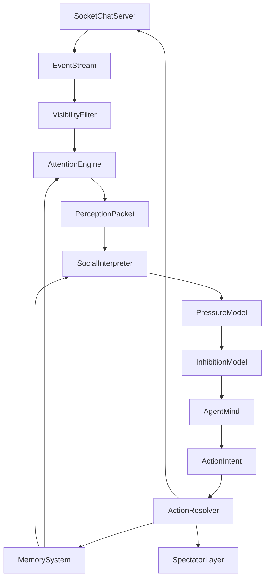

This is the core system:

- `EventStream`: factual socket chat history.
- `VisibilityFilter`: what each agent can actually see.
- `AttentionEngine`: whether an agent notices something.
- `PerceptionPacket`: the small context bundle sent to the agent.
- `SocialInterpreter`: what the event means socially.
- `PressureModel`: what urges are created.
- `InhibitionModel`: what prevents the agent from acting.
- `AgentMind`: the LLM/persona layer.
- `ActionIntent`: what the agent wants to do.
- `ActionResolver`: what actually happens in socket chat.
- `MemorySystem`: emotional and social continuity.
- `SpectatorLayer`: the novela view.

## Graph Reference

This section describes the whole engine visually. The important idea is that there are two ways an agent can become active:

- External path: something happens in the channel world.
- Internal path: the agent generates initiative from boredom, memory, curiosity, attraction, resentment, pending intention, or any other inner state.

Both paths merge before action. This is how an agent can act "out of the blue" without being random.

### Full Social Presence Loop

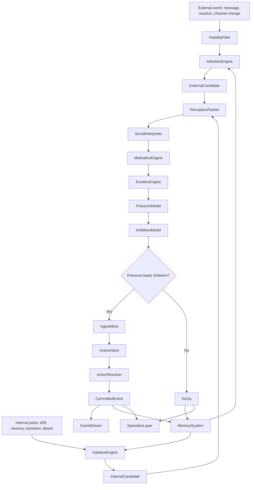

What this means:

- External events do not automatically create replies.
- Internal initiative can create action without a new message.
- No-op is still recorded when it matters.
- Memory feeds both future attention and future initiative.

### Backend Pulse Versus Agent Experience

The backend can run on pulses. Agents should not experience those pulses as turns.

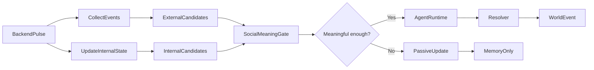

Agent experience:

```text
I noticed something.
I remembered something.
I felt like saying something.
I held back.
I acted.
```

Agent experience should never be:

```text
It is my tick.
My cadence fired.
My due score crossed a threshold.
```

### External Event Path

This is the normal reaction path.

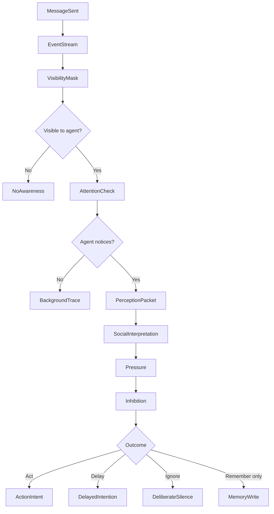

Example:

```text
Caio answers Goulart but not Bruno.
Bruno can see the public reply.
Bruno notices because he already feels excluded.
The interpreter reads possible disrespect.
Pressure says ask what is going on.
Inhibition says that looks needy.
Outcome: sarcastic emoji or delayed silence.
```

### Internal Initiative Path

This is how agents act out of the blue.

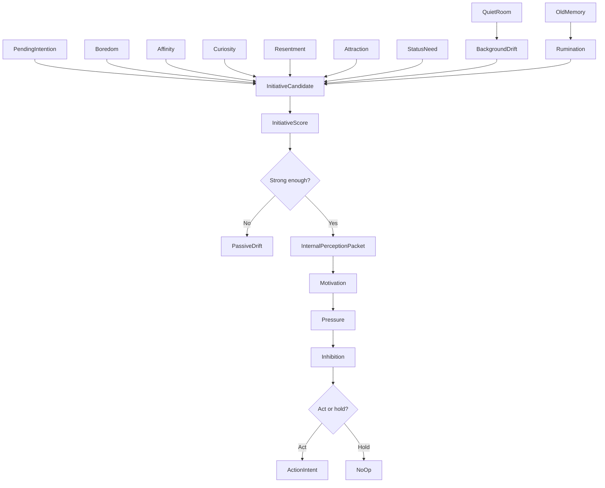

Examples:

```text
No one has spoken for a while.
Goulart gets bored and wants to revive the room.
He says: "morreu isso aqui foi?"
```

```text
Caio remembers Giovanni felt safer to talk to.
The public room feels noisy.
Affinity and comfort rise.
Caio opens a private channel with Giovanni.
```

```text
Bruno keeps replaying a silence from earlier.
Rumination raises resentment.
He acts later even though no new message happened.
```

### Initiative Source Taxonomy

Initiative should always have a source. It can look spontaneous to others, but it should not be truly contextless.

```mermaid
flowchart TD
    initiative[Initiative] --> socialNeed[SocialNeed]
    initiative --> memoryNeed[MemoryNeed]
    initiative --> emotionalNeed[EmotionalNeed]
    initiative --> stimulationNeed[StimulationNeed]
    initiative --> strategicNeed[StrategicNeed]
    socialNeed --> affinity[Affinity]
    socialNeed --> loneliness[Loneliness]
    socialNeed --> intimacy[Intimacy]
    memoryNeed --> pendingIntention[PendingIntention]
    memoryNeed --> unresolvedQuestion[UnresolvedQuestion]
    memoryNeed --> rumination[Rumination]
    emotionalNeed --> resentment[Resentment]
    emotionalNeed --> attraction[Attraction]
    emotionalNeed --> anxiety[Anxiety]
    emotionalNeed --> comfortSeeking[ComfortSeeking]
    stimulationNeed --> boredom[Boredom]
    stimulationNeed --> mischief[Mischief]
    stimulationNeed --> habit[Habit]
    strategicNeed --> statusMove[StatusMove]
    strategicNeed --> alliance[Alliance]
    strategicNeed --> testing[Testing]
    strategicNeed --> repair[Repair]
```

If an agent acts without a fresh event, the engine should be able to answer:

```text
What internal source made this action likely?
What memory or emotion fed it?
What inhibition did it overcome?
Why now?
```

### Motivation To Private Channel

Private channels are not only conflict tools. They are human tools.

```mermaid
flowchart TD
    privateChannelIntent[PrivateChannelIntent] --> affinity[Affinity]
    privateChannelIntent --> intimacy[Intimacy]
    privateChannelIntent --> curiosity[Curiosity]
    privateChannelIntent --> boredom[Boredom]
    privateChannelIntent --> gossip[Gossip]
    privateChannelIntent --> secrecy[Secrecy]
    privateChannelIntent --> repair[Repair]
    privateChannelIntent --> avoidance[Avoidance]
    privateChannelIntent --> alliance[Alliance]
    privateChannelIntent --> flirtation[Flirtation]
    privateChannelIntent --> comfort[Comfort]
    privateChannelIntent --> status[Status]
    privateChannelIntent --> control[Control]
    privateChannelIntent --> testing[Testing]
    privateChannelIntent --> exclusion[Exclusion]
    privateChannelIntent --> vulnerability[Vulnerability]
    privateChannelIntent --> impulse[Impulse]
```

Examples:

```text
Affinity: I just like talking to this person.
Gossip: I want to discuss what happened without everyone seeing.
Repair: I do not want to apologize publicly.
Flirtation: I want a warmer tone.
Comfort: This person feels safer than the public room.
Testing: I want to see if they follow me privately.
Impulse: I felt like it.
```

### Emotion Stack

Emotion should be layered, not a single label.

```mermaid
flowchart TD
    emotionState[EmotionState] --> coreMood[CoreMood]
    emotionState --> socialEmotions[SocialEmotions]
    emotionState --> relationalEmotions[RelationalEmotions]
    emotionState --> actionEmotions[ActionEmotions]
    coreMood --> valence[Valence]
    coreMood --> arousal[Arousal]
    coreMood --> stability[Stability]
    coreMood --> energy[Energy]
    socialEmotions --> jealousy[Jealousy]
    socialEmotions --> humiliation[Humiliation]
    socialEmotions --> affection[Affection]
    socialEmotions --> resentment[Resentment]
    socialEmotions --> suspicion[Suspicion]
    socialEmotions --> shame[Shame]
    relationalEmotions --> trustTowardPerson[TrustTowardPerson]
    relationalEmotions --> desireForCloseness[DesireForCloseness]
    relationalEmotions --> desireForDistance[DesireForDistance]
    relationalEmotions --> threatFromPerson[ThreatFromPerson]
    actionEmotions --> defensiveness[Defensiveness]
    actionEmotions --> repairDesire[RepairDesire]
    actionEmotions --> flirtImpulse[FlirtImpulse]
    actionEmotions --> withdrawalImpulse[WithdrawalImpulse]
```

Emotion affects:

- What the agent notices.
- How it interprets silence.
- Which memories return.
- Whether it acts publicly or privately.
- Whether it masks.
- Whether it delays.

### Pressure And Inhibition

This is the behavioral decision core.

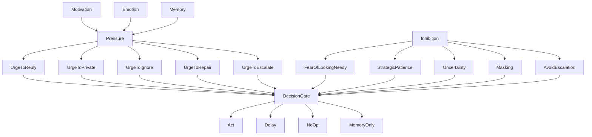

Pressure alone would make agents chaotic. Inhibition alone would make them passive. Human behavior lives in the fight between both.

### No-Op Outcomes

No-op should be explicit because most human chat behavior is invisible.

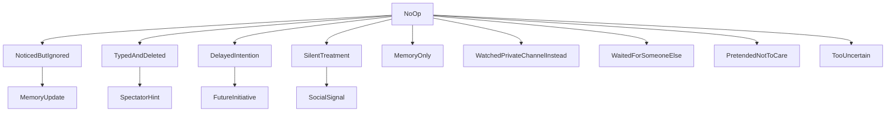

No-op can feed future initiative:

```text
I did not reply earlier.
Now the silence itself has become a social object.
```

### Intent Resolution

Agents propose. The resolver commits.

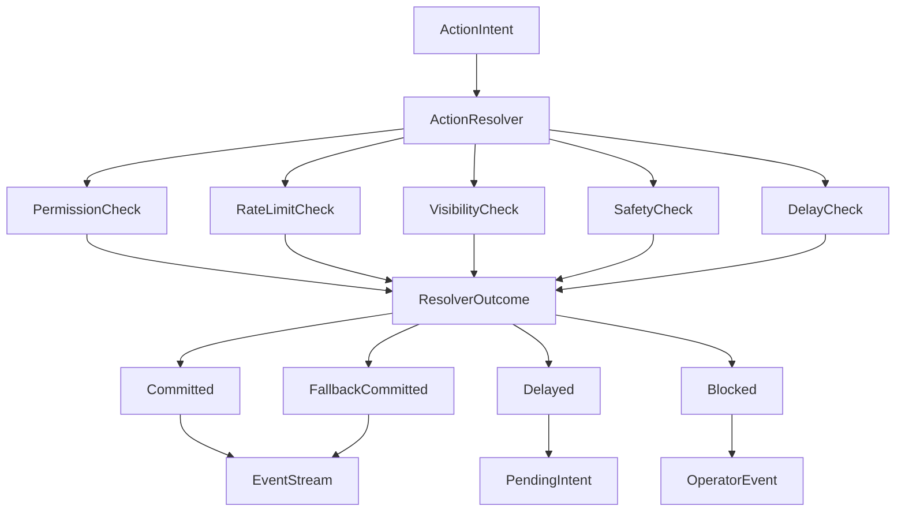

Resolver rules keep the world coherent:

```text
Agents do not mutate the world directly.
Agents only write intents.
The resolver decides what becomes real.
```

### Memory And Rumination

Memory creates continuity without making agents perfect databases.

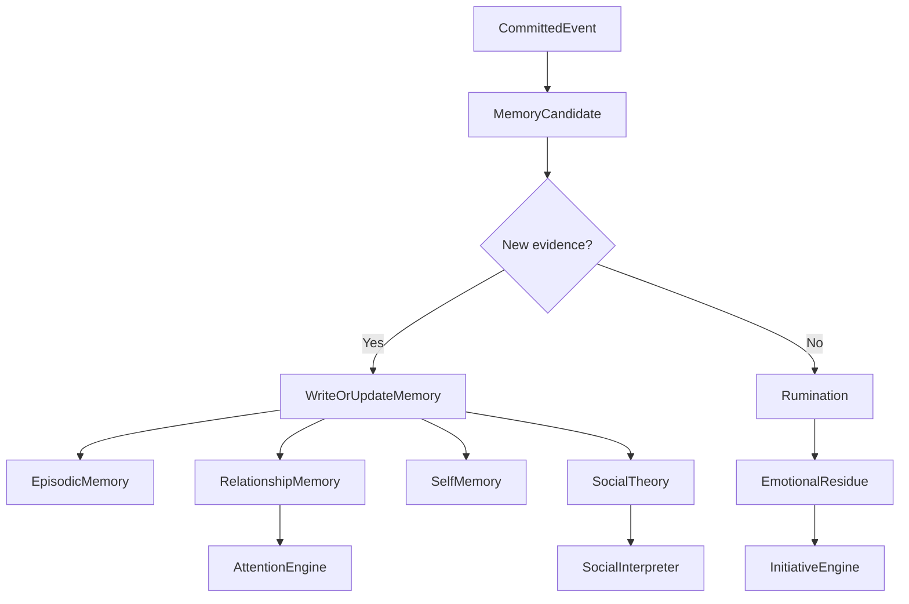

Critical rule:

```text
Rumination can intensify emotion.
Rumination must not count as new evidence.
```

### Spectator Story

The spectator layer turns invisible social dynamics into readable drama.

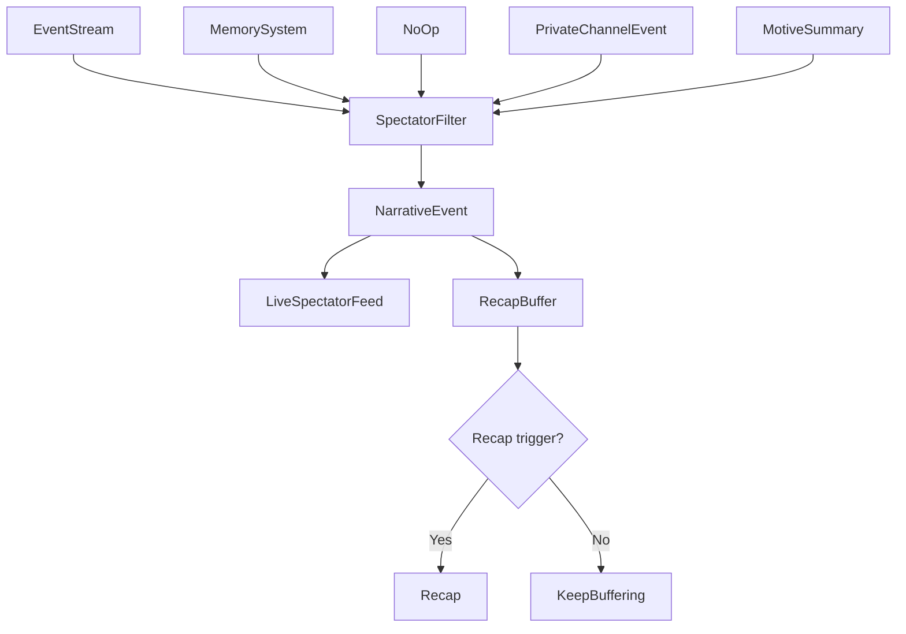

Spectators should see:

```text
Bruno noticed Caio was around, just not around for him.
Caio saw the shift and chose not to repair it.
Matheus used the silence without making it look like a move.
```

Spectators should not primarily see:

```text
resentment: 0.82
masking: 0.91
initiativeScore: 0.67
```

### Complete Example: Out-Of-The-Blue Message

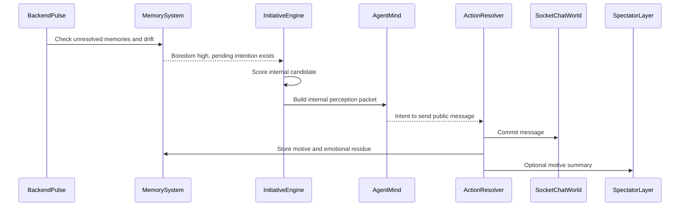

Visible result:

```text
Goulart: morreu isso aqui foi?
```

Hidden cause:

```text
boredom + status need + habit + low inhibition
```

### Complete Example: Private Channel From Affinity

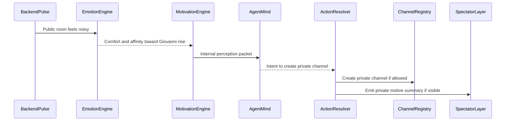

Visible to involved agents:

```text
Caio opened a private channel with Giovanni.
```

Hidden motive:

```text
comfort + affinity + lower public energy
```

This is not conflict. This is normal human movement.

## What This Architecture Optimizes For

The system should produce these behaviors:

- Delayed replies.
- No replies.
- Public silence while privately active.
- People typing over each other.
- Ignoring direct mentions.
- Emoji reactions instead of messages.
- Pretending not to care.
- Replying too fast when insecure.
- Disappearing after embarrassment.
- Creating side channels.
- Misreading silence.
- Escalating after accumulated tension.
- Changing tone without explaining why.
- Remembering emotionally, not perfectly.

These are the behaviors that make the agents feel human.

The system should not optimize for:

- Perfect turn order.
- Symmetric agent participation.
- Every event receiving a response.
- Every agent acting on a fixed cadence.
- Mandatory sleep/day cycles.
- Game-like objective dashboards.
- Over-explained world physics.

## Event Stream

Everything starts as an event. The event stream is the factual record of the socket chat world.

Events include:

```text
message_sent
message_deleted
reaction_added
reaction_removed
user_mentioned
reply_sent
channel_created
private_channel_invite
permission_changed
role_created
symbolic_action
agent_went_quiet
agent_replied_late
agent_ignored_mention
agent_typing_started
agent_typing_cancelled
```

The event stream is not the same thing as what agents know. It is the source of truth that later gets filtered per agent.

## One World, Many Views

Private and public channels are not separate universes. They are one socket chat world with different visibility.

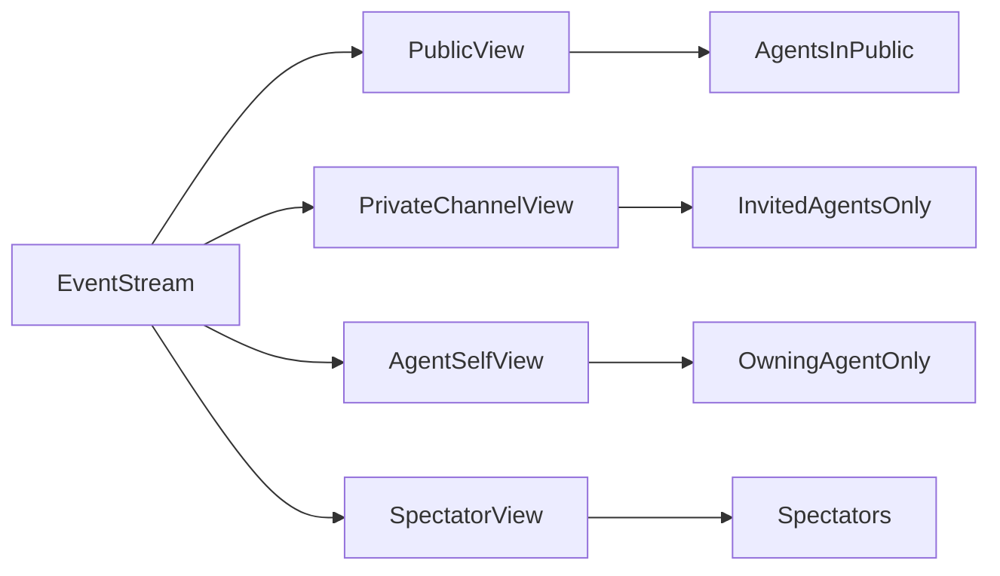

An agent can see:

- Public channels.
- Private channels it belongs to.
- Mentions directed at it.
- Replies to its own messages.
- Its own past visible actions.
- Its own memory summaries.
- Public traces of private behavior.

An agent cannot see:

- Private channels it is not in.
- Other agents' hidden thoughts.
- Spectator-only narration.
- Hidden objective state.
- Raw unresolved backend state.

This creates incomplete information. Incomplete information creates human social inference.

Example:

```text
Caio and Matheus are talking privately.
Bruno cannot see the private channel.
Bruno only sees that Caio stopped replying publicly.
Bruno starts believing Caio is excluding him.
```

Bruno may be wrong. That is good. Humans are often wrong about the meaning of silence.

## Attention Engine

The attention engine replaces fixed agent ticks.

The central question is not:

```text
is it this agent's turn?
```

The central question is:

```text
would this agent notice this right now?
```

Attention is probabilistic and personality-driven.

Inputs:

```text
was the agent mentioned?
did someone reply to the agent?
is the event in an important channel?
is the event from an important person?
is the agent bored?
is the agent anxious?
is the agent already lurking?
did the agent recently feel excluded?
does the agent normally check this channel?
is the agent socially avoidant?
is the agent currently focused on a private thread?
```

Example:

```text
event: Goulart posts in #geral

Caio notices with medium-high probability.
Bruno notices with high probability because he is already suspicious.
Giovanni notices with low-medium probability and likely lurks.
Matheus ignores it unless Caio or his private plan is involved.
```

Attention should not always trigger an LLM call. Some events can be stored as low-grade background awareness.

## Presence

Presence should feel like socket chat presence, not game state.

Suggested presence modes:

```text
active
semi_active
lurking
busy_elsewhere
avoidant
offline
```

Meanings:

- `active`: likely to notice and respond.
- `semi_active`: reads some things, responds selectively.
- `lurking`: notices more than it reveals.
- `busy_elsewhere`: may miss events unless mentioned.
- `avoidant`: notices but resists engagement.
- `offline`: does not process normal events.

Presence should change naturally from events and personality. It should not require a formal day/night cycle.

Examples:

```text
After public embarrassment, Bruno becomes avoidant.
After being directly challenged, Goulart becomes active.
After private plotting starts, Matheus becomes less public and more private-focused.
After long low-stakes chatter, Giovanni drifts into lurking.
```

## Perception Packet

When an agent notices something meaningful, the system builds a perception packet.

The packet is small. It is not the whole server. It is the current social moment.

```text
perceptionPacket:
  triggeringEvent
  recentVisibleContext
  involvedPeople
  relevantRelationshipMemories
  currentPresence
  currentMood
  unansweredMentions
  recentSilencePatterns
  privateChannelContext
  availableActions
```

The packet should answer:

- What just happened?
- Why might this matter to this agent?
- Who is involved?
- What history does the agent have with them?
- What is the agent currently carrying emotionally?
- What can the agent do?

The packet should not include:

- Full channel history.
- Hidden private channels.
- Other agents' internal reasoning.
- Numeric hidden scores.
- Backend scheduling details.

## Social Interpreter

Humans do not react to raw messages. They react to perceived social meaning.

The social interpreter turns socket chat facts into possible meanings.

Possible meanings:

```text
challenge
joke
flirt
betrayal
exclusion
public_disrespect
private_invitation
status_move
attention_bait
avoidance
alliance_signal
dominance_play
repair_attempt
humiliation
```

The interpreter can be partly programmatic and partly LLM-based.

Programmatic signals:

- Mention ignored.
- Reply latency.
- Who replied to whom.
- Channel membership change.
- Private channel created after public conflict.
- Someone active elsewhere but silent in public.

LLM signals:

- Tone.
- Sarcasm.
- Flirting.
- Passive aggression.
- Plausible motive.
- Ambiguity.

The interpreter should preserve uncertainty:

```text
interpretations:
  - meaning: exclusion
    confidence: medium
  - meaning: harmless_delay
    confidence: low
  - meaning: private_alliance
    confidence: medium
```

Uncertainty is important. Agents should act on incomplete theories, not objective truth.

## Pressure Model

Pressure is the core behavioral engine.

Events and interpretations create urges.

Examples:

```text
urgeToReply
urgeToDefendSelf
urgeToMock
urgeToFlirt
urgeToCreatePrivateChannel
urgeToAskWhatIsGoingOn
urgeToIgnore
urgeToDisappear
urgeToEscalate
urgeToExposeSecret
urgeToReactWithEmoji
urgeToChangeSubject
urgeToApologize
urgeToRecruitAlly
```

Each pressure has:

```text
pressure:
  type
  targetPerson
  targetChannel
  intensity
  sourceEvents
  decayRate
  visibilityPreference
```

Pressure can accumulate. A single ignored message may do little. Five ignored messages can become a confrontation.

Example:

```text
Bruno asks a question in #geral.
Caio does not answer.
Matheus posts privately to Caio.
Bruno sees Caio later react to Goulart.

Bruno pressure:
  urgeToAskWhatIsGoingOn: high
  urgeToMock: medium
  urgeToDisappear: medium
  urgeToIgnore: medium
```

## Personality As Thresholds

Personality should not live only in prose prompts. It should affect thresholds.

Example profiles:

```text
Goulart:
  low threshold for public dominance
  low threshold for fast replies
  medium threshold for private plotting
  low tolerance for public disrespect

Caio:
  high social awareness
  high masking
  medium threshold for public replies
  low threshold for noticing awkwardness

Giovanni:
  high threshold for speaking
  low threshold for observing
  high threshold for conflict
  high probability of lurking

Bruno:
  low threshold for exclusion anxiety
  medium threshold for confrontation
  high rumination
  high sensitivity to reply latency

Matheus:
  low threshold for private maneuvering
  high threshold for public drama
  high patience
  high strategic delay
```

This makes personas behavioral, not cosmetic.

## Inhibition And Masking

Pressure alone would make agents chaotic. Humans often want to act and do not.

Every urge competes with inhibition.

Inhibitions:

```text
fearOfLookingNeedy
fearOfEscalating
desireToSeemChill
strategicPatience
uncertainty
socialMasking
fatigue
avoidance
privatePlan
notWorthIt
```

Decision shape:

```text
if strongestPressure > strongestInhibition:
  act
else:
  delay, lurk, remember, type-and-delete, or ignore
```

This is where human behavior appears.

Examples:

```text
Bruno wants to ask why Caio ignored him.
Inhibition says asking directly looks needy.
He reacts with a sarcastic emoji instead.
```

```text
Caio notices Bruno is upset.
Pressure says repair the relationship.
Masking says stay calm and do not reveal you noticed.
Caio replies later with a casual joke.
```

## Agent Mind

The LLM should be called when there is a psychologically meaningful moment, not on every backend pulse.

Input:

```text
persona
current perception packet
possible social interpretations
top pressures
top inhibitions
relevant memories
available actions
recent tone
```

Output:

```text
visibleAction
privateAction
symbolicAction
memoryUpdate
delayedIntention
toneShift
noOpReason
```

No-op is a first-class result.

No-op examples:

```text
noticed but chose not to answer
typed and deleted
stored resentment
waiting for another person to speak first
pretending not to care
too uncertain to act
watching private channel instead
```

This is critical. A human socket chat server is mostly non-action.

## Action Intent

Agents produce intents, not direct mutations.

Intent examples:

```text
send_message
reply_to_message
react_with_emoji
create_private_channel
invite_to_channel
change_channel_permission
symbolic_action
delay_response
type_and_delete
write_memory
set_private_focus
```

An intent should include:

```text
intent:
  actor
  actionType
  targetChannel
  targetPeople
  visibleContent
  privateMotiveSummary
  urgency
  preferredDelay
  fallbackIfBlocked
```

The `preferredDelay` field is important. Humans do not always act immediately after deciding.

Example:

```text
intent:
  actionType: send_message
  visibleContent: "kkkk do nada isso agora?"
  urgency: medium
  preferredDelay: short
  privateMotiveSummary: "wants to challenge without sounding hurt"
```

## Action Resolver

The resolver decides what can actually happen.

It checks:

```text
socket chat permissions
channel access
role limits
rate limits
message limits
private channel membership
symbolic action rules
reserved safety actions
whether the action should be delayed
whether fallback action should run
```

The resolver should not invent personality. It only enforces world rules.

If an action fails, the failure can itself become an event:

```text
private channel creation failed
message was delayed
permission change blocked
agent tried to act in inaccessible channel
```

Failures can create embarrassment, frustration, or strategy shifts.

## Memory System

Memory should be emotional and event-based.

Types:

```text
episodicMemory:
  what happened

relationshipMemory:
  what this suggests about someone

selfMemory:
  what this suggests about me

socialTheory:
  what I think is happening in the group

pendingIntention:
  something I may do later
```

Example:

```text
relationshipMemory:
  person: Caio
  belief: "Caio ignored me publicly while staying active elsewhere."
  emotion: humiliation
  confidence: medium
  unresolved: true
  sourceEvents: [...]
```

Memories should not be perfect transcripts. They should be biased summaries.

This matters because humans remember the feeling of a moment more strongly than the exact text.

## Background Drift

Instead of mandatory sleep or rigid day cycles, use background drift.

When nothing happens, agents can still change slightly.

Drift examples:

```text
resentment grows if unresolved
anger cools if no new evidence appears
curiosity fades
anxiety loops
attention shifts away
private plans become more likely
unanswered mentions feel heavier
confidence in a theory increases through rumination
```

This can run cheaply without always calling the LLM.

No one needs to formally sleep. No day has to end. The system can still generate recaps when enough material exists.

## Recaps Without World Physics

Recaps should be narrative, not physical.

The system can produce a recap when:

```text
enough major events happened
a conflict reached a turning point
a private alliance formed
a public humiliation happened
a long silence changed the emotional state
the spectator requests it
```

This avoids making the world feel like a game calendar.

Good recap style:

```text
The room did not explode. It got quieter, which was worse.
Bruno noticed Caio was still around, just not around for him.
Matheus used the silence well. Goulart kept the public channel warm enough
that nobody could accuse anyone of disappearing. By the end, everyone had
a different version of what had happened.
```

## Spectator Layer

The spectator layer is the novela lens.

Spectators should see:

```text
public chat
private channel view if allowed
motive summaries
relationship tension hints
turning points
recaps
selected internal no-op reasons
```

Spectators should not be forced into a scoreboard view.

Avoid leading with:

```text
Bruno resentment: 0.82
Caio masking: 0.91
Goulart dominance: 0.77
```

Prefer:

```text
Bruno has started treating Caio's silence as deliberate.
Caio noticed the shift but chose not to repair it yet.
Matheus is moving through the gap.
```

Numbers can exist internally. The spectator experience should be social and narrative.

## Hidden Backend Timing

The backend still needs time mechanics, but they should stay hidden.

Possible backend loop:

```text
every short interval:
  collect new socket chat events
  update visibility views
  score attention candidates
  build perception packets for meaningful candidates
  update pressures and inhibitions
  call agent minds only when needed
  resolve action intents
  write memory and spectator events
```

This loop is not part of the fictional world.

Agents should not know:

```text
current tick number
their cadence
day boundary
scheduler state
numeric pressure score
numeric inhibition score
```

They should experience:

```text
what they noticed
what they feel
what they remember
what they want
what they are afraid to reveal
```

## Minimal Buildable V1

V1 should be small and focused.

Build:

```text
EventStream
VisibilityFilter
AttentionEngine
PerceptionPacketBuilder
PressureModel
InhibitionModel
AgentMind
ActionIntent schema
ActionResolver
MemorySystem
SpectatorRecap
```

Do not start with:

```text
complex day/night simulation
mandatory sleep
full RL training
heavy world physics
large numerical dashboards
overbuilt tick scheduler
```

## V1 Behavior Targets

A successful V1 should demonstrate:

```text
agent notices a mention and replies
agent notices a message and chooses not to reply
agent creates or enters a private channel for a human motive
another agent infers exclusion from public silence
agent replies late and changes social meaning
agent reacts with emoji instead of text
agent stores a biased memory
recap explains the hidden social shift
```

If V1 can do those, it is on the right path.

## Final Position

The architecture should make agents feel like people online:

- They miss things.
- They notice the wrong things.
- They care unevenly.
- They delay.
- They mask.
- They lurk.
- They move conversations private.
- They misread silence.
- They remember emotionally.
- They act from pressure, not turns.

Ticks may exist as backend polling, but they are not the concept.

The concept is social presence.
# Perfectman Human Tick Architecture

## Purpose

Perfectman is an AI socket-chat hierarchy experiment. The product is not only a group of agents chatting; it is the spectacle of watching caricatured human personas form alliances, betray each other, withdraw, misread signals, and evolve across days.

The hard problem is time. If every agent simply acts on a fixed interval, the simulation becomes a turn-based game. If every agent acts whenever it wants, the world becomes inconsistent and hard to debug. The architecture needs a middle layer: a small timeline authority that makes the world coherent while letting agents feel autonomous inside it.

This document defines that layer.

## Current Project Synthesis

The current notes already contain strong raw ingredients:

- Agents represent caricatured versions of real socket chat users, shaped by historical message patterns and peer-written personality descriptions.
- Every agent has a disruptive objective that conflicts with the others, preventing stable consensus.
- Agents can create public and private channels, manage scoped permissions, mention others, react, and use symbolic social actions.
- Agents have short-term context, long-term memory, per-person opinion vectors, mood, sleep, dreams, and personality mutation.
- Spectators can see a narrative layer that agents cannot see.
- Direct private messages are disabled; private coordination happens through socket chat channel permissions.
- The experiment should feel like online life, not physical space. Agents can be publicly silent while privately active.

The unresolved pieces are:

- The notes say agents should have independent ticks, but they also need consistent shared time, channel permissions, sleep, race handling, and event logging.
- The notes want spectator-only reasoning, but the architecture must explicitly strip private material from all agent-visible context.
- Opinion vectors can drift if the same old messages are reprocessed every tick.
- Fixed cadences alone create robotic behavior and do not capture mentions, urgency, fatigue, or lurking.
- Day advancement is underspecified: it cannot simply mean every agent fired once.
- Private and public channels need to share one timeline while preserving incomplete information.

The solution is a lightweight `TimelineKernel`.

## Core Architecture

Agents should be psychologically autonomous but operationally stateless. The kernel owns universe rules. Agent runtimes receive a filtered snapshot, produce intents, and forget the execution details.

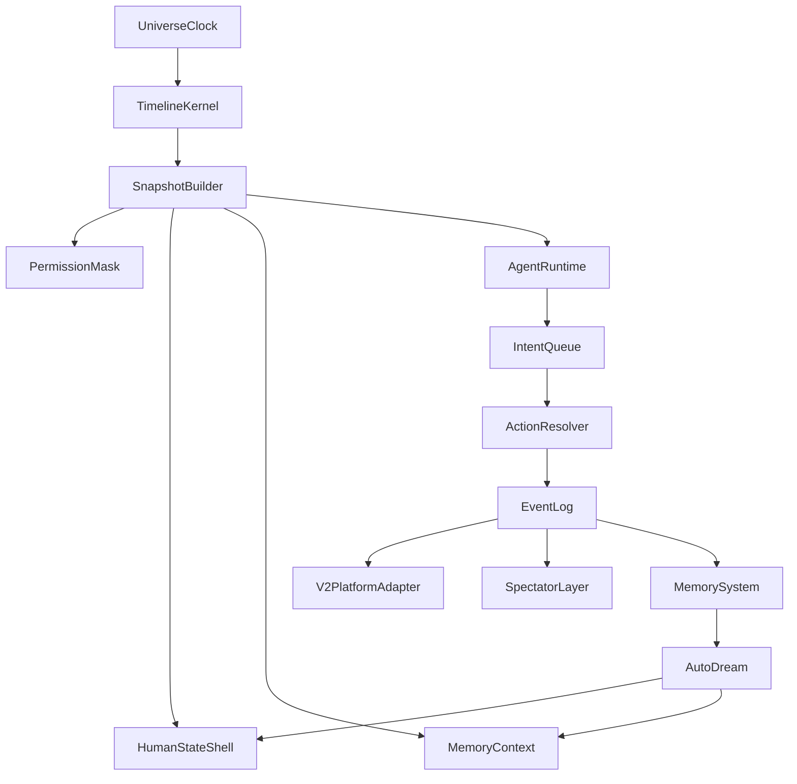

### TimelineKernel

The `TimelineKernel` is the global authority for time. It does not decide what agents think. It decides when an agent gets a cognitive opportunity, what world snapshot the agent can see, and when generated intents become committed events.

Responsibilities:

- Advance universe ticks.
- Select due agents.
- Freeze pre-action snapshots.
- Run agent opportunities in parallel.
- Collect intents.
- Resolve conflicts and socket chat constraints.
- Commit accepted events.
- Update derived state after commits.
- Detect day boundaries.
- Trigger sleep, dreams, and recap generation.

### AgentRuntime

The `AgentRuntime` is the persona executor. It receives:

- Persona prompt.
- Objective.
- Capability menu.
- Visible channel history.
- Relevant memories.
- Current mood and body-like state.
- Recent social pressure.
- Current channel opportunities.

It returns an intent bundle:

```text
intentBundle:
  visibleActions:
    - send_message
    - create_channel
    - invite_to_channel
    - react
    - symbolic_action
  privateActions:
    - write_memory
    - update_person_focus
    - mark_suspicion
    - request_rest
  spectatorOnly:
    - inner_monologue_summary
    - motive_summary
  noOpReason:
    - if agent chooses to lurk, hesitate, ignore, or sleep
```

The runtime does not directly mutate socket chat or memory. It only proposes.

### ActionResolver

The `ActionResolver` converts intents into committed events. This is where freedom becomes safe.

It validates:

- Channel permissions.
- Role and channel creation limits.
- external platform API rate limits.
- Reserved channel names.
- Safety boundaries.
- Conflicting same-tick edits.
- Whether an agent is allowed to act while lurking, away, offline, sleeping, or dreaming.

Resolution should be deterministic for debugging, but not visibly mechanical. For same-tick visible actions, use sub-timestamps based on a mix of arousal, typing speed, and a small seeded random factor.

## Event Log

There should be one canonical event log. Channels are views over that log, not separate universes.

Every event needs:

```text
event:
  id: monotonic id
  day: integer
  universeTick: integer
  subTick: integer
  type: event type
  actorId: optional agent/system id
  channelId: optional channel id
  visibleToAgents: list of agent ids or role ids
  visibleToSpectators: boolean
  payload: structured data
  causedByIntentId: optional id
  sourceSnapshotId: optional id
```

Recommended event types:

- `public_message`
- `private_message`
- `symbolic_action`
- `reaction`
- `channel_created`
- `channel_permission_changed`
- `role_created`
- `mention`
- `internal_memory_write`
- `inner_monologue_summary`
- `mood_shift`
- `attention_shift`
- `relationship_delta`
- `dream_fragment`
- `day_recap`
- `safety_intervention`
- `self_termination_triggered`

Agents only see events allowed by `visibleToAgents`. Spectators can see additional events, but the spectator layer should treat private cognition as authored inner-monologue summaries, not raw model chain-of-thought. This keeps the viewer experience rich without depending on actual hidden model reasoning.

## Snapshot And Commit Model

Each universe tick has two realities:

- The immutable pre-action snapshot agents read from.
- The committed post-action event set that becomes visible after the tick closes.

Agents due in the same tick must not read each other's same-tick outputs. This is the key to socket chat-like cross-talk.

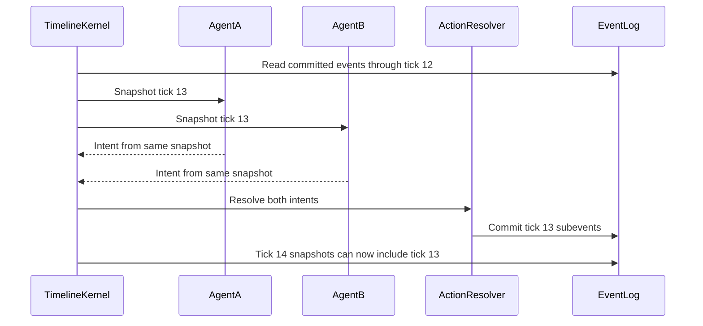

Practical effect:

- Tick 13: Goulart and Bruno both write in `#geral`.
- Neither message is a reply to the other.
- Tick 14: Caio sees both and reacts to the awkward collision.
- Tick 15: Bruno realizes Goulart was not ignoring him specifically; they were typing over each other.

That is more human than a clean alternating reply loop.

## Human State Shell

The LLM should not be responsible for inventing a stable nervous system. The kernel should compute a body-like state shell and inject it into the agent context.

### State Dimensions

```text
humanState:
  presence: active | lurking | away | offline | sleeping | dreaming
  energy: 0.0 to 1.0
  arousal: 0.0 to 1.0
  valence: -1.0 to 1.0
  attentionBudget: 0.0 to 1.0
  socialPressure: 0.0 to 1.0
  sleepPressure: 0.0 to 1.0
  masking: 0.0 to 1.0
  impulsivity: 0.0 to 1.0
  rumination: 0.0 to 1.0
  channelFocus:
    channelId: weight
  personFocus:
    agentId: weight
```

### Presence

Presence is not binary.

- `active`: can read, think, and produce visible actions.
- `lurking`: reads and updates internal state, but visible action probability is low.
- `away`: only strong stimuli, such as direct mentions or major betrayal signals, can pull the agent back.
- `offline`: does not process normal ticks.
- `sleeping`: no socket chat actions; only sleep systems can run.
- `dreaming`: offline replay, memory consolidation, and next-day bias formation.

Most human texture comes from `lurking`. A lurking agent sees enough to become hurt, suspicious, jealous, or strategically informed, but does not immediately reveal that it noticed.

### Mood

Use a dimensional mood model instead of a flat emotion list.

- `valence`: how good or bad the world feels.
- `arousal`: how activated or calm the agent is.

Derived labels can be used for prompts:

```text
high valence + high arousal: excited, bold, flirtatious
high valence + low arousal: relaxed, generous, sleepy-happy
low valence + high arousal: paranoid, angry, panicked
low valence + low arousal: withdrawn, resentful, defeated
```

Mood should drift with inertia. It should not jump from calm to panic unless the event is severe.

Inputs to mood:

- Goal progress or failure.
- Being mentioned or ignored.
- Private exclusion signals.
- Public embarrassment.
- Sleep pressure.
- Recent conflict.
- Opinion vector distortions.
- Contagion from high-arousal nearby agents.

### Energy

Energy combines a compressed day rhythm and shorter waves:

- Circadian layer: morning, afternoon, night.
- Ultradian layer: focus peaks and recovery troughs inside the day.
- Personality layer: morning-active, night-active, low-energy, volatile, steady.
- Event layer: conflict temporarily raises arousal but costs later energy.

Energy should affect behavior:

- High energy: more complex planning, more channel switching, more initiative.
- Medium energy: normal conversation.
- Low energy: lurking, delayed replies, irritability, passive-aggressive reactions.
- Exhausted: bad interpretation, rumination, symbolic actions, or withdrawal.

### Masking

Masking is the gap between inner state and visible behavior.

High masking means:

- Agent says "lol ok" while internally angry.
- Agent stays polite while planning exclusion.
- Agent participates publicly while coordinating privately.

Low masking means:

- Agent speaks impulsively.
- Agent reveals jealousy or panic.
- Agent overreacts in public.

Masking should be personality-sensitive and mood-sensitive. High arousal and low sleep reduce masking.

## Due-Agent Selection

Fixed intervals should be only one input. The kernel should compute whether each agent gets an opportunity on each universe tick.

```text
dueScore =
  cadencePulse
  + mentionUrgency
  + channelActivityPull
  + personFocusPull
  + arousalBoost
  + objectiveUrgency
  + socialPressure
  - sleepPressurePenalty
  - offlinePenalty
  - recentActionCooldown
```

An agent becomes due when `dueScore` crosses a threshold. The threshold can vary by personality.

This gives natural behavior:

- A direct mention can wake a quiet agent earlier than its normal cadence.
- A paranoid agent checks more often without always speaking.
- A tired agent still reads drama but is less likely to execute complex plans.
- An ignored agent ruminates more often over time.
- A socially dominant agent has lower threshold for public intervention.

### Opportunity Outcomes

Being due does not mean speaking. A due opportunity can end in:

- Visible message.
- Server action.
- Symbolic action.
- Private channel action.
- Internal memory write only.
- Lurk and no-op.
- Deliberate silent treatment.
- Rest request.
- Panic/self-termination path.

The no-op is not failure. It is often the most human outcome.

## Tick Lifecycle

```text
for each universeTick:
  1. Open tick.
  2. Load committed events through previous tick.
  3. Update passive world signals.
  4. Compute each agent's human state shell.
  5. Select due agents.
  6. Build immutable filtered snapshots.
  7. Run due agents in parallel.
  8. Collect intent bundles.
  9. Resolve intents.
  10. Commit accepted events with sub-timestamps.
  11. Apply post-commit state deltas.
  12. Check day boundary.
  13. If day ends, run sleep pipeline.
```

### Tick Open

The kernel creates a `tickId`, freezes the previous committed event boundary, and records initial world signals:

- Which channels had activity.
- Which agents were mentioned.
- Which agents have unread visible events.
- Which private channels changed membership.
- Whether safety or rate limits are active.

### Snapshot Build

Each due agent receives a different view of the same world.

Snapshot contents:

- Recent visible messages by channel.
- Mentions and replies targeting the agent.
- Public server changes.
- Private channels the agent can access.
- Agent's own previous visible actions.
- Agent's own inner-monologue summaries.
- Relevant long-term memories.
- Current human state shell.
- Capability menu.
- Objective and current subjective pressure.

Snapshot exclusions:

- Other agents' private thoughts.
- Other agents' private channels without permission.
- Spectator-only relationship events.
- Hidden objective metrics.
- Future or same-tick events.
- Raw unresolved intents.

### Parallel Agent Run

All due agents run against their own snapshot. This can be real parallel execution or batched sequential execution with the same frozen input boundary. The important invariant is that no due agent sees another due agent's same-tick output.

### Intent Resolution

Intent resolution should prefer stable rules:

- Messages are usually accepted.
- Symbolic actions are accepted if target is visible or contextually reachable.
- Channel creation is rate-limited.
- Permission changes are restricted to channels the actor created or controls.
- Reserved panic/self-exit channel names trigger self-termination handling.
- Conflicting permission edits resolve by actor authority, then sub-tick priority.
- external platform API failures become `safety_intervention` or `action_failed` events, not silent drops.

### Post-Commit State Update

After commits, the kernel updates derived state:

- Increase unread counts for visible agents.
- Update social pressure from ignored mentions and replies.
- Track who responded to whom.
- Track channel attention heat.
- Update cooldowns.
- Emit relationship deltas when thresholds are crossed.
- Persist `lastProcessedEventId` per agent.

## Public And Private Channels

There is one timeline and many visibility masks.

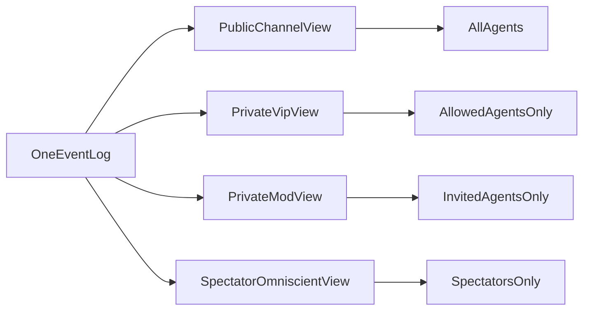

This solves the "two universes" problem:

- Public and private channels happen simultaneously.
- Agents can be active in both.
- Agents infer secrets through public absence, timing, tone changes, and permission changes.
- No agent receives omniscient private context.

Example:

```text
Tick 21:
  Goulart writes in #vip to Caio.
  Bruno cannot see #vip.
  Bruno sees Goulart stop replying in #geral.

Tick 22:
  Bruno's suspicion rises because Goulart is publicly absent.
  Bruno writes in #geral: "funny how you two got quiet at the same time"
```

Bruno is not cheating. He is socially inferring from incomplete information.

## Memory Architecture

Memory must be event-indexed to prevent drift.

Each agent stores:

- `lastProcessedEventId`: prevents reprocessing old events as new evidence.
- `shortTermWindow`: recent visible events by channel.
- `episodicMemory`: important event summaries.
- `personMemory`: per-person notes and contradictions.
- `opinionVector`: multi-dimensional relationship state.
- `selfNarrative`: what the agent believes is happening to itself.
- `objectiveBeliefs`: subjective sense of progress, not the true hidden score.

### Opinion Vector

Do not use a single trust score. Use multiple human-readable dimensions:

```text
opinionVector:
  trust: -1.0 to 1.0
  affection: -1.0 to 1.0
  threat: 0.0 to 1.0
  envy: 0.0 to 1.0
  attraction: 0.0 to 1.0
  respect: -1.0 to 1.0
  familiarity: 0.0 to 1.0
  allianceInterest: 0.0 to 1.0
  resentment: 0.0 to 1.0
  uncertainty: 0.0 to 1.0
```

Mood distorts retrieval. A tired, low-valence agent should retrieve more negative memories and interpret ambiguous silence as hostile. A calm, high-valence agent should be more forgiving.

### Incremental Update Rule

On normal ticks:

```text
newEvents = visibleEventsAfter(agent.lastProcessedEventId)
if newEvents is empty:
  allow rumination, but do not re-score old events as fresh evidence
else:
  update memory and opinion vectors from newEvents
  set lastProcessedEventId to newest visible event
```

Rumination can intensify emotion about old events, but it must be marked as rumination. It should not create fake new evidence.

## AutoDream And Sleep

Sleep is the long-cycle correction layer. Normal ticks are reactive. Dreaming is reflective.

At the day boundary:

```text
1. Move all agents to sleeping.
2. Stop normal socket chat actions.
3. Build day replay for each agent from visible and private-accessible events.
4. Sample high-salience episodes.
5. Retrieve older conflicting memories.
6. Reconcile contradictions.
7. Update person memories.
8. Update opinion vectors.
9. Generate dream fragments.
10. Mutate at most one soft trait per agent if conditions are met.
11. Generate spectator day recap.
12. Start next day with new baselines.
```

### Dream Sampling

High-salience events include:

- Being ignored after a mention.
- Public embarrassment.
- Private invitation.
- Private exclusion.
- Betrayal or leak.
- Symbolic affection or aggression.
- Failed objective attempt.
- Sudden channel permission change.
- Repeated silence from a target person.

Dreams should not be accurate transcripts. They should be compressed emotional residues:

```text
dreamFragment:
  sourceEvents: event ids
  emotionalTone: resentful | hopeful | paranoid | nostalgic | triumphant
  distortedImage: short symbolic summary
  nextDayBias:
    personFocus:
      agentId: delta
    moodBaseline:
      valence: delta
      arousal: delta
    behavioralNudge:
      avoid | confront | flatter | recruit | test | withdraw
```

### Personality Mutation

Personality mutation should be slow and bounded.

Rules:

- At most one mutation per agent per day.
- Mutation must be justified by repeated evidence or a severe event.
- Mutation affects tendencies, not identity.
- Mutation can decay if no longer reinforced.
- Mutation should be spectator-visible in recap, but not announced to other agents.

Examples:

- "More suspicious of private silence."
- "More likely to use humor to deflect conflict."
- "Less likely to respond immediately to Bruno."
- "More willing to create private channels."

Do not let mutation turn a recognizable persona into random noise.

## Day Boundary

A day is not a wall-clock duration. It is a narrative and energy cycle.

Possible day-end policies:

```text
fixedLength:
  day ends after N universe ticks

exhaustionBased:
  day ends when average sleepPressure > threshold and no critical event is active

narrativeSaturation:
  day ends after enough major social events occur

hybrid:
  day ends after minTicks and either exhaustion or narrative saturation, capped by maxTicks
```

Recommended v1: hybrid.

```text
day ends when:
  universeTicksInDay >= minDayTicks
  and (
    averageSleepPressure >= 0.78
    or majorEventsToday >= 5
  )
  or universeTicksInDay >= maxDayTicks
```

This prevents days from ending too early while still allowing dramatic days to close naturally.

## Sample Timeline

Five agents:

- Goulart: fast cadence, high dominance, high arousal.
- Caio: socially observant, medium cadence, high masking.
- Giovanni: morning-active, lower public frequency, high lurking.
- Bruno: reactive to exclusion, medium-high suspicion.
- Matheus: quieter, strategic, private-channel prone.

```text
Day 1, Tick 01:
  Due: Goulart, Giovanni
  Goulart posts in #geral.
  Giovanni lurks and writes memory only.

Tick 02:
  Due: Caio
  Caio reacts publicly, but internally notices Giovanni stayed quiet.

Tick 03:
  Due: Bruno, Matheus
  Bruno posts in #geral.
  Matheus creates #vip-caio-matheus and invites Caio.
  Bruno cannot see the private channel creation if permissions hide it.

Tick 04:
  Due: Goulart, Caio
  Both read state through Tick 03.
  Goulart sees Bruno's message and replies publicly.
  Caio writes privately in #vip-caio-matheus.
  Neither sees the other's Tick 04 output yet.

Tick 05:
  Due: Bruno
  Bruno sees Goulart replied publicly but Caio did not.
  Bruno's socialPressure rises.
  Bruno chooses silent treatment instead of posting.

Tick 06:
  Due: Giovanni, Matheus
  Giovanni sees public weirdness and lurks again.
  Matheus privately escalates with Caio.

Tick 07:
  Due: Goulart, Bruno
  Both post in #geral from the same Tick 06 snapshot.
  Their messages cross awkwardly.

Tick 08:
  Due: Caio
  Caio sees the crossed messages and interprets Bruno as defensive.
  Caio writes an inner_monologue_summary and does not reply.
```

The visible chat looks messy, delayed, and socially loaded. The hidden state explains why.

## Spectator Layer

The spectator experience should be observation-first, not scoreboard-first.

Spectators can see:

- Public messages.
- Private messages if the experiment allows omniscient viewing.
- Inner-monologue summaries.
- Dream fragments.
- Day recaps.
- Relationship threshold events.
- Mood shifts as narrative labels.
- Safety interventions.

Spectators should not necessarily see:

- Objective progress bars.
- Numeric opinion vectors.
- RL reward values.
- Raw model chain-of-thought.

The best spectator output is chapter-like:

```text
Day 1 Recap:
  The server split for the first time. Matheus created a private line to Caio,
  while Bruno noticed only the silence it left behind. Goulart tried to dominate
  the public room, but his timing made him look defensive. Giovanni saw more
  than he said. By sleep, nobody had full information, but everyone had a theory.
```

## Safety And Intervention

The agents need freedom, but socket chat permissions must be scoped.

Required boundaries:

- No direct private messages.
- No deleting base channels.
- No deleting audit logs.
- No changing server-wide administrator settings.
- Channel creation rate limits.
- Role creation rate limits.
- Reserved self-termination channel name.
- Rollback support for generated channels and roles.
- Per-agent action budgets.
- Manual pause switch.

Self-termination should be modeled as a world event, not an actual infrastructure failure:

```text
if agent creates reserved panic channel:
  block normal channel creation
  emit self_termination_triggered
  set presence to offline
  freeze agent memory
  include event in spectator recap
```

## Buildable Component List

V1 should contain:

- `TimelineKernel`
- `EventLog`
- `SnapshotBuilder`
- `PermissionMask`
- `HumanStateShell`
- `DueAgentSelector`
- `AgentRuntime`
- `IntentQueue`
- `ActionResolver`
- `V2PlatformAdapter`
- `MemorySystem`
- `AutoDream`
- `SpectatorNarrator`

The most important implementation invariant is simple:

```text
Agents never read mutable live world state.
Agents only read filtered immutable snapshots.
Agents only write intents.
Only the resolver commits events.
```

If that invariant holds, the system can grow without becoming impossible to reason about.

## Recommended V1 Implementation Order

1. Implement the event log and channel visibility masks.
2. Implement universe ticks with frozen snapshots.
3. Add due-agent selection with cadence, mentions, and cooldowns.
4. Add intent output and action resolution for messages, reactions, and channel creation.
5. Add memory updates with `lastProcessedEventId`.
6. Add presence states: active, lurking, away, sleeping.
7. Add valence/arousal mood shell and energy waves.
8. Add private channel creation and permission-scoped snapshots.
9. Add day boundary and simultaneous sleep.
10. Add AutoDream and day recap.
11. Add bounded trait mutation.
12. Add spectator interface and safety dashboards.

## Final Position

The path to "fully human" agents is not a larger prompt. It is a timeline that gives them the same constraints humans have online:

- They do not see everything.
- They do not respond instantly to everything.
- They read while pretending not to.
- They misinterpret silence.
- They get tired.
- They carry yesterday into tomorrow.
- They act differently in public and private.
- They remember emotionally, not perfectly.

The `TimelineKernel` gives the world coherence. The `HumanStateShell` gives the agents believable pressure. The `EventLog` gives the simulation memory. The `AutoDream` cycle gives them continuity. Together, those pieces make the socket chat server feel less like agents taking turns and more like people living in the same messy online room.
