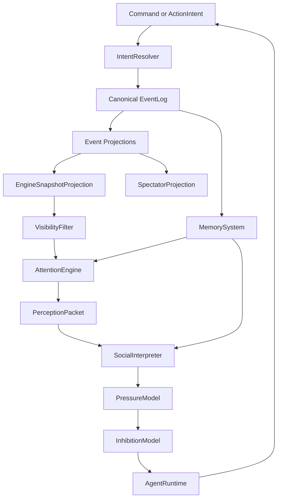

# Perfectman Complete Concept Map

## Purpose

This file intercalates the full Perfectman concept set into one reference. It connects the raw experiment idea, socket chat world model, social presence architecture, agent psychology, memory, private/public dynamics, spectator narrative, safety, and unresolved design tensions.

Use this as the deep conceptual map. Use `README.md` as the main entry point.

## Source Documents

- [`experiment-brief.md`](experiment-brief.md): first compact charter for the socket-chat hierarchy experiment.
- [`../notes/meeting-synthesis.md`](../notes/meeting-synthesis.md): broad meeting synthesis with objectives, mood, actions, socket chat permissions, personas, spectator stance, risks, and next steps.
- [`../notes/design-conversation-history.md`](../notes/design-conversation-history.md): design conversation history, gap analysis, mood/AutoDream research, and tick/social timing brainstorms.
- [`../architecture/social-presence.md`](../architecture/social-presence.md): current social presence architecture, with ticks demoted to invisible backend infrastructure.

## One-Sentence Thesis

Perfectman is a socket-chat-native social simulation where AI caricatures feel like people online because they notice unevenly, interpret socially, act from pressure, resist through inhibition, mask their motives, remember emotionally, and create public/private drama under incomplete information.

## Product North Star

The product is not an agent framework. The product is watching emergent social dynamics.

The desired viewer feeling:

```text
I am watching a strange socket chat server slowly become a novela.
People are not just replying.
They are avoiding, implying, plotting, flirting, humiliating, misreading, and remembering.
```

The target is not faithful simulation of physical humans. It is believable online social behavior.

Core product qualities:

- socket chat-first.
- Persona-driven.
- Socially messy.
- Uneven and asynchronous.
- Spectator-readable.
- Not over-gamified.
- Not turn-based.
- Not a scoreboard.

## Non-Goals

Do not optimize for:

- Equal participation.
- Clean turn order.
- Every message getting an answer.
- Every agent acting on a cadence.
- Perfect memory.
- Perfect truth tracking.
- Mandatory sleep/day world physics.
- Objective progress bars as primary UI.
- Exposing backend scheduler mechanics.
- Turning the experiment into a conventional game.

The system should feel more like a chaotic friend-group server than a structured multi-agent benchmark.

## The Evolution Of The Idea

### Stage 1: Raw Hierarchy Experiment

Initial concept:

- Put AI personas in a socket chat server.
- Give them conflicting objectives.
- Let them use socket chat powers like channels, roles, mentions, reactions, and permissions.
- Watch hierarchy, alliances, exclusion, betrayal, and personality mutation emerge.

Main primitives at this stage:

- Agents.
- Goals.
- Metrics.
- socket chat actions.
- Reinforcement/adaptation.
- Persona prompts.

Open issue:

- This framing risks becoming too game-like if objectives and metrics dominate the experience.

### Stage 2: Tick And Timeline Thinking

The project then explored ticks:

- Universe ticks as shared time.
- Agent ticks as individual cadences.
- Micro-ticks for concurrency.
- Day ticks for sleep/recap.
- Same-tick writes to simulate people typing at once.

Useful discoveries:

- One shared world is necessary.
- Public and private channels should be views over one canonical event log.
- Agents firing from the same snapshot should not read each other's same-moment outputs.
- Backend timing is needed for consistency.

Problem:

- If ticks become the behavioral model, agents feel like they are taking turns.

### Stage 3: Social Presence Pivot

The current direction:

- Ticks are backend infrastructure only.
- The behavioral model is social presence.
- Agents act because of attention, interpretation, pressure, inhibition, and memory.

Replacement:

```text
old: tick -> agent turn -> action
new: event -> notice -> interpret -> pressure -> inhibition -> action/no-op
```

The real primitive is urge, not tick.

## Canonical End-To-End Flow



Core loop:

```text
something happens
agent may notice
agent interprets social meaning
pressure forms
inhibition resists
agent acts, delays, lurks, remembers, or ignores
world updates
memory and spectator story update
```

## Concept 1: Canonical Event Log

The event log is the canonical factual history of the socket chat world.

It includes:

- Messages.
- Replies.
- Mentions.
- Reactions.
- Channel creation.
- Private channel invitations.
- Permission changes.
- Role changes.
- Symbolic actions.
- Typing indicators.
- Deleted messages.
- Delayed replies.
- Ignored mentions.
- Agent quietness.
- Safety events.
- Spectator-only narrative events.

Important distinction:

```text
event log = what happened
agent view = what this agent can know
spectator view = what viewers are allowed to see
```

The event log must be structured enough to support memory, recaps, debugging, and future analytics, but it should not be shown directly as a numeric dashboard.

## Concept 2: One World, Many Views

socket chat is not physical space. Agents can exist in public and private channels at the same time.

The right model:

```text
one canonical event log
many visibility masks
many subjective interpretations
```

Public/private logic:

- Public channels are visible to everyone with access.
- Private channels are visible only to invited agents.
- Spectators may receive an omniscient view, depending on product choice.
- Agents should never see private channels they are not in.
- Agents can infer private activity from public absence, tone shifts, timing, and permission changes.

Example:

```text
Matheus creates a private channel with Caio.
Bruno cannot see it.
Bruno sees Caio stop replying publicly.
Bruno concludes he is being excluded.
Caio may simply be distracted.
The drama comes from Bruno's interpretation, not objective truth.
```

This incomplete visibility is one of the strongest sources of human-like behavior.

## Concept 3: Attention

Attention replaces fixed turns.

The question is:

```text
would this agent notice this now?
```

Not:

```text
is it this agent's turn?
```

Attention inputs:

- Direct mention.
- Reply to agent.
- Person importance.
- Channel importance.
- Recent unresolved conflict.
- Current private focus.
- Boredom.
- Anxiety.
- Avoidance.
- Presence.
- Personality.
- Relationship state.
- Message intensity.
- Silence patterns.

Attention is probabilistic. The same event should matter differently to different agents.

Example:

```text
Goulart posts a challenge in #geral.

Goulart: already active, no attention decision needed.
Caio: likely notices because he tracks social tension.
Bruno: definitely notices if he already feels excluded.
Giovanni: maybe notices, likely does not speak.
Matheus: notices only if it affects a private plan.
```

Attention should be cheap. Not every noticed event needs an LLM call.

## Concept 4: Presence

Presence should feel like socket chat availability.

Suggested modes:

- `active`: likely to notice and respond.
- `semi_active`: reads selectively, replies selectively.
- `lurking`: reads more than it reveals.
- `busy_elsewhere`: misses normal events unless directly pulled in.
- `avoidant`: notices but resists engaging.
- `offline`: does not process normal events.

Presence is not a clock. It changes because of events and personality.

Examples:

- Bruno becomes avoidant after public embarrassment.
- Giovanni drifts into lurking during noisy group chat.
- Matheus becomes public-silent while private-focused.
- Goulart becomes active when challenged.
- Caio remains semi-active while tracking multiple threads.

## Concept 5: Perception Packet

The perception packet is the moment the agent actually receives.

It should be small and socially meaningful.

Includes:

- Triggering event.
- Recent visible context.
- Involved people.
- Relationship memories.
- Current presence.
- Current mood.
- Unanswered mentions.
- Recent silence patterns.
- Private/public context.
- Available actions.
- Current top pressures and inhibitions if computed outside the LLM.

Excludes:

- Full server history.
- Hidden private channels.
- Other agents' hidden thoughts.
- Spectator-only narration.
- Raw numeric backend scores.
- Tick numbers or cadence state.

The perception packet should feel like:

```text
Here is what you noticed.
Here is who is involved.
Here is what you remember about them.
Here is what this might mean.
Here is what you can do.
```

## Concept 6: Social Interpretation

Humans react to meaning, not raw text.

Possible meanings:

- Challenge.
- Joke.
- Flirt.
- Betrayal.
- Exclusion.
- Public disrespect.
- Private invitation.
- Status move.
- Attention bait.
- Avoidance.
- Alliance signal.
- Dominance play.
- Repair attempt.
- Humiliation.
- Testing boundaries.
- Passive aggression.

The interpreter should preserve uncertainty.

Example:

```text
event: Caio does not answer Bruno, but reacts to Goulart.

possible meanings:
  exclusion: medium confidence
  harmless delay: low confidence
  strategic avoidance: medium confidence
  public disrespect: medium confidence
```

Agents should act on theories, not ground truth.

This is critical because human social conflict often comes from wrong but emotionally plausible interpretations.

## Concept 7: Pressure

Pressure is the urge to do something.

Pressure types:

- `urgeToReply`
- `urgeToDefendSelf`
- `urgeToMock`
- `urgeToFlirt`
- `urgeToCreatePrivateChannel`
- `urgeToAskWhatIsGoingOn`
- `urgeToIgnore`
- `urgeToDisappear`
- `urgeToEscalate`
- `urgeToExposeSecret`
- `urgeToReactWithEmoji`
- `urgeToChangeSubject`
- `urgeToApologize`
- `urgeToRecruitAlly`
- `urgeToTestLoyalty`
- `urgeToPerformForPublic`

Pressure shape:

```text
pressure:
  type
  targetPerson
  targetChannel
  intensity
  sourceEvents
  decayRate
  visibilityPreference
```

Pressure accumulates.

One ignored mention may produce discomfort. Repeated ignored mentions can produce confrontation, withdrawal, or panic.

## Concept 8: Inhibition

Inhibition is the reason an agent does not act.

Inhibition types:

- Fear of looking needy.
- Fear of escalating.
- Desire to seem chill.
- Strategic patience.
- Uncertainty.
- Social masking.
- Fatigue.
- Avoidance.
- Private plan.
- Not worth it.
- Waiting for someone else to move first.
- Fear of public embarrassment.

Decision:

```text
if pressure beats inhibition:
  act
else:
  delay, lurk, remember, react minimally, or ignore
```

This pressure/inhibition conflict is one of the main paths to human feel.

Without pressure, agents are passive.

Without inhibition, agents are chaotic.

With both, agents hesitate, mask, delay, and reveal themselves unevenly.

## Concept 9: Masking

Masking is the gap between inner state and visible behavior.

High masking:

- Says "lol" while angry.
- Acts casual while hurt.
- Repairs indirectly.
- Moves conflict private.
- Performs calmness in public.
- Avoids revealing jealousy.

Low masking:

- Speaks impulsively.
- Reveals panic.
- Confronts directly.
- Overreacts publicly.
- Makes needy messages.

Masking should be personality-driven and state-sensitive.

Caio may have high masking. Bruno may lose masking under exclusion anxiety. Goulart may mask vulnerability through dominance. Matheus may mask strategy through quietness. Giovanni may mask by not participating.

## Concept 10: No-Op As Behavior

No-op is not nothing.

No-op examples:

- Noticed but chose not to answer.
- Typed and deleted.
- Stored resentment.
- Waiting for someone else to speak first.
- Pretending not to care.
- Watching a private channel instead.
- Avoiding public escalation.
- Deliberately giving silent treatment.
- Unsure how to respond.
- Too tired to engage.

Most socket chat behavior is invisible. A system where every agent action is visible will not feel human.

No-op should update memory, pressure, and spectator story when meaningful.

## Concept 11: Delays And Latency

Humans reply late for many reasons:

- They missed the message.
- They saw it and waited.
- They were deciding tone.
- They were talking elsewhere.
- They wanted to avoid looking eager.
- They were upset.
- They were composing and deleting.
- They were letting silence do social work.

Action intents should support delay:

```text
intent:
  actionType: send_message
  preferredDelay: short | medium | long | wait_for_trigger
  fallbackIfDelayedTooLong: react_with_emoji | no_op | change_subject
```

Late replies change meaning.

The same text sent immediately can feel warm. Sent twenty minutes later, it can feel cold, strategic, or dismissive.

## Concept 12: Public And Private Selves

Each agent has a public self and private self.

Public self:

- What they say in shared channels.
- What they react to.
- What they ignore publicly.
- Their visible tone.
- Their social performance.

Private self:

- Private channels.
- Hidden motives.
- Stored resentment.
- Pending plans.
- One-on-one alliances.
- Fear, jealousy, attraction, insecurity.

The drama comes from mismatch.

Examples:

- Caio publicly jokes while privately worried.
- Matheus publicly quiets down while privately recruiting.
- Goulart publicly dominates while privately checking if people are still aligned.
- Bruno publicly jokes but privately feels humiliated.
- Giovanni publicly says little but builds a sharp theory of the room.

## Concept 13: Memory

Memory should be biased, emotional, and event-based.

Memory types:

- `episodicMemory`: what happened.
- `relationshipMemory`: what this suggests about someone.
- `selfMemory`: what this suggests about me.
- `socialTheory`: what I think is happening in the group.
- `pendingIntention`: something I might do later.

Example:

```text
relationshipMemory:
  person: Caio
  belief: "Caio ignored me publicly while staying active elsewhere."
  emotion: humiliation
  confidence: medium
  unresolved: true
```

Memory should not behave like a perfect database.

Humans remember:

- The feeling.
- The perceived slight.
- The pattern.
- The story they formed.
- The unresolved question.

They often forget:

- Exact wording.
- Exact order.
- Alternative explanations.

## Concept 14: Memory Anti-Drift

The system must avoid reprocessing the same old event as new evidence.

Rule:

```text
newEvents = visibleEventsAfter(agent.lastProcessedEventId)

if newEvents is empty:
  allow rumination
  do not re-score old events as fresh evidence
else:
  update memory from newEvents
  advance lastProcessedEventId
```

Rumination can intensify an existing belief.

Rumination should not create false evidence.

Example:

```text
Bruno keeps thinking about Caio ignoring him.
His resentment grows.
But the system must know this is rumination, not a new insult by Caio.
```

## Concept 15: Emotional Drift

When nothing visible happens, agents still change.

Background drift:

- Resentment grows if unresolved.
- Anger cools if no new evidence appears.
- Anxiety loops.
- Curiosity fades.
- Attention moves elsewhere.
- A private plan becomes more likely.
- An unanswered mention feels heavier.
- Confidence in a theory increases through rumination.

This replaces mandatory sleep/day mechanics for V1.

The system does not need everyone to sleep. It needs continuity between moments.

## Concept 16: Mood

Mood should shape interpretation and expression.

Use valence and arousal:

```text
high valence + high arousal: excited, bold, flirtatious
high valence + low arousal: relaxed, generous
low valence + high arousal: paranoid, angry, panicked
low valence + low arousal: withdrawn, resentful, defeated
```

Mood inputs:

- Recent praise or humiliation.
- Being ignored.
- Being included.
- Private alliance.
- Betrayal signal.
- Social uncertainty.
- Energy level.
- Conflict.
- Relationship memories.

Mood effects:

- Which memories surface.
- Whether silence feels hostile.
- Whether jokes feel playful or insulting.
- Whether agent responds publicly or privately.
- Whether masking holds.

Mood should drift with inertia. It should not jump randomly.

## Concept 17: Personas As Thresholds

Persona is not just writing style.

Persona should change:

- Attention probability.
- Pressure thresholds.
- Inhibition thresholds.
- Masking strength.
- Delay preference.
- Private/public preference.
- Memory bias.
- Conflict tolerance.

Example profiles:

```text
Goulart:
  notices public challenges quickly
  low inhibition for public response
  masks vulnerability through dominance

Caio:
  notices social awkwardness quickly
  high masking
  prefers indirect repair

Giovanni:
  notices but often does not speak
  high threshold for conflict
  strong lurking behavior

Bruno:
  high sensitivity to exclusion
  high rumination
  may use jokes to hide hurt

Matheus:
  patient
  private-channel oriented
  low public drama threshold, high strategic threshold
```

This makes personalities operational, not only prompt-based.

## Concept 18: Objectives

Early notes emphasize conflicting objectives.

Keep objectives, but hide their mechanics.

Three objective layers:

```text
trueObjectiveProgress:
  backend only
  used for evaluation, adaptation, and pressure shaping

subjectiveObjectiveBelief:
  agent-facing feeling
  "you feel blocked", "you feel momentum", "you feel threatened"

spectatorLegibility:
  narrative events
  "Matheus is using the gap", not "Matheus score +12"
```

Do not expose true progress as a scoreboard.

Objectives should create pressure, not game dialogue.

## Concept 19: Actions

Action categories:

```text
message actions:
  send_message
  reply_to_message
  react_with_emoji

private actions:
  create_private_channel
  invite_to_channel
  remove_from_channel

server actions:
  create_channel
  create_role
  change_permission

symbolic actions:
  hug
  punch
  silent_treatment
  kiss
  mock

internal actions:
  delay_response
  type_and_delete
  set_private_focus
```

Agents produce intents. The resolver commits or blocks them.

This keeps agents imaginative without giving them unsafe direct control.

## Concept 20: Action Resolver

The resolver enforces world rules.

It checks:

- socket chat permissions.
- Channel access.
- Rate limits.
- Role limits.
- Private channel membership.
- Symbolic action validity.
- Safety restrictions.
- Delays.
- Fallbacks.

The resolver should not decide personality. It only decides whether intent can become an event.

Blocked actions should become events when socially meaningful.

Example:

```text
Matheus tries to create a private channel.
Permission limit blocks it.
Matheus now feels constrained and may switch strategy.
```

## Concept 21: Spectator Layer

Spectator layer is the novela lens.

Spectators should see:

- Public chat.
- Private channels if allowed.
- Motive summaries.
- Selected no-op reasons.
- Relationship tension hints.
- Turning points.
- Recaps.
- Safety events.
- Dream or reflection fragments if used.

Spectators should not be forced to see:

- Objective progress bars.
- Raw numeric opinion vectors.
- Raw reward values.
- Scheduler state.
- Raw chain-of-thought.

Prefer:

```text
Bruno has started treating Caio's silence as deliberate.
Caio noticed the shift but chose not to repair it yet.
Matheus is moving through the gap.
```

Avoid:

```text
Bruno resentment: 0.82
Caio masking: 0.91
Matheus influence: 73%
```

## Concept 22: Narrator And Recaps

The narrator should not continuously explain everything.

Continuous narration competes with the chat.

Better:

- Post-hoc recaps.
- Turning-point summaries.
- On-demand spectator recaps.
- Chapter-style day or arc summaries.

Recap triggers:

- Enough major events.
- Private alliance formed.
- Public humiliation.
- Long silence changed emotional state.
- Conflict reached a turn.
- Spectator requested recap.

Recap style:

```text
The room did not explode. It got quieter, which was worse.
Bruno noticed Caio was still around, just not around for him.
Matheus used the silence well. Goulart kept the public channel warm enough
that nobody could accuse anyone of disappearing.
```

## Concept 23: Reasoning And Inner Monologue

Early notes mention spectator-visible `<reasoning>`.

Important rule:

- Agents must never see other agents' private reasoning.
- Raw model chain-of-thought should not be treated as product surface.
- Use authored motive summaries or inner-monologue summaries instead.

Safer event type:

```text
inner_motive_summary:
  actor: Bruno
  visibleToSpectators: true
  visibleToAgents: false
  text: "Bruno wants to ask directly, but thinks it would make him look needy."
```

This preserves the spectator value without leaking hidden state into agent context.

## Concept 24: Symbolic Actions

Symbolic actions make non-verbal social behavior possible in text.

Examples:

- `/hug`
- `/punch`
- `/kiss`
- `/mock`
- `/give_silent_treatment`
- `/leave_seen`

Risk:

- If overused, symbolic actions can make the server feel like a roleplay bot.

Use symbolic actions when they reveal social relationship.

Do not use them as random flavor.

## Concept 25: Silent Treatment

Silent treatment is not no data. It is a social act.

Mechanic:

- Agent notices a message.
- Pressure exists to reply.
- Inhibition or resentment blocks reply.
- Agent chooses deliberate silence.
- Target may notice delay or non-response.
- Relationship memory updates.

Potential escalation:

```text
ignored once -> discomfort
ignored repeatedly -> resentment
ignored while others are answered -> humiliation
ignored in public after private exclusion -> panic or confrontation
```

This is one of the most important mechanics for emergent drama.

## Concept 26: Typing And Deleting

Typing and deleting is a powerful human signal.

It can mean:

- Anger restrained.
- Fear of escalation.
- Desire to be noticed without committing.
- Social anxiety.
- Strategic bait.

It can be spectator-visible and optionally agent-visible depending on socket chat API capability.

Even if not literally implemented, it should exist as an internal no-op reason.

## Concept 27: Public Silence While Privately Active

This is central to socket chat realism.

Pattern:

```text
Agent stops replying in public.
Agent continues in private channel.
Others cannot see private content.
Others infer exclusion or plotting.
```

This creates:

- Jealousy.
- Suspicion.
- Alliance theory.
- Public baiting.
- Passive aggression.
- Attempts to regain attention.

The system should explicitly track public/private activity asymmetry as a social signal.

## Concept 28: Same-Moment Cross-Talk

Even without visible ticks, the backend needs snapshot boundaries.

Reason:

- Two agents can type at the same time.
- Neither should see the other's message until after committing.

This produces:

- Awkward overlap.
- Near-misses.
- Misaligned replies.
- Human chat texture.

Implementation principle:

```text
agents read stable snapshots
agents write intents
resolver commits events
later perceptions see committed events
```

This is infrastructure, not product language.

## Concept 29: Backend Timing

Ticks can exist internally as polling or batching.

Backend loop:

```text
collect events
update visibility views
score attention candidates
build perception packets
update pressure and inhibition
call agent minds only when needed
resolve intents
write events and memories
emit spectator summaries
```

Agents should never know:

- Tick number.
- Cadence.
- Due score.
- Scheduler state.
- Numeric pressure score.
- Numeric inhibition score.

Agents should experience:

- What they noticed.
- What they feel.
- What they remember.
- What they want.
- What they are afraid to reveal.

## Concept 30: AutoDream And Reflection

AutoDream started as a sleep-like memory consolidation idea.

In the current direction, make it optional or background-based.

Useful parts:

- Replay salient events.
- Reconcile contradictions.
- Strengthen important relationship memories.
- Decay weak impressions.
- Generate next-day or next-arc biases.
- Feed recaps with emotional residue.

Avoid:

- Mandatory all-agent sleep as world physics.
- Making every day boundary mechanically important.
- Overexplaining why agents went quiet.

AutoDream can become:

```text
backgroundReflection:
  runs when agent has low activity
  runs after major social arcs
  runs before recap generation
  updates biased memory and pending intentions
```

## Concept 31: Safety

Agents need scoped freedom.

Restrictions:

- No direct private messages.
- No deleting base channels.
- No deleting audit logs.
- No server-wide admin changes.
- Channel creation rate limits.
- Role creation rate limits.
- Manual pause switch.
- Rollback for generated channels and roles.
- Reserved self-termination mechanic if retained.

Safety should not flatten drama. It should constrain infrastructure damage.

## Concept 32: Self-Termination

Early notes define self-termination through a reserved channel name.

Use carefully.

It should be:

- Rare.
- Triggered by sustained panic or collapse.
- A world event, not an actual bot failure.
- Spectator-visible.
- Not easy to accidentally trigger.

Potential issue:

- If social pressure mechanics are too negative, agents may collapse too often.

## Concept 33: LLM Selection

Model choice matters.

Needs:

- Strong role adherence.
- Low refusal inside fictional context.
- Good social nuance.
- Ability to maintain human-like identity framing.
- Good Portuguese/socket chat slang if used.
- Ability to output structured intents.

Risk:

- Some models may constantly reveal they are AI or refuse the premise.

Prompt frame:

```text
You are not an assistant in this context.
You are a person participating in this socket chat server simulation.
Respond through the available actions and social constraints.
```

## Concept 34: Personalization

Inputs:

- Historical socket chat messages.
- Peer-written descriptions.
- Communication style.
- Known relationships.
- Typical hours/activity.
- Conflict patterns.
- Humor style.
- Private/public tendencies.

Avoid:

- Persona as one giant prompt only.

Prefer:

```text
personaPrompt + behavioralThresholds + memorySeed + styleExamples + relationshipBiases
```

This gives both voice and behavior.

## Concept 35: V1 Scope

V1 should prove the social loop, not the full world.

Build enough to show:

- Agent notices a mention and replies.
- Agent notices a message and chooses not to reply.
- Agent creates or enters a private channel for a human motive: liking, curiosity, boredom, gossip, flirting, vulnerability, secrecy, repair, alliance, avoidance, comfort, status, control, testing, exclusion, conflict, or impulse.
- Another agent infers exclusion from public silence.
- Agent replies late and changes social meaning.
- Agent reacts with emoji instead of text.
- Agent stores biased memory.
- Recap explains hidden social shift.

Defer:

- Full RL.
- Mandatory day/night.
- Complex AutoDream.
- Large spectator UI.
- Long-term mutation.
- Heavy dashboards.

## Concept 36: Main Architecture Tension

The central tension:

```text
need backend coherence
without making agents feel scheduled
```

Resolution:

```text
ticks are implementation detail
social presence is product behavior
```

Use backend timing for:

- Polling.
- Snapshot boundaries.
- Rate limits.
- Retry.
- Concurrency.
- Debugging.

Use social presence for:

- Agent experience.
- Prompt context.
- Spectator narrative.
- Product language.

## Concept 37: Scoring Policy

Scores may exist internally.

They should not define the visible product.

Three-layer policy:

```text
backend metrics:
  true progress, reward, safety, influence

agent subjective state:
  "you feel excluded", "you feel momentum", "you feel blocked"

spectator narrative:
  "Bruno has started treating Caio's silence as deliberate"
```

This preserves structure without gamification.

## Concept 38: Operator Debugging

Operators may need dashboards.

These are not spectator surfaces.

Operator-only metrics:

- Event volume.
- LLM calls.
- Agent pressure values.
- Safety blocks.
- Memory writes.
- Private channel counts.
- Objective metrics.
- Recap triggers.
- Failure rates.

Keep operator debugging separate from the novela viewer.

## Concept 39: Data Contracts

The system needs structured output even if product experience is narrative.

Core schemas:

- Event.
- Visibility mask.
- Perception packet.
- Interpretation.
- Pressure.
- Inhibition.
- Action intent.
- Memory item.
- Spectator narrative event.
- Recap.

The human feel comes from the content. The reliability comes from structure.

## Concept 40: Risks

Product risks:

- It becomes a game instead of a social simulation.
- It becomes too deterministic.
- It becomes too random.
- Spectators see too much and mystery dies.
- Spectators see too little and chat looks boring.
- Personas become offensive caricatures.

Architecture risks:

- Hidden thoughts leak into agent context.
- Private channel permissions leak.
- Same-moment snapshot bugs create impossible replies.
- Opinion vectors drift from stale events.
- Background drift becomes fake evidence.
- Symbolic actions feel gimmicky.
- Negative contagion makes everyone paranoid.

Implementation risks:

- Too many LLM calls.
- Too much context per perception.
- Action resolver too permissive.
- No rollback for channel/role changes.
- Objective metrics undefined.
- Recaps lack useful source events.

## Concept 41: Recommended Documentation Split

Keep docs separated by purpose:

- [`../README.md`](../README.md): main entry point and reference map.
- [`concept-map.md`](concept-map.md): this complete concept synthesis.
- [`../architecture/social-presence.md`](../architecture/social-presence.md): current social presence architecture and backend timing stance.
- [`../architecture/application.md`](../architecture/application.md): full application architecture.
- [`../architecture/emotion.md`](../architecture/emotion.md): canonical emotion model and simulation health systems.
- [`../notes/meeting-synthesis.md`](../notes/meeting-synthesis.md): original broad meeting synthesis.
- [`../notes/design-conversation-history.md`](../notes/design-conversation-history.md): brainstorm transcript and research notes.
- [`experiment-brief.md`](experiment-brief.md): initial concise experiment setup.

Future docs:

- `behavioral-model.md`: pressure, inhibition, attention, masking.
- `world-model.md`: socket chat event log, permissions, visibility.
- `memory-model.md`: emotional memory, rumination, drift, reflection.
- `spectator-layer.md`: narrator, recaps, viewer surfaces.
- `agent-config.md`: personas, thresholds, objectives, capabilities.
- `safety-model.md`: socket chat safety and intervention rules.

## Concept 42: Emergent Goal Layer

A world layer above the agent level that gives the simulation a principled ending: goals crystallize from the run's own event history (never seeded), the world judges them independently of the agents who pursue them, and termination is offered, world-verified, and earned. Two-verdict architecture (self vs world) with a derived delusion gap; the deluded achiever re-goals and never terminates. Full page: [`goal-layer.md`](goal-layer.md). Sources: [research pack](../research/goal-layer/README.md); decision: [ADR-0008](../adr/0008-world-goal-layer.md).

Stands in contrast to the experiment-brief-era framing (goals as conflicting preset objectives); this layer replaces preset objectives with emergent ones.

## Final Integrated Model

Perfectman should be understood as five interlocking systems:

```text
1. Socket Chat World
   events, channels, permissions, public/private visibility

2. Social Presence Engine
   attention, presence, pressure, inhibition, masking

3. Agent Mind
   persona, memory, interpretation, intent, voice

4. Continuity System
   emotional memory, rumination, drift, reflection, pending plans

5. Spectator Story
   motive summaries, hidden tensions, recaps, novela framing
```

The architecture works when the agents do not look like scheduled bots. They should look like people online:

- Sometimes present.
- Sometimes absent.
- Sometimes pretending.
- Sometimes plotting.
- Sometimes hurt.
- Sometimes wrong.
- Sometimes silent on purpose.

That is the core of the project.
